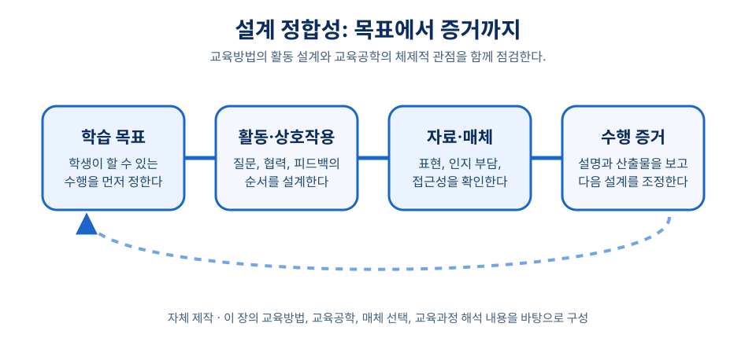
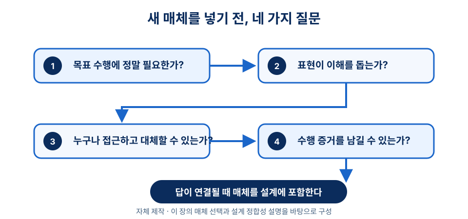

# 1장 교육방법과 교육공학의 이해

## 학습 목표

이 장을 학습한 뒤에는 다음을 설명할 수 있어야 한다.

1. 교육방법과 교육공학을 구분하고, 실제 수업 설계에서 두 관점이 만나는 지점을 설명할 수 있다.
2. AECT의 2008년 정의 논의와 2023년 현재 정의를 구분하여 교육공학의 핵심 초점을 말할 수 있다.
3. 매체 선택과 교육과정 해석이 왜 수업 설계의 문제인지 사례와 연결해 설명할 수 있다.
4. 이 책의 11장 학습 경로를 따라 자신의 수업 설계 역량을 확장할 계획을 세울 수 있다.

## 사전 읽기와 학습목표 대응표

사전 읽기는 약 40분으로 계획한다. 핵심 설명과 도입 사례를 읽고, 아래의 사전 확인을 짧게 기록한다. 이 기록은 별도 과제가 아니라 수업에서 자신의 판단을 설명하기 위한 준비이다.

| 목표 ID·학습목표 | 사전 읽기·근거 | 도입 사례·수업 적용 | 짧은 사전 확인 | 형성 평가 |
| --- | --- | --- | --- | --- |
| ch01-obj-01 교육방법과 교육공학의 접점을 설명한다. | 1절·3절의 활동과 체제 설명 → [ch01-src-aect2023, ^aect2023] | 사회 수업 사례에서 카드 분류와 동료 질문을 목표·평가와 연결한다. | ch01-act-01: 사례에서 활동 하나와 설계 조건 하나에 밑줄 긋기; ch01-act-02: 목표·자료·상호작용·평가를 한 흐름으로 다시 배열하기 | ch01-assess-01, ch01-assess-05. 활동과 설계 체제가 함께 정렬되는지 확인한다. |
| ch01-obj-02 2008년과 2023년 AECT 정의를 구분한다. | 2절의 정의 비교 → [ch01-src-aect2008, ^aect2008; ch01-src-aect2023, ^aect2023] | 앱 자체보다 자료 해석과 수행 증거를 먼저 본다. | ch01-act-01: 두 정의에서 설계 관련 낱말 하나씩 표시하기 | ch01-assess-01. 교육공학을 최신 기기 활용으로 축소하지 않는지 확인한다. |
| ch01-obj-03 매체 선택과 교육과정 해석을 설계 문제로 설명한다. | 4절·5절 → [ch01-src-mayer2001, ^mayer2001; ch01-src-moe2022, ^moe2022] | 발표 도구는 산출물 정리에 제한하고, 자료 해석을 평가한다. | ch01-act-03: 매체가 줄일 어려움과 만들 부담을 한 줄씩 적기 | ch01-assess-02, ch01-assess-03, ch01-assess-04, ch01-assess-06. 목표·인지 부담·교육과정 번역을 점검한다. |
| ch01-obj-04 11장 학습 경로를 설계 역량 확장과 연결한다. | 6절의 4부 11장 학습 경로 → [ch01-src-aect2023, ^aect2023]의 전략적 설계·평가 관점 | 교사가 자료 해석의 어려움을 발견하고 활동 순서를 조정한다. | ch01-act-04: 다음 장에서 확인할 목표-활동-평가 연결 하나 쓰기 | ch01-assess-05. 목표, 활동, 수행 증거의 일치를 확인한다. |

## 도입 사례

**창작 시나리오.** 중학교 1학년 사회 수업에서 한 예비교사는 “우리 동네의 교통 문제를 설명하고 개선안을 제안한다”는 목표를 세웠다. 처음 계획은 발표 자료 제작 앱을 활용하는 것이었다. 그러나 수업안을 다시 읽자 학생들이 어려워할 지점은 앱 사용이 아니라 자료 해석과 근거 연결이라는 점이 보였다.

교사는 짧은 동네 지도 읽기, 모둠별 원인-결과 카드 분류, 개선안 초안 공유, 동료 질문, 최종 발표 순으로 활동을 바꾸었다. 발표 도구는 마지막 산출물을 정리하는 수단으로 제한했다. 평가는 “자료를 근거로 주장했는가”와 “대안을 현실 조건과 연결했는가”에 두었다. 이 사례는 방법과 기술이 따로 고르는 목록이 아니라 목표·자료·상호작용·평가를 맞추는 하나의 설계 판단임을 보여 준다.

## 1. 교육방법을 묻는다는 것

교육방법은 “어떻게 가르칠 것인가”라는 질문에서 시작한다. 같은 내용을 다루어도 강의, 토의, 협동학습, 탐구, 프로젝트, 시범과 실습은 서로 다른 학습 경험을 만든다. 따라서 방법 선택은 유행하는 기법을 고르는 일이 아니다. 교사는 학습 목표, 학습자, 내용, 시간, 평가 조건을 함께 읽어야 한다.

이 책에서 교육방법은 교사와 학습자가 무엇을 어떤 순서로 하고 어떻게 상호작용할지를 정하는 실천적 지식이다. 개념 이해, 절차 숙달, 태도와 관점의 전환에는 서로 다른 활동과 피드백이 필요하다. 예비교사는 방법의 이름을 외우기보다, 그 방법이 작동하는 조건과 한계를 질문해야 한다.

## 2. 교육공학의 초점

교육공학은 “기기 활용”보다 넓은 관점이다. AECT가 후원한 2008년 정의 해설서는 교육공학을 학습 촉진과 수행 향상, 과정과 자원의 창출·활용·관리, 가치 등의 핵심어로 설명한다.[^aect2008] 여기서 중요한 질문은 어떤 기기가 새롭냐가 아니다. 학습 문제를 어떤 과정과 자원으로 설계하고 실행하며 개선할 것인가가 핵심이다.

AECT가 제시하는 2023년 정의도 교육공학을 이론, 연구, 실천의 윤리적 연구와 적용으로 설명한다. 이 정의는 지식의 진전, 학습과 수행의 개선, 학습자의 역량 강화를 전략적 설계, 관리, 실행, 평가와 연결한다.[^aect2023] 즉 교육공학은 도구보다 학습 경험과 환경의 설계에 주목한다.

!!! note "정의 읽기"
    이 장에서는 2008년 AECT 정의 해설서를 역사적 기준점으로, 2023년 AECT 웹페이지를 현재 정의로 구분한다. 두 출처를 하나의 문장에 섞어 인용하지 않는다.

이 관점은 교사의 질문을 바꾼다. “이 앱을 써 볼까?”보다 “이 목표에 어떤 경험이 필요한가?”, “학생은 어디에서 막힐까?”, “어떤 자료와 상호작용이 그 어려움을 줄일까?”, “실행 뒤 무엇을 보고 고칠까?”를 먼저 묻게 한다. 이 질문이 교육방법의 선택과 교육공학의 설계 관점을 잇는다.

## 3. 두 관점의 접점

교육방법은 수업 안의 활동과 상호작용을 구체화한다. 교육공학은 그 활동이 놓이는 전체 체제를 살핀다. 토의 수업을 예로 들면, 교육방법의 관점에서는 질문 유형, 발언 순서, 모둠 구성, 정리 활동을 검토한다.

교육공학의 관점에서는 토의 전에 제공할 자료, 온라인 게시판의 역할, 수행 증거를 모을 방법, 피드백의 순환, 개인정보와 접근성까지 본다. 두 관점은 경쟁하지 않는다. 활동은 설계 없이 이어지기 어렵고, 설계는 활동 없이 수업 장면이 될 수 없다. 예비교사에게 필요한 역량은 좋은 방법이나 좋은 기술의 목록이 아니라 학습 문제에 맞춰 활동·자료·매체·평가를 한 흐름으로 배치하는 능력이다.

## 4. 매체는 보조물이 아니라 설계 요소다

수업 매체는 내용을 담는 그릇에 그치지 않는다. 같은 개념도 말, 글, 그림, 표, 시뮬레이션, 영상, 실물 조작 활동으로 제시하면 학습자가 처리하는 정보와 관계가 달라진다. Mayer의 *Multimedia Learning*은 단어와 시각 자료의 관계를 학습 설계의 주요 문제로 다루며, 2001년판 서지와 목차에도 멀티미디어 원리가 별도 장으로 제시된다.[^mayer2001]

그렇다고 그림이나 영상이 언제나 더 좋은 것은 아니다. 매체 선택의 질문은 “무엇을 더 넣을까?”가 아니라 “이 표현이 목표 수행과 인지 처리에 어떤 도움을 주는가?”이다. 장식 이미지, 과도한 애니메이션, 설명과 맞지 않는 영상은 주의를 분산시킬 수 있다. 매체의 새로움보다 목표·내용·학습자·평가 증거의 정합성을 먼저 확인해야 한다.

## 5. 교육과정도 설계 조건이다

수업은 교실에서 일어나지만 설계는 교육과정 문서와 분리될 수 없다. 교육부는 2022년 12월 22일 교육부 고시 제2022-33호로 초중등학교 교육과정 총론과 각론을 고시했다. 해당 고시는 학교급별 총론, 교과 교육과정, 창의적 체험활동, 한국어 교육과정 등의 별책과 시행 일정을 제시한다.[^moe2022] 공식 교육과정은 수업 목표와 내용 범위, 학교급별 적용 시기를 판단하는 기준이다.

교사가 해야 할 일은 문서의 문장을 교실 경험으로 번역하는 것이다. 같은 성취기준도 강의식 설명, 탐구 과제, 협동 활동, 디지털 산출물 제작으로 다르게 구현할 수 있다. 그러므로 교육과정 해석은 정책 정보를 반복하는 절차가 아니라 수업 설계의 출발점이다.

## 6. 이 책의 학습 경로

공개 교재는 4부 11장으로 구성되어 있다. 1부는 교육방법과 교육공학의 토대를 다룬다. 2부는 교수설계의 원리와 모형으로, 3부는 협동학습·동기 설계·질문과 탐구 중심 수업의 실제로 이어진다. 4부에서는 멀티미디어 학습, 디지털 학습환경, AI와 교육의 만남을 다룬다.

이 순서는 수업을 바라보는 언어에서 출발해 체제적 설계, 구체적 전략, 디지털 환경으로 관점을 넓히도록 구성했다. 각 장을 읽으며 “이 내용이 내 수업의 어떤 의사결정을 바꾸는가”를 기록해 보자.

## 개념 오해와 적용 한계

- **오해: 교육공학은 최신 기기를 고르는 일이다.** **바로잡기:** 목표, 학습자, 자료, 상호작용, 평가, 윤리 조건을 함께 설계하는 일이다.
- **오해: 영상이나 그림을 더하면 언제나 학습이 좋아진다.** **적용 한계:** 효과는 표현과 목표의 관계, 학습자의 인지 부담, 접근성에 따라 달라진다.
- **오해: 교육과정 문서를 따르면 수업안이 자동으로 완성된다.** **바로잡기:** 교사는 성취기준을 활동과 수행 증거로 번역하고, 학습자와 교실 조건에 맞게 조정해야 한다.
- **적용 한계:** 도입 사례는 창작 시나리오이므로 특정 학교의 효과를 증명하지 않는다. 실제 수업안은 학습자 반응과 수행 증거를 바탕으로 타당성과 피드백을 점검한다.

## 생각해 보기

1. 내가 경험한 좋은 수업 하나를 떠올려 보자. 그 장점은 활동 선택, 전체 설계, 또는 둘의 결합 중 어디에서 비롯되었는가?
2. 새 디지털 도구를 수업에 넣기 전에 교사가 확인할 질문 세 가지를 적고, 각 질문이 왜 필요한지 설명해 보자.
3. 같은 교육과정 내용을 강의, 토의, 프로젝트로 가르친다면 학습자의 경험과 평가 증거는 어떻게 달라질까?

## 웹 학습 보조

아래 도식은 목표 1~3을 다시 확인하고, 본문의 설계 정합성과 매체 선택 절을 수업안 점검으로 연결한다.

### 목표에서 증거까지

*그림 1. 교육방법과 교육공학을 잇는 설계 정합성 자체 도식.*

### 매체 선택 점검

*그림 2. 새 매체를 수업에 포함하기 전의 네 가지 점검 질문.*

!!! tip "관련 강의 자료"
    이 장과 연계된 슬라이드: [1강 도입/개관](https://taehyeonglim.github.io/edtech/chapters/chapter-01/slides/deck.html){target=_blank}

## 이론과 연구 확장

### AECT 정의를 수업 설계 언어로 읽기

AECT의 2008년 정의 해설은 교육공학을 단순한 기기 활용이 아니라 학습 촉진과 수행 향상을 위한 과정과 자원의 창출, 활용, 관리로 설명한다.[^aect2008] 2023년 정의도 윤리적 연구와 적용, 전략적 설계, 관리, 실행, 평가를 강조한다.[^aect2023] 예비교사는 “어떤 앱을 쓸 것인가”보다 “학습자의 어떤 수행을 어떻게 관찰하고 지원할 것인가”를 먼저 물어야 한다. 초등 과학 실험에서 태블릿 촬영을 활용한다면, 촬영 자체가 아니라 관찰 기록·증거 비교·피드백 대화가 목표와 연결되어야 한다.

### 멀티미디어 원리와 매체의 절제

Mayer의 멀티미디어 학습 연구는 말과 시각 자료의 결합이 학습에 영향을 준다는 점을 체계적으로 다룬다.[^mayer2001] 이는 “영상이 많을수록 좋다”는 뜻이 아니다. 고등학교 역사 수업에서 지도, 연표, 사료 이미지를 함께 제시할 때에는 학생이 비교할 관계를 분명히 안내해야 한다. 장식 이미지나 과도한 전환 효과는 핵심 개념을 흐릴 수 있으므로, 매체는 흥미 장치가 아니라 사고를 돕는 표상으로 선택한다.

### 교육과정 문서와 교사의 번역 책임

2022 개정 교육과정 고시는 학교급별 총론과 교과 교육과정, 창의적 체험활동 등을 포함해 수업 설계의 공식 기준을 제공한다.[^moe2022] 그러나 교육과정 문장은 교실 활동으로 자동 변환되지 않는다. 예비교사는 성취기준의 동사, 내용 요소, 기대 수행을 읽고 학생의 경험으로 번역해야 한다. 같은 성취기준을 강의, 탐구, 토의, 프로젝트로 다르게 구현할 수 있으므로, 교육과정 해석은 행정 절차가 아니라 교수설계의 핵심 출발점이다.

## 토론 질문

1. 도입 사례의 교사가 발표 앱 사용을 줄이고 자료 해석 활동을 강화한 판단은 어떤 점에서 교육방법의 문제이며, 어떤 점에서 교육공학의 문제인가?
2. 새 매체를 도입할 때 “학생 흥미” 외에 반드시 확인해야 할 설계 기준 세 가지를 제시하고 이유를 설명해 보자.
3. 2022 개정 교육과정의 한 성취기준을 선택한다고 가정할 때, 이를 강의식 수업과 프로젝트 수업으로 각각 번역하면 평가 증거는 어떻게 달라질까?
4. 접근성이나 개인정보 조건 때문에 선호하는 디지털 도구를 쓰기 어려운 경우, 교사는 어떤 대체 설계를 마련해야 할까?

## 형성 평가

1. 교육방법과 교육공학의 관계를 가장 적절하게 설명한 것은 무엇인가?
   ① 교육방법은 낡은 개념이고 교육공학은 최신 기기 활용을 뜻한다.
   ② 교육방법은 활동과 상호작용을, 교육공학은 그 활동이 놓이는 설계 체제를 함께 본다.
   ③ 교육공학은 온라인 수업에서만 필요하고 대면 수업에는 적용되지 않는다.
   ④ 교육방법은 교사의 개성에만 의존하므로 평가와 연결할 수 없다.
   **정답**: ②
   **해설**: 교육방법과 교육공학은 경쟁 관계가 아니라 목표, 활동, 자료, 매체, 평가를 연결하는 상호 보완적 관점이다.

2. 다음 상황에서 교사가 먼저 해야 할 일을 쓰시오. “중학교 영어 수업에서 학생들이 발표 영상을 만들면 참여가 높아질 것이라는 이유만으로 영상 제작 과제를 넣으려 한다.”
   **예시 답안**: 영상 제작 전에 학습 목표와 평가 증거를 확인하고, 영상이 말하기 연습·피드백·수정 과정에 실제로 도움이 되는지 판단해야 한다.
   **채점 기준**: 목표 확인, 매체의 학습 기능 검토, 평가 증거와의 연결을 포함하면 충분한 답안으로 본다.

3. 매체 선택에서 피해야 할 판단 기준을 하나 쓰고, 더 적절한 기준으로 바꾸어 설명하시오.
   **예시 답안**: “최신 도구인가”만으로 고르는 것은 부적절하다. 대신 그 도구가 학습자의 인지 부담을 줄이고 목표 수행을 드러내는지 확인해야 한다.
   **해설**: 매체는 보조 장식이 아니라 설계 요소이므로 새로움보다 목표, 내용, 학습자, 평가와의 정합성이 중요하다.

4. 교육과정 해석이 수업 설계의 출발점인 이유를 한 문장으로 설명하시오.
   **예시 답안**: 교육과정은 학생이 도달해야 할 성취와 내용 범위를 제시하지만, 교사가 이를 구체적 활동과 평가로 번역해야 실제 수업이 되기 때문이다.
   **루브릭**: 교육과정의 기준 기능과 교사의 번역 책임을 모두 언급하면 우수, 둘 중 하나만 언급하면 보통으로 평가한다.

5. 다음 중 설계 정합성이 가장 높은 수업안은 무엇인가?
   ① 비판적 읽기가 목표인데 평가는 본문 암기 시험만 실시한다.
   ② 협동적 문제 해결이 목표인데 개별 강의만 듣고 수업을 끝낸다.
   ③ 자료 해석이 목표라서 학생이 자료를 비교하고 근거를 들어 설명하며 그 과정을 평가한다.
   ④ 디지털 역량이 목표라서 모든 수업 시간을 프로그램 설치에 사용한다.
   **정답**: ③
   **해설**: 목표, 활동, 수행 증거가 모두 자료 해석 능력을 향하므로 설계 정합성이 가장 높다.

6. 매체를 수업 설계에 포함하기 전에 가장 먼저 확인할 질문은 무엇인가?
   ① 가장 최신인 도구인가?
   ② 학습 목표의 수행과 평가 증거를 더 잘 드러내는가?
   ③ 학생이 이미 많이 사용하는 도구인가?
   ④ 화면 효과가 풍부한가?
   **정답**: ②
   **해설**: 매체 선택은 새로움이나 익숙함보다 목표 수행, 인지 부담, 접근성, 평가 증거와의 관계를 기준으로 판단한다.

## 요약

교육방법은 수업에서 어떤 활동과 상호작용을 선택할지 묻는 실천적 관점이다. 교육공학은 학습 경험과 환경을 설계·실행·관리·평가하는 체제적 관점이다. AECT의 2008년 정의 해설과 2023년 현재 정의는 교육공학이 기기 사용법이 아니라 윤리적이고 체계적인 학습 설계의 문제임을 보여 준다. 매체와 교육과정은 모두 수업 설계의 조건이며, 교사는 이를 학습 목표와 학습자의 경험에 맞게 해석해야 한다.

## 핵심 용어

- **교육방법**: 수업 목표를 달성하기 위해 교사와 학습자가 수행할 활동, 상호작용, 피드백의 흐름을 정하는 실천적 지식이다.
- **교육공학**: 학습과 수행을 개선하기 위해 과정과 자원을 윤리적으로 설계, 실행, 관리, 평가하는 이론·연구·실천의 영역이다.
- **매체 선택**: 특정 도구의 신기함보다 학습 목표, 인지 처리, 접근성, 평가 증거와의 적합성을 기준으로 표현 방식을 고르는 판단이다.
- **교육과정 해석**: 국가 수준 또는 학교 수준 교육과정의 요구를 실제 수업 목표, 활동, 자료, 평가로 번역하는 전문적 과정이다.
- **설계 정합성**: 목표, 학습 활동, 자료, 매체, 피드백, 평가가 같은 학습 성과를 향해 서로 맞물려 있는 상태다.

## 참고문헌

[^aect2008]: Januszewski, A., & Molenda, M. (Eds.). (2008). *Educational Technology: A Definition with Commentary* (2nd ed.). Routledge. Publisher metadata verified at `https://www.routledge.com/Educational-Technology-A-Definition-with-Commentary/Januszewski-Molenda/p/book/9780805858617`.

[^aect2023]: Association for Educational Communications and Technology. (2023). *AECT Definition for Educational Technology*. `https://www.aect.org/aect/about/aect-definition`.

[^mayer2001]: Mayer, R. E. (2001). *Multimedia Learning*. Cambridge University Press. Metadata and table-of-contents lead verified through Google Books: `https://books.google.com/books/about/Multimedia_Learning.html?id=ymJ9o-w_6WEC`.

[^moe2022]: 교육부. (2022. 12. 22.). *[교육부 고시 제2022-33호] 초중등학교 교육과정 총론 및 각론 고시*. `https://www.moe.go.kr/boardCnts/viewRenew.do?boardID=141&boardSeq=93458&lev=0&page=1&s=moe&searchType=null&statusYN=W`.
