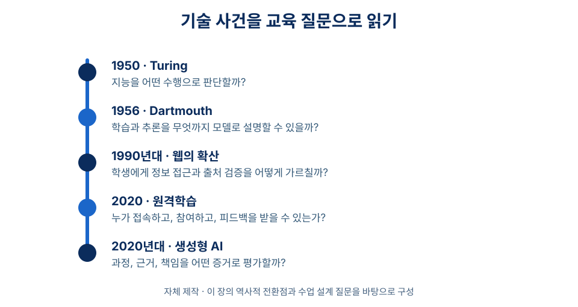
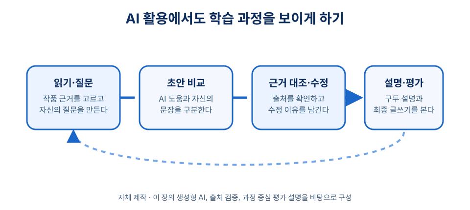

# 2장 교육과 테크놀로지의 만남

## 학습 목표

이 장을 학습한 뒤에는 다음을 설명할 수 있어야 한다.

1. 테크놀로지가 교육을 자동으로 개선한다는 관점의 한계를 설명할 수 있다.
2. 인공지능, 퍼셉트론, 웹, 원격학습, 생성형 AI의 주요 전환점을 교육의 질문과 연결할 수 있다.
3. 코로나19 이후 원격학습 경험이 디지털 격차와 교사의 설계 역량 문제를 어떻게 드러냈는지 설명할 수 있다.
4. 생성형 AI를 수업에 도입할 때 검토해야 할 지식 검증, 평가, 윤리, 교사 역할의 쟁점을 말할 수 있다.

## 사전 읽기와 학습목표 대응표

사전 읽기는 약 42분으로 계획한다. 역사적 사건의 이름을 외우기보다 핵심 설명과 도입 사례를 읽고, 아래의 짧은 사전 확인을 기록한다. 수업 중 적용은 그 기록을 근거로 판단을 비교하는 활동이며, 장별 별도 과제가 아니다.

| 목표 ID·학습목표 | 사전 읽기·근거 | 도입 사례·수업 적용 | 짧은 사전 확인 | 형성 평가 |
| --- | --- | --- | --- | --- |
| ch02-obj-01 기술결정론의 한계를 설명한다. | 1절 → [ch02-src-goldin-katz, ^goldin-katz] | AI 초안이 참여와 학습을 자동으로 보장하지 않는 사례를 읽는다. | ch02-act-01: 기술이 해결한다고 주장하는 학습 문제를 한 문장으로 쓰기 | ch02-assess-01. 효과가 목표, 학습자, 과제, 피드백, 접근성 조건에 달렸는지 확인한다. |
| ch02-obj-02 AI·퍼셉트론·웹·원격학습·생성형 AI의 전환점을 교육 질문과 연결한다. | 2~6절 → [ch02-src-turing1950, ^turing1950; ch02-src-dartmouth, ^dartmouth; ch02-src-rosenblatt1958, ^rosenblatt1958; ch02-src-minsky-papert, ^minsky-papert; ch02-src-cern-web, ^cern-web] | AI 출력과 자신의 초안을 비교하고 작품 근거를 확인한다. | ch02-act-01: 타임라인의 한 사건을 ‘교사가 확인할 질문’으로 바꾸기; ch02-act-03: 그 질문에 필요한 학습 증거 하나 정하기 | ch02-assess-04, ch02-assess-05. 출처 확인과 오류 수정 이유를 설명한다. |
| ch02-obj-03 원격학습이 드러낸 격차와 설계 역량 문제를 설명한다. | 5절 → [ch02-src-unesco-covid, ^unesco-covid; ch02-src-oecd-school2021, ^oecd-school2021; ch02-src-oecd-online2020, ^oecd-online2020] | 접속이 불안정한 학생에게 종이 발췌문과 참여 경로를 제공한다. | ch02-act-02: 참여하기 어려운 조건 하나와 대체 경로 하나 적기 | ch02-assess-02, ch02-assess-06. 접근성·격차와 교수설계·피드백을 함께 확인한다. |
| ch02-obj-04 생성형 AI 도입의 검증·평가·윤리·교사 역할을 설명한다. | 6절 → [ch02-src-openai-chatgpt, ^openai-chatgpt; ch02-src-unesco-genai, ^unesco-genai] | 초안 비교, 출처 확인, 구두 설명을 평가 증거로 사용한다. | ch02-act-04: AI 도움의 허용 범위와 기록 방식 한 가지 쓰기 | ch02-assess-03, ch02-assess-05. 결과물만으로 이해를 판단할 수 없고 출력은 검증 대상임을 확인한다. |

## 도입 사례

**창작 시나리오.** 고등학교 1학년 국어 수업에서 한 예비교사는 생성형 AI로 독서 감상문 초안을 만들게 하면 학생들이 글쓰기를 더 쉽게 시작할 수 있으리라 기대했다. 첫 활동에서 일부 학생은 AI가 만든 문장을 거의 그대로 제출했다. 다른 학생은 인터넷 접속이 불안정해 활동에 참여하지 못했다.

교사는 수업을 다시 설계했다. 종이 발췌문 읽기, 개인 질문 만들기, AI 초안과 자신의 초안 비교, 출처 확인, 구두 설명, 최종 글쓰기 순서로 바꾸었다. 평가는 AI 사용 여부가 아니라 작품 근거를 제시했는지, 초안의 수정 이유를 설명했는지, 자신의 판단을 드러냈는지에 두었다. 이 사례는 새 기술이 수업을 대신하지 않으며, 접근성·검증·평가 설계가 함께 마련될 때 교육적 의미를 갖는다는 점을 보여 준다.

## 1. 기술은 교육을 대신하지 않는다

교육과 테크놀로지의 관계에서 먼저 피해야 할 오해는 기술결정론이다. 새 기기가 나왔다고 수업이 저절로 좋아지지는 않는다. 같은 도구도 어떤 목표, 학습자, 과제, 피드백 구조 안에 놓이는가에 따라 학습을 돕기도 하고 방해하기도 한다. 중요한 질문은 “무엇이 최신 기술인가”가 아니라 “이 기술이 어떤 학습 문제를 어떤 조건에서 해결하는가”이다.

Goldin과 Katz는 기술 변화와 교육 공급의 관계를 “경주”라는 틀로 설명한다. 기술이 새로운 역량 수요를 만들 때 교육이 그 변화에 대응하지 못하면 격차와 불평등이 커질 수 있다는 분석이다.[^goldin-katz] 디지털 도구가 확산될수록 모든 학습자가 접근·이해·비판·생산의 기회를 갖도록 교육이 따라가야 한다. 그렇지 않으면 기술은 기회를 넓히는 힘이 아니라 기존 격차를 키우는 장치가 될 수 있다.

따라서 이 장은 기술사를 단순한 연대표로 다루지 않는다. 인공지능은 인간의 사고와 학습을 어떻게 이해할지 묻고, 웹은 정보 접근과 지식 검증의 방식을 바꾸며, 코로나19 원격학습은 디지털 수업의 조건과 한계를 드러냈다. 생성형 AI는 다시 “학교에서 무엇을 가르치고 어떻게 평가할 것인가”를 묻는다.

## 2. 인공지능이라는 이름이 만들어진 자리

기계가 지능을 가질 수 있는가라는 물음은 1950년 Turing의 논문에서 중요한 철학적 형태를 얻었다. Turing은 “기계가 생각할 수 있는가”를 바로 정의하기보다, 대화에서 인간과 기계를 구분할 수 있는가라는 모방 게임의 문제로 바꾸어 제시했다.[^turing1950] 이 전환은 인공지능을 단순한 공학 문제가 아니라 인간 지능을 어떻게 판별하고 설명할지의 문제로 만들었다.

1955년 McCarthy, Minsky, Rochester, Shannon은 Dartmouth에서 1956년 여름에 진행할 인공지능 연구 프로젝트를 제안했다. 이 제안서는 학습이나 지능의 다른 특징이 충분히 정확하게 기술될 수 있다면 기계가 그것을 모사할 수 있다는 가정을 내세웠다. Dartmouth는 이 연구 프로젝트를 인공지능 분야의 탄생과 연결되는 중요한 사건으로 설명한다.[^dartmouth]

교육적으로 이 사건은 두 방향의 질문을 남긴다. 학습을 설명하는 언어가 심리학과 철학뿐 아니라 계산, 정보, 모델의 언어와 만나기 시작했다. 동시에 인간 학습을 기계적으로 단순화할 위험도 생겼다. 학생의 이해를 정답 산출만으로 환원할 수 없으므로, 교사는 AI를 다룰 때 동기, 맥락, 상호작용, 가치 판단을 함께 보아야 한다.

!!! note "역사적 사건을 읽는 방법"
    이 장의 역사 서술은 “한 사건이 곧바로 교육을 바꾸었다”는 단선적 설명을 피한다. Dartmouth 1956은 인공지능 연구의 상징적 기준점이지만, 교실 수업의 변화는 연구, 산업, 정책, 학교 조건이 오랜 시간 결합하며 나타났다.

## 3. 퍼셉트론 논쟁이 남긴 교훈

1958년 Rosenblatt의 퍼셉트론 논문은 뇌에서 정보가 저장되고 조직되는 방식을 확률적 모델로 설명하려 했다.[^rosenblatt1958] 오늘날의 인공신경망과 그대로 같지는 않지만, 학습하는 기계를 상상하게 한 중요한 초기 모델이었다. 1969년 Minsky와 Papert의 *Perceptrons*는 퍼셉트론을 계산기하학의 관점에서 엄밀하게 다루며 그 한계도 드러냈다.[^minsky-papert]

이 논쟁의 교육적 교훈은 누가 옳았는지를 가르는 데 있지 않다. 모델의 가능성과 한계를 함께 읽는 태도에 있다. 어떤 기술이 한 유형의 문제를 잘 해결한다고 해서 모든 학습 문제를 해결하는 것은 아니다. 패턴 분류, 그럴듯한 언어 생성, 학생의 깊은 개념 이해는 서로 다른 설계 조건을 요구한다.

자동 채점, 학습 추천, 질의응답 도구는 교실에서 유용할 수 있다. 그러나 그 출력이 학생의 사고 과정을 충분히 설명한다고 가정해서는 안 된다. 교사는 도구가 잘하는 일과 못하는 일을 구분하고, 학생이 왜 그런 답을 만들었는지 살피는 해석자의 역할을 유지해야 한다.

## 4. 웹은 정보 접근의 조건을 바꾸었다

디지털 전환에서는 인터넷과 웹을 구분할 필요가 있다. CERN에 따르면 Tim Berners-Lee는 1989년 CERN에서 과학자들의 정보 공유 수요를 해결하려 월드와이드웹을 구상했다. 1990년에는 Robert Cailliau와 함께 관리 제안서로 정식화했고, 그해 말 첫 웹 서버와 브라우저가 CERN에서 작동했다. 1991년에는 관련 소프트웨어가 확산되기 시작했다.[^cern-web]

웹의 교육적 의미는 자료가 많아진 데 그치지 않는다. 학습자는 검색, 링크, 공유, 수정, 재구성을 통해 지식에 접근하게 되었다. CERN이 1993년 4월 30일 WorldWideWeb 소스 코드를 로열티 없이 공개한 일은 웹이 세계적으로 확산되는 중요한 조건이었다.[^cern-web] 공개성과 연결성은 학교 밖 자원을 교실로 가져왔고, 동시에 정보의 신뢰성을 판단하는 능력을 필수 역량으로 만들었다.

이 변화는 교사의 역할을 약화시키기보다 바꾸었다. 교사는 정보를 가장 많이 가진 사람에 머물기보다, 학습자가 질문을 세우고 자료의 출처와 근거를 점검하며 여러 정보를 개념적으로 연결하도록 돕는 설계자가 되어야 한다. 웹 이후의 수업에서 매체 문해력과 출처 검증은 부가 활동이 아니라 학습의 기본 조건이다.

## 5. 코로나19 원격학습은 가능성과 격차를 동시에 드러냈다

코로나19 팬데믹은 디지털 학습환경을 선택의 문제가 아니라 교육 지속성의 문제로 만들었다. UNESCO는 팬데믹이 전 세계 16억 명 이상의 학생과 청소년에게 영향을 주었고, 취약한 학습자가 특히 큰 타격을 받았다고 설명한다.[^unesco-covid] OECD는 2020년에 188개 국가와 경제권에서 15억 명의 학생이 학교에 가지 못한 상황을 보고하면서, 학교 폐쇄, 원격학습, 교사 지원, 등교 재개를 함께 추적했다.[^oecd-school2021]

이 경험은 온라인 수업이 대면 수업보다 우월하다는 증거가 아니다. OECD의 2020년 정책 보고서는 대면 수업이 불가능할 때 온라인 교수·학습이 전례 없는 규모로 활용되었지만, 학생의 학습 태도, 가정의 지원, 교사와 학교의 지원 정책이 효과를 좌우한다고 보았다.[^oecd-online2020] 원격학습의 핵심은 플랫폼을 여는 일이 아니라, 학습자가 접속하고 참여하며 피드백을 받을 조건을 설계하는 일이다.

코로나19 이후 교사가 배워야 할 것은 비상시에 화상회의 도구를 쓰는 법을 넘어선다. 디지털 접근성, 과제 구조, 상호작용 방식, 피드백 주기, 보호자 부담, 학습 데이터의 윤리적 사용을 함께 고려해야 한다. 디지털 수업은 기술 운영 역량과 교수설계 역량이 분리될 수 없음을 보여 준 사례다.

## 6. 생성형 AI는 평가와 지식 검증을 다시 묻는다

OpenAI는 ChatGPT를 소개하면서 대화 형식이 후속 질문에 답하고, 실수를 인정하며, 부정확한 전제를 지적하고, 부적절한 요청을 거절할 수 있게 한다고 설명했다. 또한 ChatGPT를 사용자의 피드백을 받아 강점과 약점을 배우기 위한 연구 미리보기로 제시했다.[^openai-chatgpt] 여기서 주목할 변화는 특정 서비스 하나가 아니라, 자연어 인터페이스를 통해 학생이 글쓰기, 설명, 요약, 번역, 코딩, 문제 풀이 지원을 받을 수 있게 된 점이다.

UNESCO의 2023년 생성형 AI 지침은 이 변화를 교육 혁신의 기회로만 보지 않는다. 지침은 생성형 AI가 인간 주체성, 포용, 형평성, 언어와 문화 다양성, 다양한 의견과 표현에 영향을 줄 수 있음을 지적한다. 교육기관은 AI 시스템의 윤리적·교육적 적합성도 검증해야 한다.[^unesco-genai] 생성형 AI 시대의 핵심 역량은 도구 사용법만이 아니다. 학생은 출력의 근거를 확인하고, 편향과 오류를 점검하며, 자신의 판단과 책임을 설명할 수 있어야 한다.

평가도 달라져야 한다. 결과물만 제출받는 과제에서는 학생의 이해와 AI의 도움을 구분하기 어렵다. 교사는 과정 기록, 구두 설명, 초안 비교, 출처 검토, 동료 피드백, 실제 수행 과제를 조합해 학습 증거를 넓혀야 한다. 동시에 AI 사용을 무조건 금지하거나 장려하기보다, 학습 목표에 따라 허용 범위와 기록 방식을 분명히 제시해야 한다.

## 7. 이 장의 위치

이 책의 11장 구조에서 이 장은 토대와 응용을 잇는다. 1장은 교육방법과 교육공학의 개념을 세웠고, 2장은 그 개념이 기술 변화의 역사에서 왜 중요한지 보여 준다. 뒤의 장들은 교수설계, 수업모형, 협동학습, 동기 설계, 질문과 탐구, 멀티미디어 학습, 디지털 학습환경, AI 교육을 더 구체적으로 다룬다.

역사적 사건의 이름을 외우는 데서 멈추지 말자. “이 기술은 어떤 학습 문제를 해결하는가?”, “누구에게 접근 가능한가?”, “어떤 증거로 학습을 확인할 것인가?”, “어떤 윤리적 위험을 관리해야 하는가?”를 각 사건에 연결해 보자. 이 질문들이 교육과 테크놀로지의 만남을 교사의 전문성 문제로 바꾼다.

## 개념 오해와 적용 한계

- **오해: AI가 그럴듯한 답을 만들면 학생도 이해한 것이다.** **바로잡기:** 학생의 이유 설명, 근거 대조, 오류 수정 과정을 별도로 확인해야 한다.
- **오해: 원격학습은 플랫폼을 열면 동등하게 참여할 수 있다.** **적용 한계:** 기기·네트워크뿐 아니라 가정의 지원, 과제 구조, 피드백, 접근성 조건이 참여를 좌우한다.
- **오해: 한 역사적 사건이 곧바로 교실을 바꾼다.** **바로잡기:** 기술의 교육적 영향은 연구, 산업, 정책, 학교 조건이 결합하는 과정에서 나타난다.
- **적용 한계:** 도입 사례는 창작 시나리오이므로 AI나 원격학습의 일반적 효과를 증명하지 않는다. 완성 수업안은 수행 증거를 바탕으로 타당성과 피드백을 검토한다.

## 생각해 보기

1. 새 기술이 수업에 들어올 때 “기술 사용”과 “학습 설계”를 구분하려면 교사가 어떤 질문을 먼저 해야 할까?
2. 웹 검색 결과와 생성형 AI 답변은 모두 편리한 정보 접근을 제공한다. 두 경우의 출처 검증 전략은 어떻게 같고 어떻게 다른가?
3. 내가 맡은 교과에서 생성형 AI 사용을 허용한다면, 접근성까지 고려하여 어떤 과제에서 허용하거나 제한할지 학습 목표와 연결해 설명해 보자.

## 웹 학습 보조

아래 도식은 목표 2~4를 본문의 역사적 전환점과 수업 설계 판단에 연결한다. 사건의 이름보다 교사가 확인할 질문과 학습 증거를 살피는 데 사용한다.

### 기술 사건과 교육 질문

*그림 1. 기술 사건을 교육 질문으로 바꾸는 자체 제작 타임라인.*

### 생성형 AI 활용의 학습 증거

*그림 2. 생성형 AI 활용 글쓰기에서 과정과 근거를 남기는 자체 도식.*

### 정책·AI·제품 읽기 기준

확인 기준일은 2026-08-10이다. 이 장의 정책·AI·제품 관련 서술은 각주에 적힌 발행 시점과 출처 범위에서 읽는다. 갱신 대상은 교육과정·학교의 AI 사용 지침, AI 서비스의 기능·이용 조건, 원격학습 접근성 지원, 관련 정책과 지침의 최신판이다. 특히 ChatGPT 관련 설명은 2022년 연구 미리보기 소개의 내용이며, 현재 제품 기능이나 학교 적용 기준을 단정하지 않는다.

!!! tip "관련 강의 자료"
    이 장과 연계된 슬라이드: [2강 교육과 기술의 관계](https://taehyeonglim.github.io/edtech/chapters/chapter-02/slides/deck.html){target=_blank}

## 이론과 연구 확장

### 기술 변화와 교육의 경주

Goldin과 Katz는 기술 변화가 새로운 역량 수요를 만들고 교육이 이에 대응하지 못하면 불평등이 커질 수 있다고 설명한다.[^goldin-katz] 이 관점은 교실의 디지털 도구 도입에도 적용된다. 중학교 수학 수업에서 학습 플랫폼을 도입할 때 빠르게 적응하는 학생만 더 많은 피드백을 받고, 접속이 어려운 학생은 뒤처진다면 기술은 격차를 줄이기보다 키울 수 있다. 교사는 기기 보급, 안내 시간, 대체 자료, 가정 지원 정도를 함께 점검해야 한다.

### 인공지능 역사에서 배우는 모델의 한계

Turing의 모방 게임은 기계 지능을 판별하는 질문을 새롭게 제기했고,[^turing1950] Dartmouth 제안은 학습과 추론을 계산 가능한 문제로 다룰 수 있다는 연구 방향을 상징적으로 보여 주었다.[^dartmouth] 그러나 이는 인간 학습을 정답 산출로 축소해도 된다는 뜻이 아니다. 퍼셉트론 논쟁이 보여 주듯 특정 모델은 가능성과 한계를 동시에 지닌다.[^rosenblatt1958] 교사는 AI가 만든 답이 그럴듯해 보여도 학생의 이해, 이유 설명, 오류 수정 과정을 따로 확인해야 한다.

### 웹 이후의 정보 문해력

CERN의 웹 역사 설명은 웹이 과학자들의 정보 공유 수요에서 출발해 공개성과 연결성을 바탕으로 확산되었음을 보여 준다.[^cern-web] 학교 수업에서는 자료 접근이 넓어진 만큼 출처 검증의 책임도 커졌다. 초등 사회 수업에서 지역 정보를 검색할 때에도 학생은 첫 결과를 그대로 믿기보다 작성 기관, 작성 시점, 자료 목적을 확인해야 한다. 웹 문해력은 별도 정보 시간에만 다루는 기능이 아니라 모든 교과에서 필요한 학습 조건이다.

### 원격학습과 생성형 AI의 윤리적 설계

UNESCO와 OECD의 코로나19 교육 자료는 팬데믹 시기 원격학습이 교육 지속성을 도왔지만 취약한 학습자에게 더 큰 어려움을 남겼음을 보여 준다.[^unesco-covid][^oecd-online2020] 생성형 AI 지침 역시 인간 주체성, 포용, 형평성, 문화 다양성, 검증 책임을 강조한다.[^unesco-genai] 디지털 수업의 핵심은 플랫폼이나 AI 도구를 허용할지의 단순 선택이 아니다. 교사는 누가 참여하기 어려운지, 어떤 도움을 기록해야 하는지, 어떤 판단을 학생 자신의 언어로 설명하게 할지를 설계해야 한다.

## 토론 질문

1. 도입 사례에서 AI 사용 자체보다 초안 비교와 구두 설명을 평가에 포함한 이유는 무엇인가?
2. 기술 변화와 교육의 “경주”라는 관점은 예비교사가 디지털 격차를 바라보는 방식을 어떻게 바꾸는가?
3. 웹 검색 결과와 생성형 AI 답변을 교과 수업에서 사용할 때, 학생에게 공통으로 가르쳐야 할 출처 검증 질문은 무엇인가?
4. 원격학습이나 AI 활용 수업에서 교사가 접근성 문제를 발견했을 때, 수업 목표를 유지하면서 참여 기회를 보장하는 방법을 논의해 보자.

## 형성 평가

1. 기술결정론의 한계를 가장 잘 설명한 것은 무엇인가?
   ① 기술이 새로우면 학습 효과는 자동으로 높아진다.
   ② 기술은 교사의 수업 설계를 불필요하게 만든다.
   ③ 기술의 효과는 목표, 학습자, 과제, 피드백, 접근성 조건에 따라 달라진다.
   ④ 기술은 교육 불평등과 관련이 없다.
   **정답**: ③
   **해설**: 새 기술이 교육을 자동으로 개선하지 않으며, 설계 조건과 사회적 맥락에 따라 결과가 달라진다.

2. 코로나19 원격학습 경험이 교사에게 남긴 설계 과제를 두 가지 쓰시오.
   **예시 답안**: 학생의 접속과 기기 접근을 확인해야 하며, 온라인 활동에서도 피드백과 참여 증거가 남도록 과제를 구조화해야 한다.
   **채점 기준**: 접근성 또는 격차 조건 한 가지와 교수설계 또는 피드백 조건 한 가지를 포함하면 충분한 답안으로 본다.

3. 생성형 AI를 활용한 글쓰기 과제에서 최종 글만 평가할 때 생길 수 있는 문제를 설명하시오.
   **예시 답안**: 최종 글만 보면 학생이 무엇을 이해했는지, AI 도움을 어떻게 사용했는지, 오류를 스스로 검토했는지 알기 어렵다.
   **해설**: 생성형 AI 시대에는 결과물뿐 아니라 초안, 수정 과정, 출처 검토, 구두 설명 같은 과정 증거가 필요하다.

4. 웹 자료를 활용하는 초등 사회 수업에서 학생에게 가르칠 출처 검증 질문을 세 가지 제시하시오.
   **예시 답안**: 누가 만든 자료인가, 언제 작성되었는가, 어떤 목적이나 관점으로 제시되었는가를 확인한다.
   **루브릭**: 저자·기관, 시점, 목적·관점, 근거 확인 중 세 가지 이상을 구체적으로 제시하면 우수로 평가한다.

5. 다음 상황에서 가장 적절한 교사의 대응은 무엇인가? “AI 질의응답 도구가 과학 개념을 그럴듯하지만 틀리게 설명했고, 몇몇 학생이 그대로 필기했다.”
   ① AI 사용을 영구히 금지하고 개념 확인은 하지 않는다.
   ② 학생에게 AI 답변의 근거를 교과서와 다른 자료로 대조하게 하고 오류 수정 이유를 설명하게 한다.
   ③ AI 답변은 항상 틀리므로 모든 디지털 자료를 제외한다.
   ④ 학생이 필기했으므로 평가에서 정답으로 인정한다.
   **정답**: ②
   **해설**: AI 출력은 검증 대상이다. 학생이 근거 대조와 오류 수정 과정을 통해 개념 이해를 드러내도록 설계해야 한다.

6. 원격학습에서 참여 기회를 넓히는 설계로 가장 적절한 것은 무엇인가?
   ① 실시간 접속만 허용하고 대체 자료는 제공하지 않는다.
   ② 가장 빠른 학생의 제출물을 모두의 학습 증거로 본다.
   ③ 접속·자료 접근·피드백의 어려움을 확인하고 대체 경로와 참여 증거를 마련한다.
   ④ 플랫폼 기능이 많으면 과제 구조는 검토하지 않는다.
   **정답**: ③
   **해설**: 원격학습의 핵심은 플랫폼 사용 자체가 아니라 학습자가 접속하고 참여하며 피드백을 받을 수 있는 조건을 설계하는 일이다.

## 요약

테크놀로지는 교육을 자동으로 개선하지 않는다. 기술 변화는 교육의 목표, 내용, 방법, 평가, 형평성 조건을 새롭게 묻는다. Turing의 모방 게임, Dartmouth 1956, 퍼셉트론 논쟁은 인공지능을 인간 학습과 지능 이해의 문제로 연결했다. 웹은 정보 접근과 출처 검증의 조건을 바꾸었고, 코로나19 원격학습은 디지털 수업의 가능성과 격차를 함께 드러냈다. 생성형 AI는 지식 검증, 평가 설계, 인간 주체성, 교사 역할을 다시 검토하게 한다.

## 핵심 용어

- **기술결정론**: 새 기술이 등장하면 교육 변화와 학습 개선이 자동으로 따라온다고 보는 관점으로, 학습 목표와 사회적 조건을 가리기 쉽다.
- **디지털 격차**: 기기와 네트워크 접근뿐 아니라 사용 역량, 지원 환경, 학습 참여 기회의 차이까지 포함하는 교육 불평등이다.
- **출처 검증**: 웹 검색 결과나 AI 출력의 근거, 저자, 맥락, 최신성, 편향 가능성을 확인하는 학습 활동이다.
- **생성형 AI**: 대규모 데이터와 모델을 바탕으로 텍스트, 이미지, 코드 등 새로운 산출물을 생성하는 인공지능 기술이다.
- **과정 중심 평가**: 최종 산출물만이 아니라 질문 설정, 자료 탐색, 초안 작성, 피드백, 수정 이유를 함께 학습 증거로 보는 평가 방식이다.

## 참고문헌

[^goldin-katz]: Goldin, C., & Katz, L. F. (2008). *The Race between Education and Technology*. Harvard University Press. Metadata verified through Google Books: `https://books.google.com/books/about/The_Race_Between_Education_and_Technolog.html?id=mcYsvvNEUYwC`.

[^turing1950]: Turing, A. M. (1950). I. Computing machinery and intelligence. *Mind, LIX*(236), 433-460. `https://doi.org/10.1093/mind/LIX.236.433`.

[^dartmouth]: McCarthy, J., Minsky, M. L., Rochester, N., & Shannon, C. E. (1955). *A Proposal for the Dartmouth Summer Research Project on Artificial Intelligence*. Stanford-hosted PDF verified at `http://jmc.stanford.edu/articles/dartmouth/dartmouth.pdf`; Stanford HTML copy verified at `https://www-formal.stanford.edu/jmc/history/dartmouth/dartmouth.html`; Dartmouth institutional history verified at `https://home.dartmouth.edu/about/artificial-intelligence-ai-coined-dartmouth`.

[^rosenblatt1958]: Rosenblatt, F. (1958). The perceptron: A probabilistic model for information storage and organization in the brain. *Psychological Review, 65*(6), 386-408. `https://doi.org/10.1037/h0042519`.

[^minsky-papert]: Minsky, M., & Papert, S. A. (1969). *Perceptrons: An Introduction to Computational Geometry*. The MIT Press. Publisher metadata verified at `https://mitpress.mit.edu/9780262630221/perceptrons/`.

[^cern-web]: CERN. (n.d.). *A short history of the Web*. `https://home.cern/science/computing/the-birth-of-the-web/short-history-web/`.

[^unesco-covid]: UNESCO. (n.d.). *Education: From COVID-19 school closures to recovery*. `https://www.unesco.org/en/covid-19/education-response`.

[^oecd-school2021]: OECD. (2021). *The State of School Education: One Year into the COVID Pandemic*. OECD Publishing. `https://doi.org/10.1787/201dde84-en`.

[^oecd-online2020]: OECD. (2020). Strengthening online learning when schools are closed: The role of families and teachers in supporting students during the COVID-19 crisis. *OECD Policy Responses to Coronavirus (COVID-19)*. OECD Publishing. `https://doi.org/10.1787/c4ecba6c-en`.

[^openai-chatgpt]: OpenAI. (2022). *Introducing ChatGPT*. `https://openai.com/index/chatgpt/`.

[^unesco-genai]: Miao, F., & Holmes, W. (2023). *Guidance for generative AI in education and research*. UNESCO. Publisher version verified at `https://unesdoc.unesco.org/ark:/48223/pf0000386693`; metadata cross-checked through UCL Discovery: `https://discovery.ucl.ac.uk/id/eprint/10176438/`.
