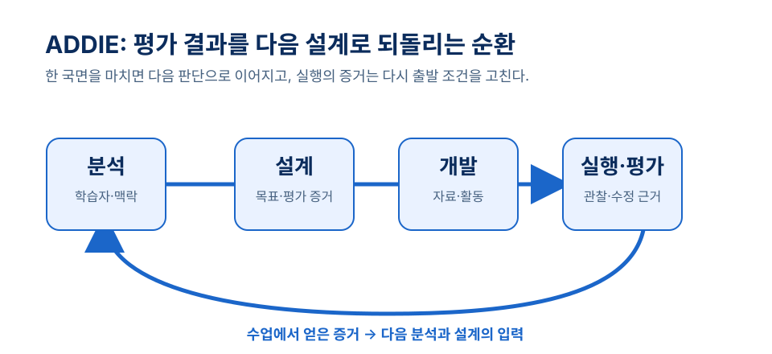
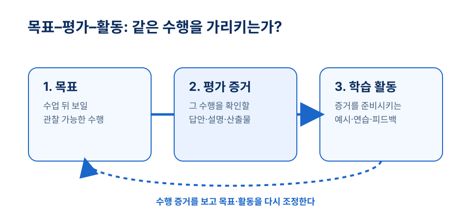

# 3장 체제적 교수설계

## 학습 목표

이 장을 학습한 뒤에는 다음을 설명할 수 있어야 한다.

1. 체제적 교수설계가 수업을 상호 연결된 설계 체제로 보는 이유를 설명할 수 있다.
2. ADDIE의 다섯 국면을 한국어 수업 설계 과업과 연결하여 말할 수 있다.
3. Dick, Carey, Carey의 접근에서 목표, 분석, 평가, 전략, 자료, 수정이 어떻게 정렬되는지 설명할 수 있다.
4. 효과성, 효율성, 매력성을 기준으로 자신의 교수설계안을 점검할 수 있다.

## 사전 읽기와 학습목표 대응표

1. **짧은 사전 확인 (5분, ch03-precheck)**: 최근 수업안에서 목표, 활동, 평가를 한 줄씩 찾아 같은 수행을 가리키는지 표시한다.
2. **핵심 읽기 (20분)**: 1~4절을 읽고 ADDIE의 각 국면에서 남겨야 할 판단 근거를 한 단어로 메모한다.
3. **수업안 적용 준비 (10분, ch03-alignment-cycle)**: 누적 수업안의 목표 하나를 골라, 그 수행을 확인할 증거와 이를 준비시킬 활동을 각각 한 문장으로 쓴다.

| 학습목표 | 사전 읽기·근거 | 도입 사례·수업 적용 | 형성 평가 |
| --- | --- | --- | --- |
| ch03-o1 체제의 연결 설명 | 1절의 목표·학습자·활동·평가 연결과 체제적 설계 관점[^dickcarey2021] | 민지의 일차함수 설계안에서 어긋난 요소 찾기 | 3번: 정렬 약화의 문제 확인 |
| ch03-o2 ADDIE 연결 | 2절의 분석–설계–개발–실행–평가 환류[^branch2009] | 실행 뒤 그래프–상황 예시를 보강한 민지 | 1번: 국면별 질문 점검 |
| ch03-o3 체제적 설계 정렬 | 3절의 하위 기능, 맥락, 평가, 전략, 자료 연결[^dickcarey2021] | 그래프 해석에 필요한 하위 기능 분석 | 5번: 해석 목표에 맞춘 활동 수정 |
| ch03-o4 설계 기준 점검 | 4절의 효과성·효율성·매력성[^merrill1996] | 배달비 비교 활동의 재설계 | 4번: 형성평가의 역할 판단 |

!!! tip "관련 강의 자료"
    이 장과 연계된 슬라이드: [4강 체제적 교수설계의 방법과 절차](https://taehyeonglim.github.io/edtech/chapters/chapter-04/slides/deck.html){target=_blank}

## 도입 사례

**창작 시나리오.** 중학교 1학년 수학 수업을 준비하는 예비교사 민지는 “일차함수의 그래프를 해석할 수 있다”라는 목표를 세웠다. 흥미를 높이려고 배달비 비교 활동부터 고르려 했지만, 지도교사와 검토하며 좌표평면 읽기, 표에서 변화율 찾기, 상황을 식으로 표현하기가 모두 필요하다는 점을 발견했다. 민지는 활동지를 만들기 전에 학습자 분석, 목표, 평가 증거, 연습 순서를 다시 맞추었다. 수업 뒤 학생 답안을 보니 “기울기”를 외운 학생은 많았지만 실제 상황의 변화율을 설명하지 못했다. 다음 차시에서 무엇을 바꿔야 할까?

## 1. 수업을 연결된 판단 체제로 보기

체제적 교수설계는 수업을 활동지나 차시안의 묶음으로 보지 않는다. 목표, 학습자, 내용, 맥락, 활동, 자료, 평가는 서로 영향을 주는 하나의 체제다. 목표가 수행 중심으로 바뀌면 평가도 달라져야 한다. 학습자의 사전 지식이 예상보다 낮다면 자료와 연습 순서도 조정해야 한다.

이 관점은 교사의 직관을 없애자는 말이 아니다. 직관을 검토 가능한 설계 판단으로 바꾸자는 뜻이다. 먼저 “학생이 무엇을 할 수 있어야 하는가”를 묻고, 이어 어려움의 원인과 확인할 증거, 실행 뒤 고칠 지점을 정한다. Dick, Carey, Carey가 분석, 설계, 개발, 형성평가를 연결해 다루는 이유도 여기에 있다.[^dickcarey2021]

Reigeluth가 편집한 교수설계 이론 모음은 교수설계 이론을 수업의 질을 높이기 위한 처방적 지식으로 제시한다.[^reigeluth1983] 처방적이라는 말은 모든 교실에 같은 활동을 쓰라는 뜻이 아니다. 조건이 달라지면 방법도 달라진다. 설계자는 그 선택의 이유를 설명할 수 있어야 한다.

## 2. ADDIE: 설계와 수정의 큰 틀

ADDIE는 분석(Analysis), 설계(Design), 개발(Development), 실행(Implementation), 평가(Evaluation)의 첫 글자를 묶은 이름이다. Branch는 이 다섯 과정을 교수설계를 읽는 기본 틀로 제시한다.[^branch2009]

분석에서는 학습자, 사전 지식, 목표 수행, 시간과 매체 조건을 확인한다. 설계에서는 목표와 평가 증거를 먼저 정하고, 활동의 순서를 잡는다. 개발에서는 활동지·설명·루브릭처럼 실제 쓸 자료를 만든다. 실행에서는 자료를 배포하는 데서 멈추지 않고 학생 반응과 제약을 관찰한다.

평가는 마지막 칸을 채우는 일이 아니다. 실행에서 얻은 답안과 관찰 기록은 분석과 설계가 맞았는지 되묻는 근거다. 따라서 ADDIE는 일직선 절차보다, 다음 설계 주기로 되돌아가는 환류 구조로 읽는 편이 좋다.[^branch2009]

## 3. 목표–증거–활동을 정렬하기

Dick, Carey, Carey의 접근은 수업 목표에서 출발해 하위 기능, 학습자와 맥락, 수행 목표, 평가, 전략, 자료, 형성평가를 연결한다.[^dickcarey2021] 예를 들어 목표가 “학생이 일차함수의 그래프를 해석한다”라면, 설명 영상을 고르기 전에 해석에 필요한 하위 기능을 나누어야 한다. 기울기와 절편 읽기, 표와 식을 그래프로 연결하기, 실제 상황의 변화율을 설명하기는 서로 다른 기능일 수 있다.

평가도 그 수행을 보여 주어야 한다. 그래프 해석이 목표인데 공식 암기만 묻는다면 정렬이 약하다. 낯선 그래프를 읽어 설명하거나 상황과 그래프를 연결하는 과제가 더 알맞은 증거가 될 수 있다. 활동은 다시 그 증거를 준비시키도록 배치한다. 예시 비교, 오류 분석, 짝 설명, 개별 연습은 목표와 평가에 비추어 필요한 이유가 있어야 한다.

형성평가에서 학생이 지시문을 반복해서 오해한다면, 문제를 학생의 성실성으로만 돌릴 수 없다. 자료나 안내의 명료성을 살펴볼 근거가 된다. 수정은 실패의 표시가 아니라 체제적 설계의 정상적인 일부다.

## 4. 좋은 설계를 판단하는 세 기준

Merrill과 동료들은 교수설계를 학습 경험과 환경을 더 효과적이고, 효율적이며, 매력적으로 개발하는 일로 설명한다.[^merrill1996] 세 기준은 수업안을 고칠 때 서로 다른 질문을 준다.

**효과성**은 학생이 목표 수행을 실제로 해내는지를 묻는다. 발표가 목표라면 실제 발표나 그에 준하는 수행 증거가 필요하다. **효율성**은 시간과 노력에 비해 성과가 적절한지를 묻는다. 설명을 줄이는 것만이 아니라, 혼란스러운 지점을 빠르게 찾고 목표와 직접 연결된 연습을 배치하는 일이 중요하다.

**매력성**은 학습자가 계속 참여할 이유를 느끼는 정도다. 단순한 오락성과 같지 않다. 목표가 의미 있고 과제가 적절히 도전적이며 피드백으로 진전이 보일 때 참여할 이유가 생긴다. 세 기준 중 하나만으로는 설계의 질을 충분히 판단하기 어렵다.

## 개념 오해와 적용 한계

- **ADDIE는 다섯 칸을 한 번씩 채우면 끝난다.** 평가는 다음 분석과 설계로 되돌아갈 수정 근거다. 실행 중 얻은 증거를 기록해야 환류가 가능하다.[^branch2009]
- **체제적 설계는 긴 양식만 잘 쓰면 된다.** 핵심은 문서의 분량이 아니라 목표, 하위 기능, 평가 증거가 연결되는지다. 목표 수행이 복잡할수록 이 연결을 더 분명하게 점검한다.[^dickcarey2021]
- **짧은 차시는 모든 절차를 같은 분량으로 해야 한다.** 모형의 이름보다 지금 불분명한 것이 목표, 맥락, 평가 증거 중 무엇인지와 세 기준의 균형을 먼저 본다.[^merrill1996]

## 생각해 보기

1. 최근 작성했거나 관찰한 수업안에서 목표, 활동, 평가가 가장 어긋난 지점은 어디인가?
2. ADDIE의 분석 단계에서 놓치면 실행 단계에서 문제가 될 학습자 정보는 무엇인가?
3. 내가 설계한 활동의 효과성은 높지만 매력성이 낮을 가능성은 어떻게 확인하고 수정할 수 있는가?

## 웹 학습 보조

다음 도식은 2절의 환류 구조와 3절의 정렬 점검을 한눈에 보이게 한다. 누적 수업안을 고칠 때 두 도식을 함께 사용한다.

*그림 3-1. ADDIE는 실행 증거를 다음 설계 주기로 돌려보낸다. 자체 제작.*

*그림 3-2. 목표, 증거, 활동은 같은 수행을 가리켜야 한다. 자체 제작.*

  
설계 흐름도

  
ADDIE를 되돌아가는 순환으로 읽기

  

    
분석 학습자와 맥락

    
설계 목표와 평가 증거

    
개발 자료와 활동

    
실행 관찰과 조정

    
평가 수정 근거

  

  
출처: 이 장 본문과 Branch(2009), Dick, Carey, Carey(2021) 논의를 바탕으로 재구성한 자체 도식.

  
설계 점검

  
목표-평가-활동 정렬표

  

    
<strong>목표</strong>수업 뒤 관찰할 수행을 쓴다.

    
<strong>평가</strong>그 수행을 확인할 증거를 정한다.

    
<strong>활동</strong>평가 증거를 준비시키는 연습을 배치한다.

  

  
출처: 이 장의 체제적 교수설계 절을 바탕으로 만든 자체 활동.

### 누적 수업안 정렬 활동

사전 확인에서 고른 목표를 작업본에 누적한다. (1) 목표를 관찰 가능한 수행으로 고치고, (2) 그 수행을 보일 평가 증거를 정하며, (3) 증거를 준비시키는 연습 활동을 배치한다. (4) 선수 지식 또는 시간·자료 제약 한 가지를 적고, (5) 짧은 답안이나 관찰 기록을 어떤 설계 요소의 수정 근거로 쓸지 표시한다. 짝과 서로의 한 행을 읽고 어긋난 곳 하나와 그 판단 근거를 말한다.

## 이론과 연구 확장

### ADDIE는 선형 절차가 아니라 환류 구조다

ADDIE를 분석에서 평가까지 한 번에 지나가는 절차로만 이해하면 실제 교실의 불확실성을 다루기 어렵다. Branch가 제시한 ADDIE 접근에서 평가는 다음 분석과 수정을 시작하는 근거가 된다.[^branch2009] 예비교사는 수업안 제출 순서보다, 학습자 반응이 목표·자료·평가 문항 중 무엇을 고치게 하는지 기록해야 한다.

### 체제적 설계는 목표 분석과 평가 정렬을 요구한다

Dick, Carey, Carey의 접근은 수업 목표, 하위 기능 분석, 학습자와 맥락 분석, 수행 목표, 평가, 전략, 자료, 형성평가를 분리하지 않는다.[^dickcarey2021] “환경 문제를 이해한다”보다 “학교 쓰레기 배출 자료를 근거로 감량 방안을 제안한다”라고 쓰면 필요한 자료, 연습, 평가 루브릭이 더 분명해진다.

### 처방적 지식은 교실 조건을 함께 읽는다

Reigeluth의 교수설계 이론 논의는 교수설계를 수업의 질을 높이기 위한 처방적 지식으로 본다.[^reigeluth1983] 이는 모든 학급에 같은 활동을 적용하라는 뜻이 아니다. 사전 지식, 시간, 매체, 평가 방식이 달라지면 같은 목표라도 교수 전략은 달라져야 한다.

## 토론 질문

1. 내가 최근 작성한 수업안에서 가장 먼저 수정할 요소는 무엇이며, 그 이유는 무엇인가?
2. 학교 현장에서 시간이 부족할 때에도 반드시 남겨야 할 분석 정보는 무엇인가?
3. 학생의 오답을 설계 수정의 신호로 읽을 수 있는 사례를 하나 들어 보자.
4. 효과성, 효율성, 매력성 중 예비교사가 가장 과소평가하기 쉬운 기준은 무엇인가?

## 형성 평가

1. **ADDIE 국면 점검 (ch03-fa-1).** ADDIE의 다섯 국면을 한국어로 쓰고, 각 국면에서 예비교사가 확인할 질문을 하나씩 제시하시오.
   **예시 답안**: 분석–학습자는 무엇을 이미 아는가, 설계–목표와 평가는 어떻게 맞는가, 개발–어떤 자료가 필요한가, 실행–학습자는 어떻게 반응하는가, 평가–무엇을 수정할 것인가.
   **채점 기준**: 다섯 국면을 모두 포함하고, 각 질문이 해당 국면의 기능과 연결되면 충분하다.

2. **수행 목표 고쳐 쓰기 (ch03-fa-2).** “학생은 분수를 이해한다”라는 목표를 수행 목표로 고쳐 쓰시오.
   **예시 답안**: 학생은 그림과 수식을 사용하여 분자와 분모가 나타내는 관계를 설명할 수 있다.  
   **해설**: “이해한다”보다 관찰 가능한 설명 수행과 자료 사용 조건을 드러낸다.

3. **목표–활동–평가 정렬 점검 (ch03-fa-3).** 활동은 흥미롭지만 평가가 단순 암기 문항으로만 구성되어 있다. 가장 큰 문제는 무엇인가?
   ① 자료의 수가 부족하다. ② 목표, 활동, 평가의 정렬이 약하다. ③ 활동 시간이 너무 길다. ④ 학습자의 흥미가 지나치게 높다.
   **정답**: ②
   **해설**: 활동의 흥미만으로 목표 달성을 확인할 수 없다. 평가는 목표 수행의 증거가 되어야 한다.

4. **평가 목적 구분 (ch03-fa-4).** 다음 중 형성평가의 주된 목적은 무엇인가?
   ① 완성된 프로그램의 채택 여부만 판단한다. ② 설계와 자료를 개선할 근거를 모은다. ③ 학생에게 최종 등급만 부여한다. ④ 활동의 흥미만 확인한다.
   **정답**: ②
   **해설**: 형성평가는 개발·실행 과정에서 설계와 자료를 고치기 위해 사용한다.

5. **해석 수행을 위한 수정 (ch03-fa-5).** 학생들이 그래프의 기울기 계산은 맞히지만 실제 상황에서 변화율의 의미를 설명하지 못한다. 가장 알맞은 수정은 무엇인가?
   ① 계산 문항 수만 늘린다. ② 그래프와 실제 상황을 연결하는 예시와 연습을 추가한다. ③ 목표에서 해석을 삭제한다. ④ 피드백 없이 같은 문제를 반복한다.
   **정답**: ②
   **해설**: 목표가 해석이라면 상황 설명 수행을 준비시키는 활동과 평가가 필요하다.

## 요약

체제적 교수설계는 목표, 학습자, 내용, 자료, 활동, 평가를 연결된 체제로 본다. ADDIE는 분석, 설계, 개발, 실행, 평가를 통해 설계와 수정을 조직하는 큰 틀이다. Dick, Carey, Carey의 접근은 목표와 하위 기능, 평가, 전략, 자료, 형성평가를 더 세밀하게 정렬하도록 돕는다. 설계의 질은 효과성, 효율성, 매력성을 함께 보며 판단한다.

## 핵심 용어

- **체제적 교수설계**: 목표, 학습자, 내용, 자료, 활동, 평가를 서로 연결된 요소로 보고 수업을 설계·수정하는 접근.
- **ADDIE**: 분석, 설계, 개발, 실행, 평가의 다섯 국면으로 교수설계 과정을 조직하는 큰 틀.
- **수행 목표**: 학습자가 수업 뒤 실제로 보여 줄 수 있는 관찰 가능한 행동 중심의 목표.
- **형성평가**: 설계와 자료를 개선하기 위해 개발·실행 과정에서 수집하는 평가 정보.
- **정렬**: 목표, 평가, 교수 전략과 자료가 같은 학습 수행을 향하도록 맞춘 상태.

## 참고문헌

[^branch2009]: Branch, R. M. (2009). *Instructional Design: The ADDIE Approach*. Springer New York. https://doi.org/10.1007/978-0-387-09506-6. Publisher metadata verified at `https://link.springer.com/book/10.1007/978-0-387-09506-6`.

[^dickcarey2021]: Dick, W., Carey, L., & Carey, J. O. (2021). *The Systematic Design of Instruction* (9th ed.). Pearson Education. Metadata verified through Google Books at `https://books.google.com/books/about/The_Systematic_Design_of_Instruction.html?id=K-1FzwEACAAJ`.

[^reigeluth1983]: Reigeluth, C. M. (Ed.). (1983). *Instructional-design Theories and Models: An Overview of Their Current Status* (Vol. 1). Hillsdale, NJ: Lawrence Erlbaum Associates. Original-publication metadata verified through Reigeluth's author bibliography at `https://www.reigeluth.net/pubsinsttheor`; current Google Books/Taylor & Francis metadata inspected as a secondary record.

[^merrill1996]: Merrill, M. D., Drake, L., Lacy, M. J., Pratt, J., & ID2 Research Group. (1996). Reclaiming instructional design. *Educational Technology, 36*(5), 5-7. Bibliographic entry verified at `https://mdavidmerrill.wordpress.com/publications/instructional-design/`; article PDF inspected at `https://mdavidmerrill.files.wordpress.com/2019/04/reclaiming.pdf`.
