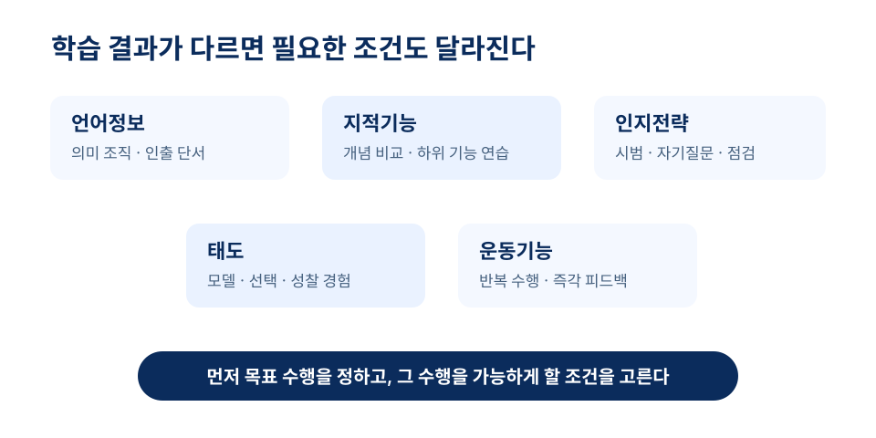
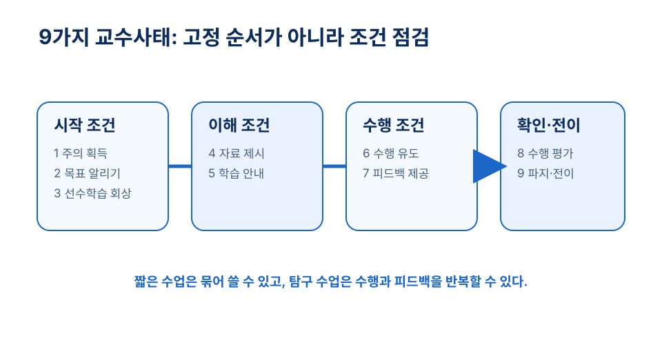

# 4장 수업의 구성과 학습의 조건

## 학습 목표

이 장을 학습한 뒤에는 다음을 설명할 수 있어야 한다.

1. 가녜의 학습 조건 관점에서 학습 결과 유형과 수업 설계의 관계를 설명할 수 있다.
2. 9가지 교수사태를 학습자의 내적 처리를 돕는 외적 조건으로 해석할 수 있다.
3. 학습위계와 내용 계열화가 수업 목표, 선수학습, 연습 활동을 어떻게 연결하는지 설명할 수 있다.
4. 정교화 이론과 개정 블룸 분류표로 단원 수준의 내용 조직과 차시 수준의 목표 진술을 점검할 수 있다.

## 사전 읽기와 학습목표 대응표

1. **짧은 사전 확인 (5분, ch04-precheck)**: 누적 수업안의 목표 하나를 보고 학생이 먼저 할 수 있어야 할 기능 두 가지를 적는다.
2. **핵심 읽기 (25분)**: 1~4절을 읽고 목표의 학습 결과 유형, 필요한 조건, 평가 증거를 연결해 표시한다.
3. **수업안 적용 준비 (10분, ch04-conditions-alignment)**: 한 활동에서 선수학습 회상, 수행 기회, 피드백 중 빠진 조건 하나를 표시하고 보완 문장을 쓴다.

| 학습목표 | 사전 읽기·근거 | 도입 사례·수업 적용 | 형성 평가 |
| --- | --- | --- | --- |
| ch04-o1 결과 유형과 조건 설명 | 1~2절의 학습 결과 유형과 조건 설계[^gagne1992] | 잎의 역할을 설명하는 과학 수업 | 1번: 유형별 지원 점검 |
| ch04-o2 교수사태 해석 | 2절의 외적 사건과 내적 처리 연결[^gagne1992][^niu2020] | 도입 질문과 전이 과제를 넣은 준호의 수업 | 3번: 새 맥락 전이 활동 |
| ch04-o3 위계와 계열화 연결 | 3절의 선수학습·내용 조직 논의[^reigeluth1979][^reigeluth2014] | 삼각형 넓이의 하위 기능 | 2번: 선수학습 근거 |
| ch04-o4 목표 진술 점검 | 4절의 지식·인지과정 차원[^ak2001][^krathwohl2002] | 생태계 설명 목표 | 4~5번: 두 차원과 목표 진술 |

!!! tip "관련 강의 자료"
    이 장과 연계된 슬라이드: [5강 수업의 구성과 절차](https://taehyeonglim.github.io/edtech/chapters/chapter-05/slides/deck.html){target=_blank}

## 도입 사례

**창작 시나리오.** 초등학교 5학년 과학 수업을 맡은 예비교사 준호는 “식물의 잎이 하는 일을 설명한다”라는 차시를 준비했다. 처음에는 영상 한 편과 빈칸 채우기 활동이면 충분하다고 생각했다. 그러나 증산 작용이라는 용어를 기억하는 일과 잎의 구조, 물의 이동, 실험 결과를 연결해 설명하는 일은 다른 학습 결과였다. 준호는 화분이 시드는 사례로 수업을 열고, 지난 시간의 뿌리 역할을 회상하게 했다. 이어 관찰 자료와 짧은 실험 결과를 비교하게 하고, 마지막에는 새 식물 관리 상황에 설명을 적용하게 했다. 이 수업에서 각 활동은 어떤 학습 조건을 마련하는가?

## 1. 수업을 학습 조건으로 보기

수업은 교사가 설명한 시간의 합이 아니다. 학습자가 도달할 수행, 그 수행에 필요한 선수 경험, 이를 가능하게 할 자료와 활동을 맞추는 설계다. “좋은 수업”은 목표, 내용, 학습자, 매체, 평가 조건이 함께 맞물린 상태를 뜻한다.

가녜의 *The Conditions of Learning*은 학습 결과의 종류와 그것을 가능하게 하는 조건을 함께 분석하는 관점을 제시했다.[^gagne1965] 이 관점에서 교사의 첫 질문은 “무엇을 재미있게 보여 줄까?”보다 “학생이 수업 뒤 무엇을 할 수 있어야 하는가?”다.

조건은 교실 환경만 가리키지 않는다. 목표, 선수학습, 자료 제시, 연습 기회, 피드백, 평가, 전이 과제도 모두 설계상의 조건이다. 같은 설명을 하더라도 목표가 사실 기억인지, 개념 구분인지, 원리 적용인지에 따라 필요한 조건은 달라진다.

## 2. 학습 결과와 교수사태를 연결하기

가녜, 브리그스, 웨이저는 학습 결과를 언어정보, 지적기능, 인지전략, 태도, 운동기능으로 구분하는 교수설계 관점을 제시한다.[^gagne1992] 이 분류의 목적은 이름을 외우는 데 있지 않다. 목표 수행에 맞추어 어떤 지원을 마련할지 판단하는 데 있다.

언어정보에는 의미 있는 조직과 인출 단서가 필요하다. 지적기능에는 개념을 변별하고 원리를 적용할 예시와 하위 기능 연습이 필요하다. 인지전략은 교사의 시범, 자기질문, 점검 절차를 통해 더 잘 보인다. 태도에는 모델, 선택, 성찰 경험이 중요하고, 운동기능에는 반복 수행과 즉각적 피드백이 필요하다.

9가지 교수사태는 이 조건을 수업 흐름에서 점검하게 하는 틀이다. 1992년판 *Principles of Instructional Design*과 이를 바탕으로 한 교수학습 자료는 주의, 목표 인식, 선수학습 회상, 자료 제시와 안내, 수행, 피드백, 평가, 파지와 전이를 외적 수업 사건으로 설명한다.[^gagne1992][^niu2020] 각 사태는 학습자의 내적 처리를 돕는다. 따라서 한 차시에서 같은 길이로 모두 넣어야 하는 체크리스트가 아니다.

## 3. 선수학습에서 단원 조직까지

학습위계는 최종 목표를 이루기 위해 먼저 갖추어야 할 하위 기능과 선수 지식을 분석하는 도구다. “삼각형의 넓이를 구한다”는 목표를 생각해 보자. 밑변과 높이를 구분하고, 길이 단위를 이해하며, 곱셈과 나눗셈을 쓸 수 있어야 한다. 한 조건이 빠진 경우 반복되는 오류는 개인의 결핍보다 아직 설계되지 않은 조건의 신호일 수 있다.

다만 모든 내용이 엄격한 한 줄 위계로만 조직되지는 않는다. 절차적 수행은 단계의 순서가 중요하고, 개념 지식은 관계를 비교하는 일이 중요하며, 태도는 경험과 모델의 질이 중요하다. 최종 답만 묻지 말고 하위 기능을 드러내는 짧은 과제와 단계별 피드백을 넣어야 학생이 어디에서 막혔는지 읽을 수 있다.

단원 수준에서는 무엇을 먼저 조망하고 무엇을 나중에 깊게 다룰지도 결정해야 한다. 정교화 이론은 전체를 대표하는 단순한 구조에서 출발해 세부와 복잡성을 더하는 조직 원리를 제시한다.[^reigeluth1979][^reigeluth2014] 그러나 안전 절차나 기초 기능처럼 정확한 단계가 핵심인 내용에는 절차적 계열화가 더 알맞을 수 있다. 이론의 이름보다 내용의 성격을 먼저 본다.

## 4. 관찰 가능한 목표를 쓰기

“이해한다”, “안다”, “익힌다”는 교사의 의도를 넓게 담지만, 학생이 실제로 무엇을 해야 하는지는 보여 주지 못한다. 목표는 설명하기, 분류하기, 적용하기, 분석하기, 평가하기, 설계하기처럼 관찰 가능한 수행으로 나타나야 한다.

블룸과 동료들의 1956년 분류는 교육목표를 체계적으로 살피려는 대표적 시도였다.[^bloom1956] Anderson과 Krathwohl의 개정 분류표는 지식 차원과 인지과정 차원을 구분하는 2차원 틀을 제시한다.[^ak2001] Krathwohl의 개관도 네 지식 범주와 인지과정 차원을 함께 검토한다.[^krathwohl2002]

예를 들어 “분수를 이해한다”보다 “분수의 분자와 분모가 나타내는 관계를 그림과 수식으로 설명한다”가 더 분명하다. 목표가 분석인데 활동은 설명 듣기에 머물고 평가가 용어 암기에 그친다면 조건은 어긋난다. 반대로 사실 기억이 목표인데 과도하게 복잡한 프로젝트를 요구하면 인지적 부담이 목표를 넘어설 수 있다.

## 개념 오해와 적용 한계

- **9가지 교수사태는 모든 차시에 같은 순서와 분량으로 넣어야 한다.** 이 틀은 내적 학습 과정을 돕는 조건을 점검하는 렌즈다. 짧은 수업에서는 압축하고, 탐구에서는 수행과 피드백을 반복할 수 있다.[^gagne1992]
- **학습위계는 모든 내용을 단일한 선행 순서로 환원한다.** 절차적 기능에는 단계 분석이, 개념 비교에는 관계의 동시 제시가, 태도에는 경험과 모델이 더 알맞을 수 있다.
- **정교화 이론은 언제나 최선이다.** 전체 조망과 세부 탐색이 필요한 단원에는 유용하지만, 정확한 순서가 핵심인 내용에는 절차적 계열화를 선택한다.[^reigeluth2014]

## 생각해 보기

1. 최근에 들었거나 직접 해 본 수업에서 강하게 드러난 교수사태와 빠진 교수사태는 무엇인가?
2. “학생은 비례식을 활용하여 실생활 문제를 해결할 수 있다”라는 목표에는 어떤 선수학습이 필요한가?
3. 내가 만든 목표 하나를 지식 차원과 인지과정 차원으로 분류하고, 활동과 평가도 같은 수행을 향하는지 점검해 보자.

## 웹 학습 보조

첫 도식은 학습 결과에 맞는 지원을, 둘째 도식은 9가지 교수사태를 점검할 수업 흐름을 보여 준다. 1~2절을 읽은 뒤 누적 수업안의 한 활동에 적용한다.

*그림 4-1. 목표 수행의 특성에 맞춰 수업 조건을 고른다. 자체 제작.*

*그림 4-2. 9가지 교수사태는 고정 순서가 아니라 조건 점검 틀이다. 자체 제작.*

  
조건 매트릭스

  
학습 결과 유형에 맞는 지원

  

    
<strong>언어정보</strong> 의미 조직, 단서, 인출 기회

    
<strong>지적기능</strong> 개념 변별, 원리 적용, 하위 기능

    
<strong>인지전략</strong> 시범, 자기질문, 점검 절차

    
<strong>태도·운동기능</strong> 모델, 선택 경험, 반복 연습과 피드백

  

  
출처: 이 장 본문과 Gagné 계열 학습 조건 논의를 바탕으로 만든 자체 매트릭스.

  
수업 흐름 점검

  
9가지 교수사태 압축 체크

  <ol class="activity-steps">
    <li>주의, 목표, 선수학습을 도입부에서 확인한다.</li>
    <li>자료, 안내, 수행, 피드백이 목표 수행으로 이어지는지 본다.</li>
    <li>평가 뒤 파지와 전이를 위한 변형 과제를 남긴다.</li>
  </ol>
  
출처: 이 장의 9가지 교수사태 절을 바탕으로 만든 자체 활동.

### 누적 수업안 조건 점검 활동

앞 장에서 만든 목표–증거–활동 행을 가져온다. (1) 목표의 학습 결과 유형과 지식·인지과정 차원을 표시하고, (2) 필요한 선수학습 또는 하위 기능 두 가지를 쓴다. (3) 그중 하나를 확인할 도입 질문을 넣고, (4) 수행 뒤 제공할 피드백 문장을 쓴다. (5) 마지막으로 같은 수행을 다른 맥락에서 확인할 전이 과제를 한 줄로 추가한다.

## 이론과 연구 확장

### 학습 결과 유형은 수업 지원의 종류를 바꾼다

가녜 계열 교수설계는 학습 결과를 언어정보, 지적기능, 인지전략, 태도, 운동기능으로 구분하고 각 결과에 맞는 조건을 설계하도록 한다.[^gagne1992] 역사 용어 기억에는 의미 조직과 인출 연습이, 민주적 의사결정 원리 적용에는 사례 비교와 판단 근거 제시가 더 필요할 수 있다.

### 9가지 교수사태는 내적 처리를 돕는 외적 사건이다

9가지 교수사태는 정해진 양식의 칸이 아니라 주의, 목표 인식, 선수학습 회상, 자료 지각, 의미화, 수행, 피드백, 평가, 전이의 조건을 점검하는 렌즈다.[^gagne1992] Northern Illinois University의 교수학습 자료도 이 틀을 수업 설계 안내로 소개한다.[^niu2020]

### 정교화는 단원의 큰 그림과 세부를 오가게 한다

정교화 이론은 내용을 단순한 전체 조망에서 더 복잡한 세부로 확장하는 조직 원리를 제안한다.[^reigeluth1979] Reigeluth와 Aslan의 설명처럼 이 관점은 교수 내용을 조직하고 계열화하는 데 쓰인다.[^reigeluth2014] 단, 내용의 성격에 따라 다른 계열화 원리가 더 적절할 수 있다.

### 분류표는 목표의 내용과 수행을 함께 묻는다

개정 블룸 분류표는 목표가 어떤 지식 차원과 인지과정 차원을 요구하는지 점검하게 한다.[^ak2001] 그 바탕이 된 교육목표 분류 전통은 Bloom과 동료들의 저작에서 확인할 수 있고,[^bloom1956] Krathwohl은 개정 분류표의 지식·인지과정 두 차원을 개관한다.[^krathwohl2002]

## 토론 질문

1. 같은 주제라도 언어정보 목표와 지적기능 목표로 가르칠 때 활동과 평가는 어떻게 달라져야 하는가?
2. 실제 학교 수업에서 가장 자주 생략되기 쉬운 교수사태는 무엇이며, 그 결과는 무엇인가?
3. 학습위계 분석은 학생의 오류를 읽는 방식을 어떻게 바꿀 수 있는가?
4. 개정 블룸 분류표를 동사 목록 베끼기가 아닌 목표 작성 도구로 쓰려면 무엇을 확인해야 하는가?

## 형성 평가

1. **학습 결과 유형별 지원 점검 (ch04-fa-1).** 가녜의 학습 결과 유형 다섯 가지를 쓰고, 각각에 맞는 수업 지원을 하나씩 제시하시오.
   **예시 답안**: 언어정보–의미 조직, 지적기능–개념 변별 연습, 인지전략–자기질문 시범, 태도–모델과 성찰, 운동기능–반복 연습과 즉각 피드백.
   **채점 기준**: 다섯 유형을 모두 포함하고 지원 방식이 유형의 특성과 맞으면 적절하다.

2. **선수학습 확인 (ch04-fa-2).** “학생은 삼각형의 넓이를 구할 수 있다”라는 목표의 선수학습으로 가장 적절한 것은 무엇인가?
   ① 밑변과 높이 구분, 길이 단위 이해, 곱셈과 나눗셈 사용 ② 삼각형의 역사 암기 ③ 활동지 색칠 ④ 최종 답만 암기
   **정답**: ①
   **해설**: 학습위계 분석은 최종 수행에 필요한 하위 기능을 드러낸다.

3. **새 맥락 전이 활동 (ch04-fa-3).** “파지와 전이 향상”에 가장 알맞은 활동은 무엇인가?
   ① 같은 정의를 한 번 더 읽는다. ② 배운 비례식을 다른 생활 장면의 할인율 문제에 적용한다. ③ 교사가 답을 말한다. ④ 수업 목표를 다시 받아쓴다.
   **정답**: ②
   **해설**: 전이 활동은 같은 지식을 새 맥락에서 사용하게 한다.

4. **목표의 두 차원 점검 (ch04-fa-4).** 개정 블룸 분류표에서 지식 차원과 인지과정 차원을 함께 보는 이유는 무엇인가?
   ① 목표 문장을 길게 만들기 위해 ② 같은 내용도 요구 수행이 달라질 수 있어서 ③ 모든 목표를 창조 수준으로 바꾸기 위해 ④ 평가를 생략하기 위해
   **정답**: ②
   **해설**: 목표는 내용뿐 아니라 학생이 그 내용으로 무엇을 할지도 밝혀야 한다.

5. **관찰 가능한 목표 진술 (ch04-fa-5).** “학생은 생태계를 이해한다”를 더 관찰 가능하게 고쳐 쓰시오.
   **예시 답안**: 학생은 먹이사슬 그림을 보고 생산자, 소비자, 분해자의 관계를 설명할 수 있다.  
   **루브릭**: 핵심 개념, 관찰 가능한 동사, 수행 조건이 포함되면 우수하다.

## 요약

가녜의 학습 조건 관점은 학습 결과 유형에 따라 필요한 교수 조건이 달라진다는 점을 강조한다. 9가지 교수사태는 학습자의 내적 과정을 돕는 외적 수업 사건이고, 학습위계는 목표 성취에 필요한 선수학습과 하위 기능을 드러낸다. 정교화 이론은 단원 수준의 내용 조직을, 개정 블룸 분류표는 차시 수준의 목표·활동·평가 정렬을 점검하게 한다.

## 핵심 용어

- **학습 조건**: 특정 학습 결과가 일어나도록 목표, 선수학습, 자료, 연습, 피드백, 평가를 배열한 설계 조건.
- **학습 결과 유형**: 언어정보, 지적기능, 인지전략, 태도, 운동기능처럼 서로 다른 수행 특성을 지닌 학습 성과 범주.
- **9가지 교수사태**: 주의 획득에서 파지와 전이 향상까지 학습자의 내적 과정을 돕기 위한 외적 수업 사건.
- **학습위계**: 최종 목표 수행에 필요한 하위 기능과 선수학습을 분석한 구조.
- **정교화 이론**: 단원이나 교과 내용을 전체 조망에서 세부 탐색으로 점차 확장하도록 조직하는 계열화 이론.

## 참고문헌

[^gagne1965]: Gagné, R. M. (1965). *The Conditions of Learning*. Holt, Rinehart and Winston. `https://books.google.com.bh/books?id=EhGdAAAAMAAJ`

[^gagne1992]: Gagné, R. M., Briggs, L. J., & Wager, W. W. (1992). *Principles of Instructional Design* (4th ed.). Harcourt Brace Jovanovich College Publishers. `https://books.google.com/books/about/Principles_of_Instructional_Design.html?id=LH3uAAAAMAAJ`

[^niu2020]: Northern Illinois University Center for Innovative Teaching and Learning. (2020). *Gagné's Nine Events of Instruction*. `https://www.niu.edu/citl/resources/guides/instructional-guide/gagnes-nine-events-of-instruction.shtml`.

[^reigeluth1979]: Reigeluth, C. M. (1979). In search of a better way to organize instruction: The elaboration theory. *Journal of Instructional Development, 2*, 8-15. `https://doi.org/10.1007/BF02984374`.

[^reigeluth2014]: Reigeluth, C. M., & Aslan, S. (2014). Elaboration theory: A theory to organize and sequence instructional content. In J. M. Spector (Ed.), *Encyclopedia of Educational Technology*. Sage Publications. `https://www.reigeluth.net/_files/ugd/4d4aa4_d7a333f8c2014bc0b30e85026775f95a.pdf`

[^bloom1956]: Bloom, B. S., Engelhart, M. D., Furst, E. J., Hill, W. H., & Krathwohl, D. R. (1956). *Taxonomy of Educational Objectives: The Classification of Educational Goals. Handbook I: Cognitive Domain*. David McKay Co., Inc. `https://teaching.charlotte.edu/services-programs/teaching-guides/course-design/blooms-educational-objectives/`

[^ak2001]: Anderson, L. W., & Krathwohl, D. R. (2001). *A Taxonomy for Learning, Teaching, and Assessing: A Revision of Bloom's Taxonomy of Educational Objectives*. Longman. `https://books.google.com/books/about/A_Taxonomy_for_Learning_Teaching_and_Ass.html?id=EMQlAQAAIAAJ`

[^krathwohl2002]: Krathwohl, D. R. (2002). A revision of Bloom's taxonomy: An overview. *Theory into Practice, 41*(4), 212-218. `https://eric.ed.gov/?id=EJ667155`
