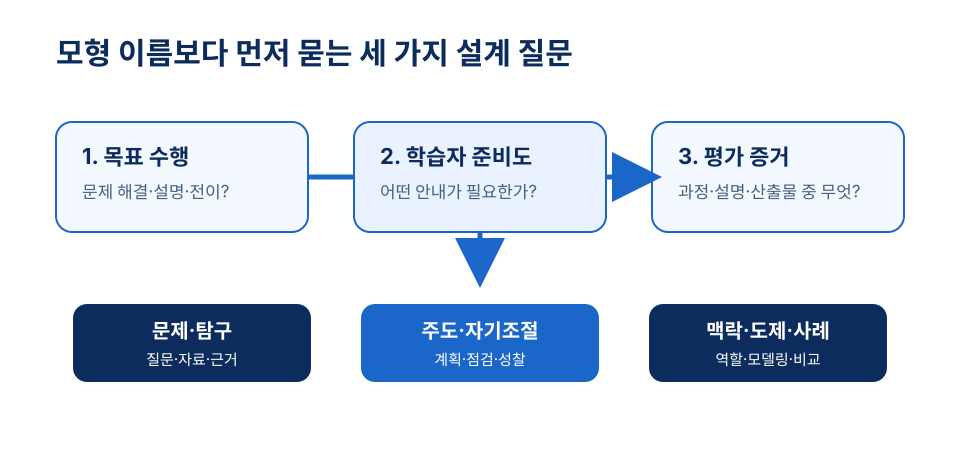
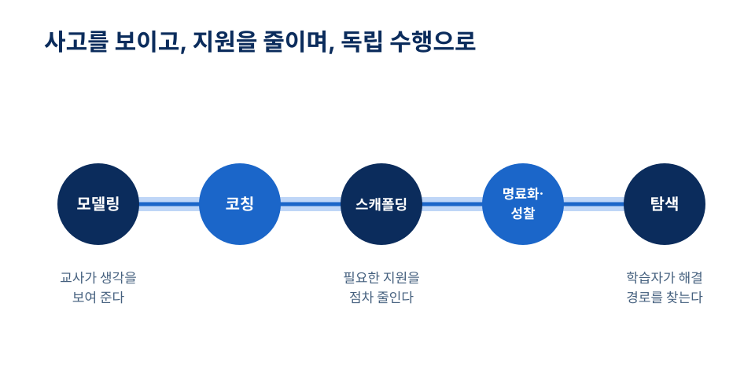

# 5장 교수이론과 수업모형

## 학습 목표

이 장을 학습한 뒤에는 다음을 설명할 수 있어야 한다.

1. 문제기반학습과 탐구학습이 공통으로 요구하는 문제, 질문, 자료, 안내의 조건을 설명할 수 있다.
2. 자기주도학습과 자기조절학습을 구분하고, 두 관점이 수업 설계에서 어떻게 만나는지 말할 수 있다.
3. 정착수업과 목표기반시나리오가 맥락과 목표로 학습 활동을 조직하는 방식을 설명할 수 있다.
4. 인지적 도제와 인지적 융통성 이론을 활용해 복잡한 사고에 필요한 지원과 사례 배치를 점검할 수 있다.

## 사전 읽기와 학습목표 대응표

처음에는 핵심 설명과 도입 사례를 읽고, 다음 읽기에서 풀이 사례·연구 확장·형성 평가를 다룬다. 아래 사전 읽기 시간은 첫 읽기를 위한 권장 시간이며 전체 독립 학습 시간은 아니다.

사전 읽기는 약 45분으로 계획한다. 이 장은 텍스트 읽기와 기록을 중심으로 학습하며, 별도의 영상이나 외부 자료를 전제하지 않는다.

| 학습 목표 | 어디서 배우는가 | 무엇으로 확인하는가 |
| --- | --- | --- |
| 1. 문제기반학습과 탐구학습의 공통 조건을 설명한다 | 2절[^hmelo2004][^nrc2000][^barrows1980][^bruner1961] | 형성 평가 1번 |
| 2. 자기주도학습과 자기조절학습을 구분한다 | 3절[^knowles1975][^zimmerman2002] | 형성 평가 2번 |
| 3. 정착수업과 목표기반시나리오의 조직 방식을 설명한다 | 4절[^ctgv1990][^schank1992] | 형성 평가 3번 |
| 4. 인지적 도제와 인지적 융통성으로 지원과 사례 배치를 점검한다 | 5~6절[^collins1989][^collins1991][^spiro1988] | 형성 평가 4번, 5번 |

<!-- alignment-map (편집용, 화면 비노출)
objectives: ch05-o1, ch05-o2, ch05-o3, ch05-o4
activity_ids: ch05-precheck, ch05-model-selection
assessment_ids: ch05-fa-1, ch05-fa-2, ch05-fa-3, ch05-fa-4, ch05-fa-5
source_ids: hmelo2007, barrows1980, hmelo2004, nrc2000, bruner1961, knowles1975, zimmerman2002, ctgv1990, schank1992, collins1989, collins1991, spiro1988
-->

- **읽기 전(5분)**: 누적 수업안의 목표에 가장 덜 맞는 모형 하나를 고르고 근거를 쓴다.
- **읽은 뒤(10분)**: 목표에 맞는 모형을 잠정 선택하고, 필요한 안내와 평가 증거를 각각 한 문장으로 쓴다.

## 도입 사례

**창작 시나리오.** 초등학교 사회 수업을 준비하는 예비교사 서연은 “지역의 교통 약자를 위한 이동권 개선 방안을 제안한다”라는 프로젝트를 구상했다. 처음에는 문제기반학습이라고 이름 붙였지만, 학생들이 무엇을 조사할지, 자료의 신뢰성을 어떻게 판단할지, 중간 피드백을 언제 받을지가 보이지 않았다. 서연은 문제를 더 좁히고, 버스 정류장 접근성 지도와 인터뷰 질문 예시, 정책 제안서 루브릭을 제공했다. 모둠 역할과 자기조절 점검표도 넣었다. 이 수업은 문제기반학습, 탐구, 인지적 도제 중 무엇을 어떻게 조합한 것일까?

## 1. 수업모형을 읽는 세 가지 질문

교수이론과 수업모형은 수업을 대신 설계해 주는 처방전이 아니다. 문제기반학습, 탐구학습, 자기주도학습, 자기조절학습, 정착수업, 목표기반시나리오, 인지적 도제, 인지적 융통성은 모두 학습자가 무엇을 하면서 배우는지에 다른 초점을 둔다.

모형 이름을 외우기보다 세 가지를 묻는다. 첫째, 목표가 요구하는 수행은 무엇인가? 둘째, 학습자가 막힐 때 어떤 안내가 필요한가? 셋째, 과정과 산출물 중 무엇으로 학습을 확인할 것인가? 같은 구성주의 계열의 모형이라도 문제의 구조, 교사의 역할, 학습자 자율성, 평가 증거는 다르게 설계된다.

<figure class="chapter-visual">
  
  <figcaption>수업모형 선택은 이름 맞히기가 아니라 목표 수행과 필요한 안내, 평가 증거를 함께 판단하는 일이다.시각자료: OpenAI GPT Image로 생성 · 2026</figcaption>
</figure>

## 2. 문제와 탐구를 중심에 두는 수업

문제기반학습(problem-based learning, PBL)은 학습자가 복잡한 문제를 만나 무엇을 더 알아야 할지 찾고, 필요한 지식을 학습한 뒤 다시 문제에 적용하고 성찰하도록 조직한다. Barrows와 Tamblyn은 의학교육 맥락에서 문제 해결을 통해 이후에 쓸 지식과 임상적 문제 해결 능력을 기르려는 접근을 제시했다.[^barrows1980] Hmelo-Silver는 하나의 정답으로 닫히지 않은 문제, 협력적 학습 필요 확인, 자기주도학습, 적용과 성찰을 문제기반학습의 핵심으로 설명한다.[^hmelo2004]

따라서 문제는 공식을 대입하는 연습문제와 다르다. 학생이 상황을 해석하고, 모르는 것을 드러내고, 필요한 자료를 찾게 해야 한다. 교사는 정답을 빠르게 알려 주기보다 문제를 명료화하고 자료 탐색과 토의를 조정한다.[^hmelo2004] 평가는 최종 답안만이 아니라 문제 정의, 자료 선택, 근거 사용, 협력 과정, 성찰을 함께 볼 수 있다.

탐구학습은 질문을 만들고 자료를 수집하거나 분석하며 근거에 비추어 설명을 구성하는 과정을 중시한다. National Research Council은 탐구를 자연 세계를 연구하는 방식이자 학생이 과학 지식과 지식 산출 방법을 이해하는 방식으로 설명한다.[^nrc2000] 질문이 너무 넓으면 학습자는 길을 잃고, 자료가 너무 빈약하면 설명은 추측이 된다. 반대로 절차가 지나치게 촘촘하면 탐구는 지시 수행이 된다.

Bruner의 발견 학습 논의는 교육에서 발견의 가능성을 다룬 고전으로 자주 언급된다.[^bruner1961] 그러나 교실 설계에서는 발견 자체보다 질문의 폭, 자료의 신뢰성, 중간 점검, 설명의 근거 기준을 함께 마련해야 한다.

### 문제기반학습과 프로젝트의 구별

문제기반학습은 처음 만난 문제에서 학습할 필요를 찾고 새 지식을 적용하는 순환이 중심이다.[^hmelo2004] 프로젝트는 일정 기간 산출물을 계획·제작하는 조직 방식으로 사용할 수 있다. 두 접근은 함께 나타날 수 있지만 발표물을 만들었다는 이유만으로 문제기반학습이 되지는 않는다. 이 장의 이동권 사례에서는 먼저 접근이 어려운 이유를 조사할 학습 필요를 찾는지, 만든 제안서를 근거에 따라 수정하는지를 확인한다.

초등 수업에서는 문제 상황을 제시한 뒤 ‘이미 아는 것’과 ‘더 알아야 할 것’을 분리해 쓰게 한다. 학생들이 필요한 자료를 찾거나 읽고 잠정 해결안을 만들면, 교사는 조건이 다른 반례를 제시한다. 학생은 해결안을 수정하고 다음에도 사용할 조사 방법을 정리한다. 각 단계의 산출물은 질문 목록, 근거 기록, 수정된 제안, 성찰이다. 산출물은 본 교재가 제안하는 설계 예시이며 모형의 고정 서식은 아니다.

## 3. 자기주도성과 자기조절을 기르는 수업

자기주도학습은 학습자가 목표, 자원, 활동, 평가를 일정 정도 스스로 계획하고 실행하는 일과 관련된다. Knowles는 학습 계약, 자기평가, 목표 진술, 자원 활용 같은 절차를 다룬다.[^knowles1975] 이 관점에서 교사는 모든 내용을 전달하는 사람이라기보다, 학생이 계획을 세우고 자원을 찾고 결과를 점검하도록 돕는 촉진자다.

하지만 자기주도학습은 학생에게 모든 책임을 넘기는 방식이 아니다. 목표를 세운 경험이 부족하거나 자료의 질을 판단할 기준이 없으면 자율성은 방임이 된다. 목표 선택지를 제공하고, 자료의 범위를 정하고, 중간 산출물과 자기평가 기준을 마련해야 안내된 자율성이 된다.

자기조절학습은 목표 달성을 위해 인지, 동기, 행동을 조절하는 과정에 더 초점을 둔다. Zimmerman은 목표 설정, 전략 사용, 자기점검, 피드백 반영처럼 학습 과정 안에서 일어나는 조절을 세밀하게 본다.[^zimmerman2002] 프로젝트 주제 선택은 자기주도성의 장치가 될 수 있지만, 일정표·초안 점검·피드백 반영은 자기조절을 위한 장치다. 둘은 함께 설계될 때 실제 학습으로 이어진다.

## 4. 시나리오와 맥락으로 지식을 묶는 수업

정착수업은 학습을 풍부한 맥락에 정착시키려는 접근이다. Cognition and Technology Group at Vanderbilt는 비디오디스크 기반 문제 해결 환경에 수업을 정착시키는 방식을 설명하며 상황인지 관점과 연결한다.[^ctgv1990] 여기서 앵커는 흥미로운 영상이나 이야기의 배경이 아니다. 학생이 질문을 만들고 자료를 분석하며 해결안을 비교할 때 계속 참조할 공통의 사례와 문제 상황이다.

예를 들어 지역 축제 예산과 동선 자료를 앵커로 쓰면 학생은 비율, 거리, 비용, 제약 조건을 함께 검토할 수 있다. 앵커가 너무 얇으면 학생은 다시 교사의 설명에만 의존한다. 너무 복잡하면 핵심 목표가 흐려진다. 맥락의 정보와 제약이 학습 활동과 평가에 계속 연결되어야 한다.

목표기반시나리오는 학습자가 의미 있는 목표와 역할을 수행하며 필요한 지식과 기능을 배우도록 조직한다. Schank의 기술보고서는 잘 정의된 목표를 추구하는 과정에서 필요한 기능과 사례를 배우도록 하는 구조를 설명한다.[^schank1992] 역할극만으로는 충분하지 않다. 역할, 의사결정 지점, 피드백, 최종 산출물이 목표와 맞아야 한다.

## 5. 전문가의 사고를 보이게 하는 수업

인지적 도제는 전통적 도제의 장점을 읽기, 쓰기, 수학 문제 해결 같은 인지적 과제에 맞게 재구성하려는 접근이다. Collins, Brown, Newman은 학교 지식이 실제 사용 맥락에서 분리되면 학생이 전문가의 사고 과정을 보기 어렵다는 문제에서 출발한다.[^collins1989]

Collins, Brown, Holum은 인지적 도제의 방법 요소로 모델링, 코칭, 스캐폴딩, 명료화, 성찰, 탐색을 정리한다.[^collins1991] 모델링은 정답 과정만 보여 주는 일이 아니다. 문제를 읽고 무엇을 먼저 볼지, 어떤 단서를 의심할지, 어떤 전략을 버릴지까지 드러낸다. 코칭과 스캐폴딩은 학생 수행을 돕되 지원을 점차 줄인다.

명료화와 성찰에서는 학생이 자신의 풀이 이유를 말하고 다른 풀이와 비교한다. 탐색에서는 지원이 줄어든 뒤 학생이 스스로 문제를 설정하거나 해결 경로를 찾는다. 따라서 인지적 도제는 “시범 뒤 따라 하기”에서 끝나지 않는다.

## 6. 복잡한 지식을 여러 사례로 다루는 수업

인지적 융통성 이론은 복잡하고 비구조화된 지식 영역에서 단순한 설명만으로는 전이가 어렵다는 문제의식에서 출발한다. Spiro와 동료들은 고급 지식 습득, 여러 표상, 지식 요소 사이의 다양한 연결, 적용 사례의 중요성을 강조한다.[^spiro1988]

역사적 사건 해석, 문학 작품 분석, 윤리적 판단, 복잡한 과학 개념처럼 하나의 원리가 항상 같은 방식으로 적용되지 않는 영역에서는 여러 사례가 필요하다. 한 사례만 깊이 다루면 학생은 표면 특징을 일반 원리로 오해할 수 있다. 반대로 사례를 많이 나열하면 연결이 약해진다.

교사는 서로 다른 사례를 비교하게 하고, 같은 개념이 어떤 조건에서 다르게 나타나는지 묻고, 학생이 설명을 수정하도록 해야 한다. 디지털 자료는 여러 경로의 탐색을 지원할 수 있지만, 기술 자체가 인지적 융통성을 보장하지는 않는다.

### 모형을 구별하는 비교 기준

아래 표는 앞 절의 문헌을 바탕으로 각 접근에서 특히 살필 조건을 정리한 것이다. 일부는 학습 과정에 대한 이론이고 일부는 교수 절차를 조직하는 모형이므로, 모두를 같은 단계 목록으로 환원하지 않는다.[^hmelo2004][^zimmerman2002][^ctgv1990][^schank1992][^collins1991][^spiro1988]

| 접근 | 중심이 되는 학습 과업 | 교사가 마련할 지원 | 확인할 증거 |
| --- | --- | --- | --- |
| 문제기반학습 | 문제에서 학습 필요를 찾고 해결안을 고친다. | 자료 접근과 문제 명료화 질문 | 학습 필요·근거·수정의 연결 |
| 탐구학습 | 질문에 답할 증거를 만들고 설명한다. | 조사 가능한 질문과 증거 기준 | 증거와 설명의 일치 |
| 자기주도학습 | 학습 목표·자원·평가에 관한 결정을 맡는다. | 선택 범위와 자원 탐색 안내 | 계획의 이유와 실행 후 재판단 |
| 자기조절학습 | 과제 수행 중 전략·동기·행동을 조절한다. | 자기점검과 피드백 활용 기회 | 오류 진단과 전략 변경 |
| 정착수업 | 풍부한 공통 맥락을 참조해 문제를 해결한다. | 재탐색할 정보와 제약이 있는 앵커 | 맥락 자료를 사용한 해결 |
| 목표기반시나리오 | 역할과 임무를 수행하며 기능을 익힌다. | 의사결정 결과에 관한 피드백 | 임무 속 기능 사용과 선택 이유 |
| 인지적 도제 | 전문가의 사고를 보고 설명하며 독립한다. | 모델링·코칭·점진적 지원 감소 | 사고의 명료화와 독립 수행 |
| 인지적 융통성 | 복잡한 지식을 여러 사례에서 재구성한다. | 다중 관점과 사례 간 비교 | 조건 변화에 따른 설명 수정 |

### 풀이가 있는 사례: 안전한 통학로 제안

**창작 시나리오.** 초등 사회에서 두 통학로 중 안전한 길을 제안한다. 교사는 지도와 횡단보도 위치, 보도 폭에 관한 가상 자료를 제공한다. 학생들은 처음에는 “가까운 길”을 고른다. 문제기반학습의 관점에서 교사는 안전을 판단하려면 무엇을 더 알아야 할지 묻는다. 학생들은 횡단 횟수와 시야 조건이 필요하다고 정하고 자료를 다시 읽는다. 인지적 도제의 모델링으로 교사는 “짧지만 시야가 가린 이 구간을 다시 보겠다”는 사고를 말한다. 이후 다른 경로는 학생이 비교하고 교사는 필요한 때만 질문한다.

완성된 지도에는 경로뿐 아니라 선택한 근거와 기각한 대안을 남긴다. 자기조절 점검으로 ‘처음 판단에서 무엇을 고쳤는가’를 쓰게 한다. 여기서 지도 제작은 산출물이고, 자료를 읽어 판단을 수정하는 과정이 핵심 학습이다. 색칠을 잘한 학생이 아니라 제약 조건을 설명하는 학생이 목표 수행을 보인다.

조건을 바꿔 학생들이 범례를 읽지 못한다면 개방적인 조사만으로 진행하기 어렵다. 짧은 범례 읽기와 교사의 사고 시범을 먼저 제공한다. 반대로 자료 해석이 익숙하다면 공사 구간이 생겼다는 조건을 추가해 기존 선택을 재검토하게 한다. 어려운 사례를 추가하는 목적은 단순 분량 증가가 아니라 같은 기준을 새 조건에 재구성하는 데 있다.

### 안내를 줄일 때 확인할 수행

지원 감소는 시간이 지났다는 이유로 결정하지 않는다. 학생이 질문을 명료화하고 근거를 선택하며 설명의 빈틈을 찾을 수 있는지 본다. 모델링 뒤 바로 독립 과제로 보내기보다, 일부 판단을 학생에게 넘긴 뒤 필요할 때 피드백한다. 문제기반·탐구학습을 최소 안내와 동일시해서는 안 된다는 논의도 이런 지원의 역할을 강조한다.[^hmelo2007]

## 7. 수업모형을 조합하고 선택하기

이 장의 모형들은 서로 배타적이지 않다. 문제기반학습 안에 자기주도성과 자기조절 장치를 넣을 수 있고, 정착수업에 인지적 도제나 목표기반시나리오를 결합할 수 있다. 탐구 수업에서도 교사는 모델링과 스캐폴딩을 제공할 수 있다.

선택 기준은 모형의 유행이 아니다. 사실 기억이 핵심인 짧은 수업에는 복잡한 시나리오가 비효율적일 수 있다. 반대로 실제 문제 해결, 설명 구성, 판단, 전이가 목표라면 문제, 탐구, 맥락, 사례 비교가 필요할 수 있다. 목표, 학습자 준비도, 시간과 자료, 평가 증거를 함께 보고 필요한 설계 요소만 조합한다.

## 개념 오해와 적용 한계

- **문제기반학습과 탐구학습은 학생에게 맡겨 둘수록 좋다.** 질문, 자료, 중간 점검, 평가 기준이 없으면 학습이 아니라 방임이 된다.[^hmelo2004][^nrc2000]
- **자기주도성은 지원이 적을수록 높다.** 목표 설정·자료 판단·시간 관리의 준비도에 맞는 안내가 있어야 자율성이 학습으로 이어진다.[^knowles1975][^zimmerman2002]
- **흥미로운 역할극이나 사례만 있으면 맥락 수업이 된다.** 앵커·역할·의사결정·산출물·평가는 목표에 연결되어야 하며, 도제의 시범은 점진적 독립으로 이어져야 한다.[^ctgv1990][^collins1991]
- **여러 사례를 많이 보여 주면 전이가 생긴다.** 사례 사이의 조건과 차이를 비교하고 설명을 수정할 기회가 필요하다.[^spiro1988]

## 생각해 보기

1. 내가 설계할 수업 목표 하나에 가장 적절한 모형과 덜 적절한 모형을 각각 고르고 이유를 설명해 보자.
2. 문제기반학습이나 탐구학습에서 학습자에게 제공해야 할 최소한의 안내는 무엇인가?
3. 한 개념을 여러 사례로 가르칠 주제를 찾고, 사례 사이의 차이를 묻는 질문을 세 개 만들어 보자.

## 웹 학습 보조

다음 도식은 1절의 모형 선택 질문과 5절의 인지적 도제 지원 감소를 시각화한다. 누적 수업안에서 모형을 선택한 뒤, 필요한 안내가 줄어드는 경로를 표시해 본다.

*그림 5-1. 수업모형은 세 가지 설계 질문을 거쳐 선택한다. 자체 제작.*

*그림 5-2. 인지적 도제는 안내된 수행에서 독립 수행으로 이동한다. 자체 제작.*

  
모형 선택 지도

  
수업모형을 목표와 조건에 맞추기

  

    
<strong>문제·탐구</strong>문제 정의, 자료 탐색, 근거 있는 설명이 핵심일 때

    
<strong>자기주도·자기조절</strong>계획, 전략, 점검, 성찰을 학습 목표로 삼을 때

    
<strong>맥락·도제·사례</strong>전문가 사고, 역할, 복잡한 사례 비교가 필요할 때

  

  
출처: 이 장의 교수이론과 수업모형 비교를 바탕으로 만든 자체 도식.

  
모형 적용 활동

  
모형 이름보다 설계 조건 쓰기

  <ol class="activity-steps">
    <li>목표 수행이 문제 해결, 탐구, 설명, 절차 숙달 중 어디에 가까운지 표시한다.</li>
    <li>학습자가 스스로 해야 할 일과 교사가 안내해야 할 일을 나눈다.</li>
    <li>평가가 산출물, 과정 기록, 설명, 성찰 중 무엇을 볼지 정한다.</li>
  </ol>
  
출처: 이 장의 모형 선택 원리를 바탕으로 만든 자체 활동.

### 누적 수업안 모형 선택 활동

앞 장에서 보완한 누적 수업안을 검토한다. (1) 목표 수행에 가장 맞는 모형 하나와 덜 맞는 모형 하나를 고르고 근거를 쓴다. (2) 학생이 스스로 할 일과 교사가 제공할 안내를 나눈다. (3) 자료·사례·역할·시범 중 목표에 꼭 필요한 요소만 남긴다. (4) 과정 기록, 설명, 산출물, 성찰 중 평가 증거를 고르고 목표와 연결한다. (5) 짝이 모형 이름을 가린 채 설계안을 읽고 선택 근거가 설득력 있는지 피드백한다.

## 이론과 연구 확장

### 탐구와 최소 안내는 같은 조건이 아니다

Hmelo-Silver와 동료들은 문제기반·탐구학습에 포함된 스캐폴딩을 강조하며 이를 최소 안내 학습으로 묶는 해석을 비판했다.[^hmelo2007] 이 논쟁을 읽을 때는 모형 명칭보다 실제 제공한 자료, 교사 개입, 학습자 사전 지식, 평가 과제를 비교한다. 논쟁 논문 자체는 특정 초등 학급에서 어떤 모형이 우수하다는 직접 실험 결과가 아니다.

### 자기주도성과 자기조절은 역할이 다르지만 함께 필요하다

Knowles의 자기주도학습 논의는 학습자가 목표, 자원, 활동, 평가에 참여하는 절차를 강조한다.[^knowles1975] Zimmerman의 자기조절학습 논의는 목표 설정, 전략 사용, 자기점검, 피드백 반영처럼 학습 과정의 조절을 더 세밀하게 본다.[^zimmerman2002]

### 맥락과 역할은 지식 사용의 이유를 만든다

정착수업은 학습을 풍부한 문제 맥락에 정착시켜 학생들이 자료와 상황을 함께 참조하도록 한다.[^ctgv1990] 목표기반시나리오는 학습자가 의미 있는 목표와 역할을 수행하면서 필요한 지식과 기능을 배우도록 조직한다.[^schank1992]

### 전문가 사고와 복잡한 사례는 전이를 준비한다

인지적 도제는 모델링, 코칭, 스캐폴딩, 명료화, 성찰, 탐색을 통해 전문가 사고를 드러내고 학습자가 점차 독립하도록 돕는다.[^collins1991] 인지적 융통성 이론은 복잡하고 비구조화된 지식 영역에서 여러 사례와 표상을 오가며 지식을 재구성해야 함을 강조한다.[^spiro1988]

## 토론 질문

1. 문제기반학습의 “좋은 문제”와 단순히 긴 서술형 문제는 무엇이 다른가?
2. 자기주도학습을 방임으로 만들지 않기 위해 교사는 어떤 최소 지원을 제공해야 하는가?
3. 정착수업이나 목표기반시나리오에서 흥미로운 맥락이 학습 목표를 가리지 않게 하려면 무엇이 필요한가?
4. 인지적 도제에서 교사의 사고 과정을 드러내는 일은 어떤 도움과 위험을 함께 가질 수 있는가?

## 형성 평가

먼저 답을 작성한 뒤 해설을 펼쳐 비교한다. 서술형은 예시 문장과의 일치보다 판단 근거를 확인한다.

1. **문제에서 학습 필요 찾기.** 안전한 통학로 수업을 문제기반학습으로 설계하시오. 학습 필요, 자료, 교사 안내, 수정된 산출물을 포함하시오.

    ??? question "예시 답안과 채점 기준"

        **예시 답안**: 학생이 거리만으로 선택한 이유를 확인하고 시야·횡단 조건의 학습 필요를 찾게 한다. 가상 지도를 읽는 시범과 질문을 제공하고 근거에 따라 고친 경로 제안서를 받는다.

        **부분 답안**: “통학로 포스터를 만든다”는 답은 학습 필요와 새 지식의 적용이 보이지 않는다.

        **채점 기준**: 충분: 문제·학습 필요·자료·안내·수정을 연결한다. 부분: 문제와 산출물만 연결한다. 보완: 제작 활동만 제시한다.

2. **주도성과 조절.** 주제는 교사가 정했지만 학생이 계획한 전략의 실패를 점검하고 바꿨다. 적절한 해석은?

    ① 주제를 못 골랐으므로 자기조절도 없다. 
    ② 학습 운영의 주도권과 별개로 수행 과정의 자기조절이 나타났다. 
    ③ 전략을 바꿨으므로 모든 교육과정 결정을 학생이 맡았다. 
    ④ 피드백을 받았으므로 자기조절이 사라졌다. 

    ??? question "정답과 오답 해설"

        **정답**: ②

        **해설**: ②는 결정의 주도권과 과정 조절을 구별한다. ①·③은 둘을 같은 것으로 보고, ④는 외부 피드백을 활용하는 자기조절을 놓친다.

3. **앵커와 시나리오.** 정착수업과 목표기반시나리오를 구별하는 설명으로 적절한 것은?

    ① 두 접근 모두 맥락은 도입에서만 보고 이후에는 사용하지 않는다. 
    ② 역할에 직업 이름을 붙이면 목표기반시나리오의 학습 설계가 완성된다. 
    ③ 정착수업은 공통 맥락의 정보·제약을, 목표기반시나리오는 임무·역할과 필요한 기능의 수행을 연결한다. 
    ④ 두 접근 모두 학습자의 판단을 미리 완성해 제공하는 것이 핵심이다. 

    ??? question "정답과 오답 해설"

        **정답**: ③

        **해설**: ③은 두 접근의 조직 초점을 구별한다. ①은 맥락을 배경 장식으로 축소하고, ②는 임무·기능·피드백을 빠뜨리며, ④는 학습자의 문제 해결 기회를 없앤다.

4. **인지적 도제의 지원 감소.** 통학로 비교에서 모델링·코칭·성찰을 어떻게 사용하고 언제 지원을 줄일지 쓰시오.

    ??? question "예시 답안과 채점 기준"

        **예시 답안**: 교사는 시야와 횡단 조건을 비교하는 사고를 말한다. 학생의 근거가 빠질 때 질문으로 코칭하고 서로의 판단을 비교하게 한다. 새 경로를 스스로 근거로 판단하면 질문 수를 줄인다.

        **부분 답안**: “교사가 시범을 보이고 학생이 따라 한다”는 답은 사고의 명료화·성찰과 독립 수행 기준이 빠져 있다.

        **채점 기준**: 충분: 세 방법과 수행에 근거한 감소 조건을 제시한다. 부분: 방법은 있지만 감소 기준이 없다. 보완: 동작 모방으로만 설명한다.

5. **인지적 융통성.** 새 공사 구간 때문에 이전에 고른 길의 안전성이 달라졌다. 전이를 돕는 과제는?

    ① 이전 모범 답안을 그대로 반복한다. 
    ② 지도에 쓰인 지명만 더 외운다. 
    ③ 조건이 다른 지도들을 비교하지 않고 따로 색칠한다. 
    ④ 기존 판단 기준을 새 제약에 적용하고 달라진 선택의 이유를 설명한다. 

    ??? question "정답과 오답 해설"

        **정답**: ④

        **해설**: ④는 조건에 따라 지식을 재구성한다. ①은 고정 적용, ②는 단편 기억, ③은 사례 사이의 연결이 빠져 있다.

## 요약

수업모형은 처방전이 아니라 학습자가 무엇을 하며 배우는지 보는 설계 렌즈다. 문제기반학습과 탐구학습은 문제·질문·자료·안내를, 자기주도성과 자기조절은 계획과 점검을, 정착수업과 목표기반시나리오는 맥락과 역할을, 인지적 도제와 인지적 융통성은 전문가 사고와 사례 비교를 강조한다. 모형을 선택할 때에는 목표 수행, 학습자 준비도, 필요한 안내, 평가 증거를 함께 본다.

## 핵심 용어

- **문제기반학습**: 복잡한 문제를 출발점으로 학습 필요를 확인하고 지식을 탐색·적용·성찰하는 수업 접근.
- **탐구학습**: 질문, 자료 수집과 분석, 근거에 기반한 설명 구성을 중심으로 하는 학습 접근.
- **자기조절학습**: 학습자가 목표 달성을 위해 인지, 동기, 행동을 계획·점검·조정하는 과정.
- **정착수업**: 풍부한 공통 맥락이나 앵커를 중심으로 지식과 문제 해결을 연결하는 수업 접근.
- **인지적 도제**: 전문가의 사고 과정을 보이게 하고, 코칭과 스캐폴딩을 통해 학습자의 독립 수행을 돕는 접근.

## 참고문헌

[^barrows1980]: Barrows, H. S., & Tamblyn, R. M. (1980). *Problem-Based Learning: An Approach to Medical Education*. Springer Publishing Company. [출처](https://books.google.com/books/about/Problem_Based_Learning.html?id=9u-5DJuQq2UC)

[^hmelo2004]: Hmelo-Silver, C. E. (2004). Problem-based learning: What and how do students learn? *Educational Psychology Review, 16*, 235-266. [출처](https://doi.org/10.1023/B:EDPR.0000034022.16470.f3)

[^nrc2000]: National Research Council. (2000). *Inquiry and the National Science Education Standards: A Guide for Teaching and Learning*. Washington, DC: National Academy Press. [출처](https://doi.org/10.17226/9596)

[^bruner1961]: Bruner, J. S. (1961). The act of discovery. *Harvard Educational Review, 31*, 21-32. [출처](https://www.semanticscholar.org/paper/The-act-of-discovery.-Bruner/6a42018b90ff4ce38915c341c11f471f8e8d165f)

[^knowles1975]: Knowles, M. S. (1975). *Self-Directed Learning: A Guide for Learners and Teachers*. Association Press. [출처](https://eric.ed.gov/?id=ED114653)

[^zimmerman2002]: Zimmerman, B. J. (2002). Becoming a self-regulated learner: An overview. *Theory Into Practice, 41*(2), 64-72. [출처](https://eric.ed.gov/?id=EJ656632)

[^ctgv1990]: Cognition and Technology Group at Vanderbilt. (1990). Anchored instruction and its relationship to situated cognition. *Educational Researcher, 19*(6), 2-10. [출처](https://doi.org/10.3102/0013189X019006002)

[^schank1992]: Schank, R. C. (1992). *Goal-Based Scenarios* (Technical Report No. 36). Institute for the Learning Sciences, Northwestern University. [출처](https://web-archive.southampton.ac.uk/cogprints.org/624/1/V11ANSEK.html)

[^collins1989]: Collins, A., Brown, J. S., & Newman, S. E. (1989). Cognitive apprenticeship: Teaching the craft of reading, writing, and mathematics. In L. B. Resnick (Ed.), *Knowing, Learning, and Instruction: Essays in Honor of Robert Glaser*. Lawrence Erlbaum Associates. [출처](https://eric.ed.gov/?id=ED284181)

[^collins1991]: Collins, A., Brown, J. S., & Holum, A. (1991). Cognitive apprenticeship. *American Educator, 15*(3). [출처](https://www.aft.org/ae/winter1991/collins_brown_holum)

[^spiro1988]: Spiro, R. J., Coulson, R. L., Feltovich, P. J., & Anderson, D. K. (1988). *Cognitive Flexibility Theory: Advanced Knowledge Acquisition in Ill-Structured Domains* (Technical Report No. 441). Center for the Study of Reading, University of Illinois at Urbana-Champaign. [출처](https://eric.ed.gov/?id=ED302821)

[^hmelo2007]: Hmelo-Silver, C. E., Duncan, R. G., & Chinn, C. A. (2007). Scaffolding and achievement in problem-based and inquiry learning: A response to Kirschner, Sweller, and Clark (2006). *Educational Psychologist, 42*(2), 99–107. [https://doi.org/10.1080/00461520701263368](https://doi.org/10.1080/00461520701263368)
