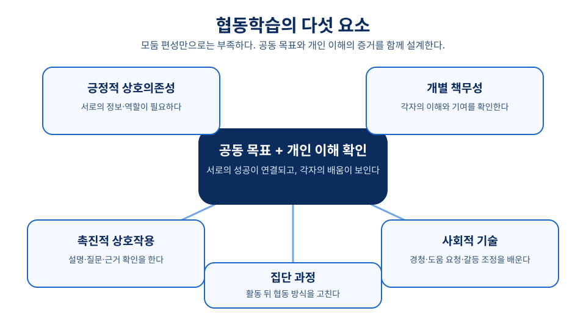
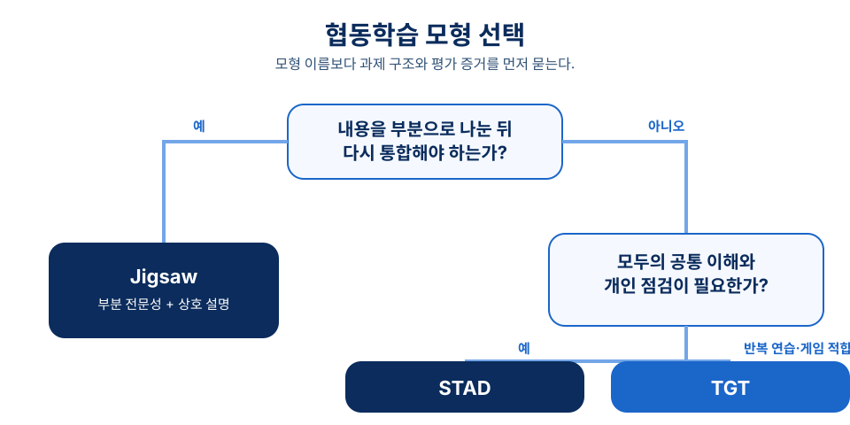

# 6장 협동학습 전략

## 학습 목표

이 장을 학습한 뒤에는 다음을 설명할 수 있어야 한다.

1. 협동학습을 단순한 모둠 활동과 구분하고, 사회적 상호의존성 관점에서 핵심 조건을 설명할 수 있다.
2. 긍정적 상호의존성, 개별 책무성, 촉진적 상호작용, 사회적 기술, 집단 과정의 의미를 수업 설계 언어로 풀어낼 수 있다.
3. Jigsaw, STAD, TGT의 절차와 평가 구조를 비교하여 학습 목표에 맞는 모형을 선택할 수 있다.
4. 협동학습에서 무임승차, 불균등 참여, 피상적 설명을 줄이기 위한 교사의 개입 방안을 설계할 수 있다.

## 사전 읽기와 학습목표 대응표

사전 읽기는 약 40분으로 계획한다. 역할을 나누었다고 협동학습이 되는 것은 아니라는 점에 유의하며 읽는다.

| 학습 목표 | 어디서 배우는가 | 무엇으로 확인하는가 |
| --- | --- | --- |
| 1. 협동학습을 모둠 활동과 구분해 설명한다 | 1~2절[^johnson2009][^cli] | 형성 평가 1번 |
| 2. 다섯 요소를 수업 설계 언어로 풀어낸다 | 2절[^cli] | 형성 평가 5번, 6번 |
| 3. Jigsaw·STAD·TGT를 비교해 모형을 선택한다 | 3~5절[^jigsaw][^aronson1978][^slavin1982][^stad1978][^tgt1974][^slavin1995] | 형성 평가 2번, 3번 |
| 4. 참여 위험을 줄이는 교사 개입을 설계한다 | 2절·5절[^slavin1996] | 형성 평가 4번 |

<!-- alignment-map (편집용, 화면 비노출)
objectives: ch06-obj-01, ch06-obj-02, ch06-obj-03, ch06-obj-04
activity_ids: ch06-prework-conditions, ch06-cumulative-interaction
assessment_ids: ch06-check-conditions, ch06-check-model-choice
source_ids: johnson2009, cli, slavin1982, jigsaw, aronson1978, stad1978, tgt1974, slavin1995, slavin1996
-->

- **읽기 전(10분)**: 누적 수업안에서 학생들이 서로 설명해야 하는 지점 하나와 개인 이해를 확인할 증거 하나를 표시한다.
- **읽은 뒤(별도 제출 없음)**: 협동학습 구조 하나를 골라 목표, 상호의존 장치, 개별 책무성 증거, 교사 개입 문장을 함께 적는다.

!!! tip "관련 강의 자료"
    이 장과 연계된 슬라이드: [6강 협동학습 전략](https://taehyeonglim.github.io/edtech/chapters/chapter-06/slides/deck.html){target=_blank}

## 도입 사례

**창작 시나리오.** 중학교 2학년 과학 수업에서 교사는 “식물의 광합성 조건을 설명하고 실험 결과를 해석한다”는 목표로 모둠 활동을 준비했다. 처음 수업안은 네 명이 한 장의 활동지를 채우는 방식이었다. 예비 검토에서 계산을 잘하는 한 학생이 과제를 맡고 다른 학생은 필기만 할 가능성이 드러났다.

교사는 자료 카드, 변수 설명, 그래프 해석, 발표 정리의 역할을 나누었다. 같은 역할을 맡은 학생은 먼저 전문가 집단에서 핵심을 확인한 뒤 원래 모둠으로 돌아왔다. 마지막에는 모둠 산출물과 별도로 각자가 빛의 세기와 광합성량의 관계를 설명하는 짧은 퀴즈를 썼다. 이 사례의 쟁점은 “모둠을 만들었는가”가 아니라, 서로에게 필요한 과제와 개인 이해의 증거를 함께 만들었는가이다.

## 1. 협동학습은 어떤 구조인가

협동학습은 학생을 한 모둠에 앉히는 활동명이 아니다. 이 장에서는 공동 목표를 향해 서로 의존하되, 각자의 학습 책임도 드러나도록 만든 수업 구조를 말한다. Slavin은 다양한 수행 수준의 학생이 작은 집단에서 공동 목표를 향해 일하고, 한 학생의 성공이 다른 학생의 성공을 돕는 구조를 학생 팀 학습의 핵심으로 설명했다.[^slavin1982]

따라서 “모둠별로 해결해 보세요”라는 지시만으로는 부족하다. 학생은 왜 서로 도와야 하는지, 각자가 무엇을 책임지는지, 무엇으로 이해를 확인할지를 알아야 한다. 이 장치가 없으면 몇 명이 과제를 떠안고 다른 학생은 관찰자로 남을 수 있다.

사회적 상호의존성 관점은 목표가 어떻게 연결되느냐가 상호작용의 성격을 바꾼다고 본다. Johnson과 Johnson은 이 관점을 협동학습의 토대로 설명하며, 이론과 연구, 실천의 순환 속에서 여러 협동학습 절차가 발전했다고 정리한다.[^johnson2009] 교사의 일은 “함께하라”는 태도를 요구하는 데 그치지 않고 목표·역할·자료·평가·상호작용을 배열하는 일이다.

## 2. 다섯 요소를 수업 언어로 바꾸기

Cooperative Learning Institute는 효과적인 협동에 긍정적 상호의존성, 개인 및 집단 책무성, 촉진적 상호작용, 사회적 기술, 집단 과정이 함께 필요하다고 제시한다.[^cli] 이 다섯 요소는 활동지의 장식이 아니라 교사가 관찰하고 조정할 수업 조건이다.

긍정적 상호의존성은 한 학생의 노력과 이해가 다른 학생의 학습에도 필요하게 만드는 장치다. 공동 산출물, 역할 분담, 자원 분배, 팀 목표를 사용할 수 있다. 핵심은 역할의 이름이 아니라, 한 부분이 빠지면 모둠의 전체 이해가 불완전해지는가이다.

개별 책무성은 각자의 이해와 기여를 확인하는 구조다. 개인 퀴즈, 한 문장 설명, 무작위 발표, 개인 성찰을 모둠 산출물과 함께 두면 교사는 누가 무엇을 배웠는지 볼 수 있다. 학생 팀 학습은 집단 목표와 개인 점수를 연결하는 방식으로 이 두 요구를 함께 다룬다.[^slavin1982]

촉진적 상호작용은 답을 건네는 대화가 아니라 설명과 질문으로 이해를 확인하는 대화다. “근거를 하나 더 말해 보자”, “친구 설명을 다른 예로 바꿔 보자”처럼 학생이 실제로 쓸 말을 제공한다. 사회적 기술도 자동으로 생기지 않으므로 경청, 도움 요청, 갈등 조정, 차례 지키기를 관찰 가능한 행동으로 가르친다.

집단 과정은 활동 뒤에 협동 방식을 되돌아보는 짧은 절차다. “오늘 누구의 행동이 이해를 도왔는가?”, “다음 시간에 무엇을 바꿀 것인가?”를 기록하면 협동이 분위기가 아니라 연습 가능한 역량이 된다.[^cli]

## 3. Jigsaw: 부분 전문성을 전체 이해로 연결하기

Jigsaw는 내용을 여러 부분으로 나누고, 각 학생이 한 부분의 전문가가 된 뒤 원래 모둠에서 서로 가르치는 모형이다. Jigsaw Classroom은 이질적 집단 편성, 부분 배정, 전문가 집단 논의, 원래 집단 복귀, 교사의 순회 관찰, 최종 퀴즈를 절차에 포함한다.[^jigsaw] Aronson과 동료들의 저서는 이 방법의 고전적 출처다.[^aronson1978]

이 모형은 부분을 다시 합쳐야 전체를 이해할 수 있을 때 강하다. 역사 인물의 생애, 생태계 구성 요소, 문학 작품의 관점처럼 분절과 통합이 가능한 내용이 좋은 후보이다. 반대로 순차적 기능을 모두가 충분히 반복해야 하는 수업이라면 Jigsaw만으로는 연습 기회가 부족할 수 있다.

교사는 각 부분의 분량과 난이도를 맞추고, 전문가 집단에서 핵심 개념·예시·오개념을 정리하게 해야 한다. 원래 모둠으로 돌아온 뒤에는 개별 점검을 둔다. 그래야 설명을 듣지 못한 학생이나 피상적으로 설명한 학생을 놓치지 않는다.

## 4. STAD와 TGT: 공통 목표를 개인 성장과 연결하기

STAD(Student Teams-Achievement Divisions)는 이질적 팀의 학습, 개인 퀴즈, 팀 점수 산출을 연결하는 모형이다.[^stad1978] Slavin의 정리는 학생이 팀 안에서 서로 연습하되 퀴즈는 개인이 치르고, 개인의 향상 정도가 팀 점수에 반영되는 구조를 제시한다.[^slavin1982] 그래서 성취가 높은 학생만 기여하는 방식에서 벗어나 각자가 자신의 기준에서 성장할 수 있다.

STAD는 모든 학생이 같은 핵심 개념이나 기능을 익혀야 하고 개별 점검이 가능한 수업에 잘 맞는다. 반면 해석의 다양성이나 창의적 산출물이 핵심인 과제에서는 퀴즈와 향상 점수가 과제의 본질을 좁힐 수 있다. 팀 학습의 목표는 친구가 답을 대신 주는 일이 아니라, 모두가 혼자 설명할 수 있게 돕는 일이다.

TGT(Teams-Games-Tournament)는 STAD와 비슷한 팀 학습 구조에 학업 게임과 토너먼트를 더한다.[^tgt1974] 학생은 이질적 팀에서 함께 공부하고, 토너먼트에서는 비슷한 수행 수준의 다른 팀 학생과 겨룬다.[^slavin1982] 반복 연습과 즉각적 피드백이 필요한 내용에서는 참여를 돕지만, 승패가 설명과 이해를 밀어내지 않게 교사가 관리해야 한다.

## 5. 모형을 고르고 실행을 점검하기

Jigsaw, STAD, TGT는 이름이 아니라 해결하려는 수업 문제로 고른다. 내용이 독립적인 부분으로 나뉘어 다시 통합되어야 하면 Jigsaw를 검토한다. 모두가 같은 개념이나 기능을 익히고 개인 점검이 가능하면 STAD가 자연스럽다. 공통 목표를 반복 연습하고 게임 규칙을 안정적으로 운영할 수 있으면 TGT를 고려한다.[^slavin1995]

모형을 고른 뒤에는 평가 증거를 먼저 정한다. 집단 산출물만 보면 개인 이해를 알기 어렵다. Slavin은 협동학습 연구의 가능성을 신중하게 다루면서도 집단 목표와 개별 책무성을 결합하는 구조의 중요성을 반복해서 논의한다.[^slavin1996] 교실에서는 “모둠 결과와 개인 이해를 모두 확인한다”는 규칙으로 번역할 수 있다.

교사는 활동 전에는 목표, 역할, 자료, 시간, 평가를 설계한다. 활동 중에는 설명의 질, 참여 균형, 소외 신호를 살피고 필요한 질문을 던진다. 활동 뒤에는 개인 정리와 집단 성찰을 함께 받는다. 이 세 시점을 나누면 교사의 개입은 통제가 아니라 학습을 보이게 하는 지원이 된다.

## 개념 오해와 적용 한계

- **“역할을 나누면 협동학습이다”라는 오해**: 역할표만으로는 상호의존성이 생기지 않는다. 각 역할의 정보나 판단이 전체 이해에 실제로 필요한지, 그리고 모두의 이해를 따로 확인하는지 함께 점검한다.
- **“모둠 점수 하나면 공정하다”라는 오해**: 집단 산출물 하나만으로는 무임승차와 이해 격차를 알기 어렵다. 개인 퀴즈, 무작위 설명, 개인 성찰처럼 부담이 과도하지 않은 개인 증거를 결합한다.
- **“게임을 넣으면 참여가 높아진다”는 단순화**: TGT의 게임은 반복 연습을 돕는 장치이지 목표가 아니다. 경쟁이 과열되면 게임을 줄이고, 라운드 뒤에 정답의 근거를 설명하게 한다.

## 생각해 보기

1. 최근 경험한 모둠 활동 하나를 떠올려 보자. 다섯 요소 중 가장 약했던 것은 무엇이며, 어떤 증거로 그렇게 판단했는가?
2. 자신이 가르칠 단원에서 Jigsaw와 STAD 중 하나를 고른다면, 내용의 구조와 개인 이해 확인을 어떻게 연결할 것인가?
3. 말수가 적은 학생에게 참여를 요구하면서도 부담이나 낙인을 만들지 않으려면 교사는 어떤 선택지를 제공해야 할까?

## 웹 학습 보조

두 도식은 2절의 다섯 요소와 5절의 모형 선택을 한눈에 정리한다. 수업안을 고칠 때 첫 도식으로 빠진 조건을 찾고, 둘째 도식으로 내용 구조와 평가 증거에 맞는 모형을 선택한다.

*그림 6-1. 협동학습의 다섯 요소: 상호의존성과 책무성을 중심으로 상호작용, 사회적 기술, 집단 과정을 함께 설계한다.*

*그림 6-2. 협동학습 모형 선택: 과제의 분절·통합, 공통 목표, 반복 연습과 게임의 적합성을 차례로 묻는다.*

## 이론과 연구 확장

### 사회적 상호의존성은 목표와 평가를 함께 묻는다

사회적 상호의존성 관점은 학습자의 목표가 어떻게 연결되는지가 상호작용을 바꾼다고 본다.[^johnson2009] 다섯 요소는 그 연결을 교실에서 관찰할 수 있게 하는 설계 언어다.[^cli] 따라서 역할 배분과 개인 점검, 활동 후 성찰은 따로 고르는 장치가 아니라 하나의 구조로 작동해야 한다.

### Jigsaw는 분업이 아니라 상호 설명의 구조다

Jigsaw는 학생이 부분 전문가가 되어 원래 모둠의 전체 이해에 기여하도록 만든다.[^jigsaw] Aronson과 동료들의 고전적 논의도 이 방법이 단순 분업을 넘어 서로에게 필요한 존재가 되도록 수업 구조를 바꾸려 했음을 보여 준다.[^aronson1978] 내용의 분절과 재통합이 어려운 수업에서는 개인 연습과 점검을 더 강화해야 한다.

### STAD와 TGT의 점수 구조는 이해를 대신할 수 없다

STAD는 개인 향상 점수를 팀 점수와 연결해 공동 목표와 개인 책무성을 함께 다룬다.[^slavin1982] TGT는 학업 게임과 토너먼트를 사용하지만, 게임이 학습 설명을 대신하지 않도록 관리해야 한다.[^tgt1974] 교사는 점수보다 “왜 그렇게 풀었는가”를 듣고, 그 설명을 다음 연습에 반영해야 한다.

## 토론 질문

1. 도입 사례에서 교사가 추가한 장치 중 무엇이 협동학습의 질을 가장 크게 바꾸었는가? 근거를 들어 판단해 보자.
2. Jigsaw, STAD, TGT 중 하나를 자신의 전공 수업에 적용한다면, 어떤 내용 구조와 평가 증거가 필요할까?
3. 집단 점수와 개인 점수를 함께 사용할 때 공정성, 학습 부담, 참여 균형 사이의 긴장을 어떻게 조정할 수 있을까?

## 형성 평가

1. **협동학습 조건 점검**: 협동학습을 단순한 모둠 활동과 구분하는 핵심 조건 두 가지를 쓰시오.
   **예시 답안**: 긍정적 상호의존성과 개별 책무성이 필요하다. 학생들이 서로의 성공에 실제로 기여해야 하며, 각자의 이해와 기여도 따로 확인되어야 한다.
   **채점 기준**: 상호의존성과 개인 책임을 모두 언급하고, 단순 좌석 배치와의 차이를 설명하면 적절하다.

2. **모형 선택 점검**: Jigsaw가 특히 적합한 학습 내용의 조건을 설명하시오.
   **예시 답안**: 내용을 여러 부분으로 나눈 뒤 각 부분을 다시 통합해야 전체 이해가 완성되는 주제에 적합하다.
   **해설**: Jigsaw는 부분 전문성과 원래 모둠의 상호 설명이 핵심이므로, 분절과 통합이 가능한 내용에서 장점이 크다.

3. STAD에서 개인 향상 점수를 사용하는 이유로 가장 적절한 것은 무엇인가?
   ① 이미 성취가 높은 학생만 팀에 기여하게 하려는 것이다.
   ② 개인의 성장과 팀 목표를 연결하여 개별 책무성을 높이려는 것이다.
   ③ 집단 산출물 평가를 완전히 없애려는 것이다.
   ④ 게임 경쟁을 협동학습의 핵심으로 만들려는 것이다.
   **정답**: ②
   **해설**: STAD는 개인 퀴즈와 향상 점수를 통해 각 학생이 자신의 기준에서 성장하며 팀에 기여하도록 설계한다.

4. TGT를 사용할 때 교사가 주의해야 할 점을 한 가지 쓰고 이유를 설명하시오.
   **예시 답안**: 경쟁이 과열되어 학생들이 개념 설명보다 승패에 집중하지 않도록 해야 한다. 라운드 뒤 정답의 이유를 설명하게 하면 게임을 학습으로 연결할 수 있다.
   **루브릭**: 경쟁 관리, 설명 확인, 학습 목표 유지 중 두 가지 이상을 연결하면 우수하다.

5. 협동학습 활동 후 집단 과정 성찰 질문을 두 가지 제안하시오.
   **예시 답안**: “오늘 우리 모둠에서 친구의 이해를 도운 행동은 무엇인가?”, “다음 활동에서 더 균형 있게 참여하려면 무엇을 바꾸어야 하는가?”
   **채점 기준**: 협동 행동을 구체적으로 돌아보고 다음 개선과 연결하는 질문이면 적절하다.

6. 다음 중 긍정적 상호의존성을 가장 잘 만드는 과제 구조는 무엇인가?
   ① 구성원이 같은 문제를 각자 풀고 가장 빠른 답만 제출한다.
   ② 한 학생이 전체 발표를 준비하고 나머지는 자료를 읽는다.
   ③ 서로 다른 자료를 분석해 결합해야 공동 설명이 완성되고, 각자 자신의 부분을 설명한다.
   ④ 모둠별로 자유롭게 대화한 뒤 참여 점수만 받는다.
   **정답**: ③
   **해설**: 각자의 정보와 설명이 공동 이해에 필요할 때 학생들은 서로의 학습에 실제로 의존하게 된다.

7. Jigsaw가 특히 적합한 학습 내용의 조건으로 가장 알맞은 것은 무엇인가?
   ① 모든 학생이 같은 절차를 반복 숙달해야 하는 기능 학습
   ② 내용을 여러 부분으로 나눈 뒤 다시 통합해야 전체 이해가 완성되는 주제
   ③ 교사가 설명한 답을 빠르게 암기하는 단원
   ④ 개인 산출물만으로 충분히 평가할 수 있는 과제
   **정답**: ②
   **해설**: Jigsaw는 부분 전문성과 원래 모둠의 상호 설명을 핵심으로 하므로 분절과 통합이 가능한 내용에서 장점이 크다.

## 요약

협동학습은 모둠 편성이 아니라 긍정적 상호의존성과 개별 책무성을 함께 설계하는 일이다. 다섯 요소는 과제, 상호작용, 성찰을 점검하는 기준이 된다. Jigsaw는 부분 전문성과 통합에, STAD는 공통 목표와 개인 향상에, TGT는 반복 연습과 관리된 게임에 알맞다. 어떤 모형이든 모둠 결과와 개인 이해를 함께 확인하고, 활동 뒤 협동 방식을 성찰해야 한다.

## 핵심 용어

- **긍정적 상호의존성**: 구성원 각자의 노력과 이해가 공동 목표 달성에 실제로 필요하도록 목표, 역할, 자원, 보상을 연결한 상태다.
- **개별 책무성**: 집단 활동 속에서도 각 학생의 이해와 기여를 확인할 수 있도록 개인 점검, 설명, 성찰을 포함하는 구조다.
- **촉진적 상호작용**: 학생들이 답만 나누지 않고 설명, 질문, 격려, 근거 확인을 통해 서로의 학습을 돕는 대화 과정이다.
- **Jigsaw**: 학습 내용을 부분으로 나누어 각 학생이 한 부분의 전문가가 된 뒤 원래 모둠에서 전체 이해를 완성하는 협동학습 모형이다.
- **STAD**: 이질적 팀의 학습, 개인 퀴즈, 개인 향상 점수의 팀 반영을 통해 공동 목표와 개인 책임을 결합하는 학생 팀 학습 모형이다.

## 참고문헌

[^johnson2009]: Johnson, D. W., & Johnson, R. T. (2009). An educational psychology success story: Social interdependence theory and cooperative learning. *Educational Researcher, 38*(5), 365-379. `https://doi.org/10.3102/0013189X09339057`

[^cli]: Cooperative Learning Institute. (n.d.). *What is cooperative learning?* `https://www.co-operation.org/what-is-cooperative-learning`

[^slavin1982]: Slavin, R. E. (1982). *Cooperative Learning: Student Teams. What Research Says to the Teacher*. National Education Association. ERIC ED222489. `https://eric.ed.gov/?id=ED222489`

[^jigsaw]: The Jigsaw Classroom. (n.d.). *The Jigsaw Classroom*. Social Psychology Network. `https://www.jigsaw.org/`

[^aronson1978]: Aronson, E., Blaney, N., Stephan, C., Sikes, J., & Snapp, M. (1978). *The Jigsaw Classroom*. Beverly Hills, CA: Sage Publishing Company. `https://www.jigsaw.org/information/`

[^stad1978]: Slavin, R. E. (1978). Student teams and achievement divisions. *Journal of Research and Development in Education, 12*(1), 39-49. ERIC EJ199082. `https://eric.ed.gov/?id=EJ199082`

[^tgt1974]: Edwards, K. J., & DeVries, D. L. (1974). *The Effects of Teams-Games-Tournament and Two Instructional Variations on Classroom Process, Student Attitudes, and Student Achievement. Report Number 172*. Johns Hopkins University, Center for the Study of Social Organization of Schools. ERIC ED093883. `https://eric.ed.gov/?id=ED093883`

[^slavin1995]: Slavin, R. E. (1995). *Cooperative Learning: Theory, Research, and Practice* (2nd ed.). Boston, MA: Allyn and Bacon. ISBN 0205156304. `https://books.google.com/books/about/Cooperative_Learning.html?id=GWnuAAAAMAAJ`

[^slavin1996]: Slavin, R. E. (1996). Research on cooperative learning and achievement: What we know, what we need to know. *Contemporary Educational Psychology, 21*(1), 43-69. ERIC EJ526831. `https://eric.ed.gov/?id=EJ526831`
