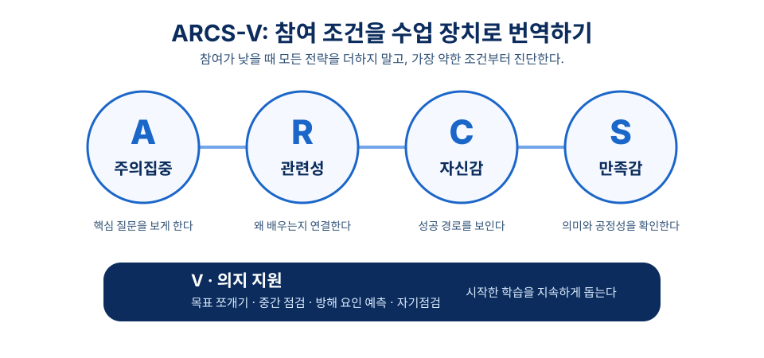
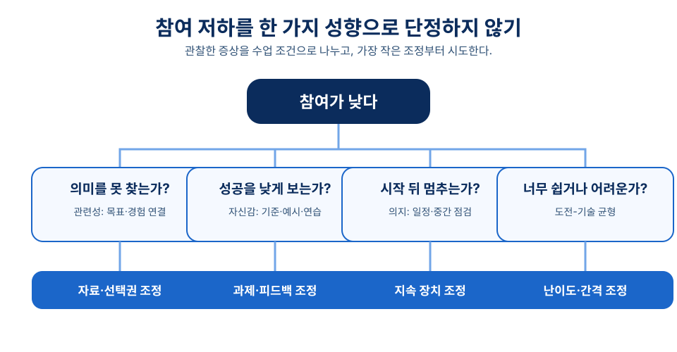

# 7장 학습동기 설계 (ARCS)

## 학습 목표

이 장을 학습한 뒤에는 다음을 설명할 수 있어야 한다.

1. 학습동기를 단순한 흥미 유발이 아니라 수업 설계의 조건으로 설명할 수 있다.
2. Keller의 ARCS 모형을 주의집중, 관련성, 자신감, 만족감의 네 범주로 구분하고 수업 장면에 적용할 수 있다.
3. ARCS-V에서 의지(volition)가 추가되는 이유를 동기 유지와 자기조절의 관점에서 설명할 수 있다.
4. 자기결정성 이론의 기본 심리 욕구와 동기 연속체를 수업 설계 판단에 연결할 수 있다.
5. 몰입 이론의 도전-기술 균형을 활용하여 학습 과제의 난이도와 피드백을 조정할 수 있다.

## 사전 읽기와 학습목표 대응표

사전 읽기는 약 40분으로 계획한다. 재미있는 도입이나 보상을 더하면 동기가 자동으로 높아진다는 생각은 경계하며 읽는다.

| 학습 목표 | 어디서 배우는가 | 무엇으로 확인하는가 |
| --- | --- | --- |
| 1. 학습동기를 수업 설계의 조건으로 설명한다 | 1절[^keller1987] | 형성 평가 1번 |
| 2. ARCS 네 범주를 수업 장면에 적용한다 | 2절[^keller1987][^keller2010][^lepper1973] | 형성 평가 2번 |
| 3. ARCS-V에서 의지가 추가되는 이유를 설명한다 | 3절[^keller2016] | 형성 평가 3번, 5번 |
| 4. 자기결정성 이론의 욕구를 설계 판단에 연결한다 | 4절[^deci1985][^ryan2000a][^ryan2000b][^niemiec2009] | 형성 평가 4번 |
| 5. 도전-기술 균형으로 난이도와 피드백을 조정한다 | 5~6절[^csik1990][^fong2015] | 형성 평가 6번 |

<!-- alignment-map (편집용, 화면 비노출)
objectives: ch07-obj-01, ch07-obj-02, ch07-obj-03, ch07-obj-04, ch07-obj-05
activity_ids: ch07-prework-diagnosis, ch07-cumulative-motivation
assessment_ids: ch07-check-arcs, ch07-check-motivation-design
source_ids: keller1987, keller2010, keller2016, deci1985, ryan2000a, ryan2000b, csik1990, fong2015, lepper1973, niemiec2009
-->

- **읽기 전(10분)**: 누적 수업안에서 참여가 낮아질 수 있는 장면 하나를 ARCS-V와 자율성·유능감·관계성 관점으로 진단한다.
- **읽은 뒤(별도 제출 없음)**: 가장 약한 조건 한두 가지에 집중해 선택권, 성공 기준과 피드백, 관계 지원 중 필요한 장치를 근거와 함께 적는다.

!!! tip "관련 강의 자료"
    이 장과 연계된 슬라이드: [7강 학습 동기 유발 전략](https://taehyeonglim.github.io/edtech/chapters/chapter-07/slides/deck.html){target=_blank}

## 도입 사례

**창작 시나리오.** 고등학교 1학년 수학 수업에서 한 교사는 함수 단원 프로젝트의 제출률이 낮아진 원인을 “학생들이 재미없어해서”라고 보았다. 학생 면담과 과제 기록을 살펴보니 이유는 하나가 아니었다. 일부는 함수 그래프가 자신의 생활과 어떤 관련이 있는지 몰랐고, 일부는 평가 기준을 몰라 시작을 미뤘으며, 일부는 초안 뒤의 수정 일정을 관리하지 못했다.

교사는 스포츠 기록과 통학 시간 자료 중 하나를 선택하게 했다. 좋은 그래프 해석 예시와 루브릭을 먼저 보여 주고, 초안-동료 피드백-수정본의 중간 기한도 나누었다. 이 사례의 질문은 “더 재미있게 만들까?”가 아니라, 관련성·자신감·지속 중 어느 조건이 약한가이다.

## 1. 학습동기를 설계한다는 것

학습동기는 학습자가 과제에 주의를 기울이고, 그 과제를 자신의 목표와 연결하며, 성공 가능성을 판단하고, 결과에 의미를 부여하는 과정과 관련된다. 그래서 동기 설계는 도입부의 흥미로운 활동을 고르는 일이 아니다. 학습자가 왜 배우는지, 어떻게 해낼 수 있는지, 학습 뒤 어떤 가치를 확인하는지를 수업 전체에 배치하는 일이다.

Keller의 ARCS 모형은 동기 문제를 주의집중(Attention), 관련성(Relevance), 자신감(Confidence), 만족감(Satisfaction)으로 나누어 진단하도록 돕는다.[^keller1987] 이 틀의 장점은 동기를 개인 성향으로 돌리지 않고 목표, 자료, 활동, 피드백, 평가의 설계 문제로 보게 한다는 데 있다.

같은 전략도 학습자의 선행 지식, 문화적 배경, 교실 관계, 평가 압력에 따라 다르게 경험된다. 따라서 ARCS는 처방 목록보다 진단 질문으로 쓰는 편이 좋다. 이 장은 자기결정성 이론과 몰입 이론도 함께 살펴, 학습자의 의미 경험과 과제 조건을 함께 판단한다.

## 2. ARCS 네 범주로 수업 장면 읽기

### 2.1 주의집중: 보게 한 뒤 핵심 질문으로 이동하기

주의집중은 학습자가 과제에 정신적 자원을 쓰게 하는 조건이다. 새롭거나 놀라운 자료로 시선을 여는 일도 포함되지만, 더 중요한 것은 호기심을 핵심 질문으로 이어 가는 일이다.[^keller1987] 사진이나 영상 다음에 예측 질문, 모순 사례, 짧은 탐구를 두면 주의가 개념으로 이동할 수 있다.

수업 리듬을 바꾸는 것도 도움이 된다. 설명, 개인 사고, 짝 토의, 실습을 적절히 전환하면 단조로움을 줄일 수 있다. 그러나 눈길을 끄는 자료가 목표와 연결되지 않으면 주의는 산만함이 된다. “흥미로운가?”와 “핵심 개념으로 돌아오는가?”를 함께 묻는다.

### 2.2 관련성: 왜 배워야 하는지 연결하기

관련성은 학습자가 내용과 활동을 자신의 필요, 경험, 목표와 연결해 느끼는 조건이다. Keller의 설명에서 관련성은 실생활 예시 하나를 넣는 것보다 넓다.[^keller2010] 현재 관심, 미래 역할, 가치, 친숙한 맥락과 학습 과제를 잇는 설계 판단이 필요하다.

예를 들어 통계 수업에서 스포츠 기록, 학교 설문, 지역 문제 자료를 사용할 수 있다. 그러나 소재가 친숙하다고 관련성이 저절로 생기지는 않는다. 학생이 그 자료로 어떤 개념을 배우고 어떤 판단을 할지 말할 수 있어야 한다.

### 2.3 자신감: 성공의 경로를 보이기

자신감은 학습자가 과제를 해낼 수 있다고 판단하는 정도와 관련된다. 막연한 격려보다 요구 조건, 성공 기준, 예시, 연습 기회를 분명히 하는 것이 중요하다.[^keller1987] 학습자는 무엇을 해야 하는지 예측할 수 있을 때 시작할 가능성이 높아진다.

과제는 너무 쉽거나 너무 어려워서도 안 된다. 작은 성공에서 복잡한 수행으로 이동하도록 과제를 나누고, 해석 가능한 피드백을 주면 유능감의 근거가 생긴다. 선택지는 무제한일 필요가 없으며, 초보 학습자에게는 제한적이지만 구조화된 선택이 더 도움이 될 수 있다.

### 2.4 만족감: 결과의 의미와 공정성을 확인하기

만족감은 학습 뒤에 “해 볼 만했다”, “내 노력이 의미 있었다”, “평가가 공정했다”고 느끼는 경험과 관련된다. Keller는 자연적 결과, 긍정적 강화, 공정성을 만족감의 중요한 조건으로 다룬다.[^keller2010] 목표, 연습, 평가가 연결될 때 학습자는 결과를 납득하기 쉽다.

보상은 학습의 의미를 대체하지 않아야 한다. Lepper, Greene, Nisbett의 고전 연구는 기대된 외적 보상이 내재적으로 흥미롭던 활동의 흥미를 약화시킬 수 있는 사례로 자주 인용된다.[^lepper1973] 이를 모든 보상이 해롭다는 말로 넓히지는 않되, 보상이 자율성과 의미 경험을 밀어내지 않는지 점검한다.

## 3. ARCS-V: 시작 뒤의 지속을 설계하기

Keller는 ARCS를 확장해 의지(Volition)를 포함하는 ARCS-V를 논의했다.[^keller2016] 의지는 목표를 선택한 뒤에도 피로, 지연, 방해 요인을 조절하며 행동을 이어 가는 과정과 관련된다. 동기가 방향을 만든다면, 의지는 그 방향을 실제 행동으로 유지하게 한다.

학생이 과제의 필요성을 이해하고 성공 가능성도 인정해도 장기 과제를 끝내지 못할 수 있다. 이런 경우에는 흥미로운 자료보다 목표 쪼개기, 일정 가시화, 중간 점검, 방해 요인 예측, 자기점검표가 더 직접적인 지원이 될 수 있다. 온라인 학습에서는 고립감과 알림처럼 지속을 끊는 조건도 함께 살핀다.

모든 수업에 복잡한 자기조절 도구를 더할 필요는 없다. 먼저 주된 문제가 주의, 의미, 성공 가능성, 만족감, 지속 중 어디에 있는지 구분한다. 그 뒤 가장 작은 장치부터 시도하고, 학습 부담이 늘지 않는지 확인한다.

## 4. 자기결정성 이론으로 동기의 질 묻기

자기결정성 이론은 자율성의 정도와 기본 심리 욕구의 충족을 통해 동기를 설명한다. Deci와 Ryan의 저서는 이 논의를 체계화한 대표적 원천이며,[^deci1985] Ryan과 Deci는 내재적 동기, 사회적 발달, 안녕감과 연결해 이 이론을 요약한다.[^ryan2000a]

세 기본 심리 욕구는 자율성, 유능감, 관계성이다. 자율성은 행동을 강압이 아니라 의미 있는 선택으로 느끼는 경험이다. 유능감은 환경에 효과적으로 작용할 수 있다는 감각이며, 관계성은 타인과 연결되고 존중받는 경험이다.[^ryan2000a] 교실에서는 선택권, 감당 가능한 도전, 안전한 도움 요청으로 이 조건을 읽을 수 있다.

이 이론은 외재적 동기를 모두 나쁜 것으로 보지 않는다. Ryan과 Deci는 외적 규제부터 더 자율적인 내면화까지 여러 형태를 제시한다.[^ryan2000b] “시험에 나오니 하라”와 “이 개념을 이해하면 네 프로젝트를 더 설득력 있게 만들 수 있다”는 같은 과제라도 다른 동기 경험을 만든다.

## 5. 몰입: 도전과 기술의 간격 조정하기

Csikszentmihalyi의 몰입 이론은 활동 자체에 깊게 집중하는 최적 경험을 설명한다.[^csik1990] 수업 설계에서 중요한 점은 “항상 재미있는가”보다 과제의 도전 수준과 학습자의 기술 수준이 지나치게 어긋나지 않는가이다. Fong과 동료들의 메타분석도 도전-기술 균형과 몰입의 관계를 검토한다.[^fong2015]

도전이 기술보다 훨씬 높으면 불안과 무력감이 생길 수 있다. 반대로 기술보다 훨씬 낮으면 지루함이 생긴다. 진단 질문, 단계적 과제, 선택 도전, 초안 피드백으로 약간 어렵지만 해볼 만한 수준을 만든다.

몰입은 모든 학생이 매 시간 도달해야 하는 상태가 아니다. 교실에는 시간표, 관계, 피로, 평가, 기초 기능 차이가 있다. 이 이론은 수업의 유일한 목표가 아니라 난이도와 피드백을 조정하는 관점으로 사용한다.

## 6. 교실 설계에서 이론을 함께 쓰기

먼저 참여 저하의 원인을 나눈다. 학생이 과제를 보지 않는지, 의미를 못 찾는지, 성공을 낮게 보는지, 평가가 불공정하다고 느끼는지, 시작 뒤 지속하지 못하는지를 확인한다. 더 흥미로운 자료를 찾는 일은 진단 다음의 선택이지 첫 반응이 아니다.

그다음 가장 약한 조건 한두 가지에 집중한다. 예를 들어 실패 예측이 문제라면 평가 기준 공개, 예시 분석, 낮은 위험의 연습, 단계적 피드백이 우선이다. 자율성·유능감·관계성을 함께 점검하면 전략이 학습자를 통제하는 방식으로 흐르는 것을 막을 수 있다. Niemiec과 Ryan은 교육 장면에서 이 세 욕구 지원이 내재적 동기와 내면화를 이해하는 핵심임을 설명한다.[^niemiec2009]

마지막으로 수업 뒤 증거를 확인한다. 제출률, 질문의 질, 중도 포기 양상, 자기평가, 출구표, 산출물의 개선을 보며 다음 수업을 수정한다. “ARCS를 썼으니 효과가 있었다”고 단정하지 말고, 어떤 학습자에게 어떤 조건에서 도움이 되었는지 조심스럽게 해석한다.

## 개념 오해와 적용 한계

- **“재미있는 도입이면 동기가 해결된다”는 오해**: 주의집중은 시작 조건일 뿐이다. 도입 뒤에 핵심 질문, 의미 있는 활동, 성공 기준, 공정한 평가가 연결되는지 본다.
- **“보상은 언제나 나쁘다”는 단순화**: 외적 보상이 학습의 의미를 밀어낼 위험은 있지만, 모든 인정과 피드백을 없애라는 뜻은 아니다. 학습자가 노력과 전략의 가치를 확인하도록 설계한다.
- **“모든 학생에게 같은 동기 전략이 통한다”는 오해**: 전략은 선행 지식, 관계, 문화, 평가 압력에 따라 다르게 경험된다. 한 번에 모든 장치를 넣지 말고 참여 저하의 원인을 확인한 뒤 작게 조정한다.

## 생각해 보기

1. 최근 참여가 낮았던 수업 장면을 떠올려 보자. ARCS-V의 다섯 범주 중 무엇이 가장 약했고, 어떤 관찰이 그 판단을 뒷받침하는가?
2. 학습자의 선택권을 늘리는 전략이 오히려 부담이 되는 경우는 언제일까? 제한적 선택은 어떻게 설계할 수 있을까?
3. 자신의 과제 하나에서 도전-기술 간격을 조정한다면 난이도, 예시, 피드백 간격 중 무엇부터 바꾸겠는가?

## 웹 학습 보조

두 도식은 참여 저하를 진단하고 수업 장치로 번역할 때 쓴다. 첫 도식은 ARCS-V의 범주를, 둘째 도식은 원인에서 설계 조정으로 가는 질문을 보여 준다.

*그림 7-1. ARCS-V 설계 지도: 네 범주로 참여 조건을 읽고 의지 지원으로 지속을 돕는다.*

*그림 7-2. 동기 진단 흐름: 증상을 하나의 성향으로 단정하지 않고 수업 조건으로 나누어 본다.*

  
ARCS-V 진단

  
참여가 멈춘 지점 찾기

  

    
<strong>주의집중</strong>학생이 핵심 문제를 보고 있는가.

    
<strong>관련성</strong>왜 배우는지 자신의 목표와 연결되는가.

    
<strong>자신감</strong>성공 기준과 연습 기회를 예측할 수 있는가.

    
<strong>만족감</strong>결과가 공정하고 의미 있게 느껴지는가.

    
<strong>의지</strong>시작한 뒤 지연과 방해를 조절할 장치가 있는가.

  

  
출처: 이 장 2~3절의 ARCS와 ARCS-V 논의를 바탕으로 만든 자체 진단 도식.

  
동기 설계

  
전략을 더하기 전 세 단계

  <ol class="activity-steps">
    <li>참여가 낮아진 장면을 하나 고르고 그렇게 판단한 관찰 근거를 적는다.</li>
    <li>다섯 조건 중 가장 약한 하나를 정하고 이유를 쓴다.</li>
    <li>그 조건에 맞는 가장 작은 장치 하나만 넣고, 학습 부담이 늘지 않는지 확인한다.</li>
  </ol>
  
출처: 이 장 6절의 교실 설계 절차를 바탕으로 만든 자체 활동.

## 이론과 연구 확장

### ARCS는 흥미 유발 목록보다 진단 도구에 가깝다

Keller의 ARCS 모형은 동기 문제를 주의집중, 관련성, 자신감, 만족감으로 나누어 설계자가 원인을 구분하도록 돕는다.[^keller1987] Keller의 저서는 이를 학습 수행을 위한 체계적 동기 설계 접근으로 제시한다.[^keller2010] 참여가 낮을 때 더 자극적인 자료를 먼저 넣기보다, 학생이 무엇에서 멈추는지 확인해야 한다.

### ARCS-V는 지속을 위한 최소 장치를 묻게 한다

ARCS-V는 기존 네 범주에 의지를 더해 학습을 시작한 뒤 지속하는 문제를 설명한다.[^keller2016] 장기 과제에는 목표 쪼개기, 중간 점검, 자기점검표 같은 장치가 도움이 될 수 있다. 다만 실제 지연 원인을 확인하지 않은 채 복잡한 관리 도구를 더하면 학습 부담만 커질 수 있다.

### 자기결정성 이론은 동기의 질을 보완한다

자기결정성 이론은 자율성, 유능감, 관계성을 통해 동기의 질을 설명한다.[^ryan2000a] 외재적 동기도 자율성의 정도에 따라 여러 방식으로 내면화될 수 있다.[^ryan2000b] 선택권, 성공 가능한 도전, 존중받는 관계는 ARCS 전략이 통제 장치가 아니라 학습 지원으로 경험되게 하는 조건이다.

### 몰입 관점은 과제와 피드백의 간격을 조정한다

몰입 논의는 도전과 기술의 균형, 분명한 목표, 해석 가능한 피드백의 중요성을 보여 준다.[^csik1990] 도전-기술 균형에 관한 메타분석은 이 관계를 검토하며, 난이도를 단순한 재미 문제가 아니라 정교한 과제 조정으로 보게 한다.[^fong2015] 진단 질문과 초안 피드백은 학생마다 다른 간격을 조정하는 실용적 출발점이 될 수 있다.

## 토론 질문

1. 도입 사례의 참여 저하 원인을 ARCS-V 범주로 나누면 각각 어떤 지원이 필요한가?
2. 친숙한 실생활 소재가 학습 목표를 가리지 않도록 하려면 관련성 전략에 어떤 기준을 두어야 할까?
3. 보상이나 점수가 학생의 자율성을 약화시키지 않으려면 목표, 피드백, 평가를 어떻게 연결해야 할까?

## 형성 평가

1. ARCS 모형의 네 범주를 쓰고, 각 범주의 수업 설계 질문을 한 문장씩 제시하시오.
   **예시 답안**: 주의집중-학생이 핵심 문제를 보게 하는가, 관련성-왜 배워야 하는지 연결되는가, 자신감-성공 기준과 연습 기회가 있는가, 만족감-결과가 공정하고 의미 있게 느껴지는가.
   **채점 기준**: 네 범주를 모두 포함하고 각 범주를 수업 설계 판단과 연결하면 적절하다.

2. **ARCS 범주 점검**: 다음 상황의 주된 동기 문제를 고르시오. “학생들이 과제의 필요성은 인정하지만 평가 기준을 몰라 시작을 미룬다.”
   ① 주의집중 ② 관련성 ③ 자신감 ④ 만족감
   **정답**: ③
   **해설**: 평가 기준과 성공 조건을 예측하지 못하면 성공 가능성 판단이 낮아지므로 자신감 지원이 우선이다.

3. ARCS-V에서 의지를 별도로 다루는 이유를 설명하시오.
   **예시 답안**: 동기가 생겨도 장기 과제에서는 피로, 방해 요인, 지연 때문에 행동을 지속하지 못할 수 있으므로 목표 쪼개기와 중간 점검 같은 조절 지원이 필요하기 때문이다.
   **해설**: 의지는 시작 의도보다 학습 행동의 유지와 자기조절에 초점을 둔다.

4. **동기 설계 점검**: 자기결정성 이론의 세 기본 심리 욕구를 쓰고, 그중 하나를 지원하는 수업 전략을 제안하시오.
   **예시 답안**: 자율성, 유능감, 관계성이다. 유능감을 지원하려면 좋은 산출물 예시와 단계별 연습 기회를 제공할 수 있다.
   **루브릭**: 세 욕구 이름이 정확하고, 제안한 전략이 해당 욕구와 논리적으로 연결되면 우수하다.

5. 다음 중 의지 지원에 가장 가까운 설계는 무엇인가?
   ① 예상 밖의 사진으로 수업을 시작한다.
   ② 과제의 실생활 쓰임을 설명한다.
   ③ 초안-피드백-수정본의 중간 기한과 자기점검표를 제공한다.
   ④ 평가 결과 뒤에 칭찬 스티커를 준다.
   **정답**: ③
   **해설**: 의지 지원은 과제를 시작한 뒤에도 방해 요인과 지연을 조절하며 행동을 지속하게 하는 장치다.

6. 도전-기술 균형을 고려한 과제 조정으로 가장 적절한 것은 무엇인가?
   ① 모든 학생에게 같은 어려운 과제를 즉시 제시한다.
   ② 학생의 현재 수준을 살핀 뒤 단계적 과제와 해석 가능한 피드백을 제공한다.
   ③ 과제가 쉬워도 반복 횟수만 늘린다.
   ④ 흥미로운 영상만 길게 보여 준다.
   **정답**: ②
   **해설**: 도전이 기술과 지나치게 어긋나지 않도록 과제의 수준과 피드백을 조정해야 한다.

## 요약

ARCS는 주의집중, 관련성, 자신감, 만족감으로 참여 조건을 진단하게 한다. ARCS-V는 시작 뒤의 지속을 의지 지원으로 다룬다. 자기결정성 이론은 자율성·유능감·관계성으로 동기의 질을 묻고, 몰입 관점은 도전과 기술의 간격을 조정하게 한다. 교사는 전략을 많이 더하기보다 참여가 멈추는 조건을 찾아, 목표·활동·피드백·평가를 그 조건에 맞게 연결해야 한다.

## 핵심 용어

- **ARCS 모형**: 학습동기를 주의집중, 관련성, 자신감, 만족감의 네 범주로 진단하고 처방하는 Keller의 동기 설계 모형이다.
- **관련성**: 학습 내용과 활동이 학습자의 경험, 목표, 가치, 미래 역할과 의미 있게 연결되어 있다고 느끼게 하는 조건이다.
- **자신감**: 학습자가 요구 조건과 성공 기준을 이해하고, 적절한 도전 속에서 자신의 노력과 전략이 결과에 영향을 미친다고 판단하는 상태다.
- **의지**: 목표를 선택한 뒤에도 방해 요인, 피로, 지연을 관리하며 학습 행동을 지속하는 조절 과정이다.
- **도전-기술 균형**: 과제 난이도와 학습자의 현재 기술 수준이 지나치게 어긋나지 않아 몰입과 지속적 참여를 돕는 조건이다.

## 참고문헌

[^keller1987]: Keller, J. M. (1987). Development and use of the ARCS model of instructional design. *Journal of Instructional Development, 10*(3), 2-10. `https://doi.org/10.1007/BF02905780`

[^keller2010]: Keller, J. M. (2010). *Motivational Design for Learning and Performance: The ARCS Model Approach*. Springer. `https://doi.org/10.1007/978-1-4419-1250-3`

[^keller2016]: Keller, J. M. (2016). Motivation, learning, and technology: Applying the ARCS-V motivation model. *Participatory Educational Research, 3*(2), 1-15. `https://doi.org/10.17275/per.16.06.3.2`

[^deci1985]: Deci, E. L., & Ryan, R. M. (1985). *Intrinsic Motivation and Self-Determination in Human Behavior*. Plenum Press. `https://doi.org/10.1007/978-1-4899-2271-7`

[^ryan2000a]: Ryan, R. M., & Deci, E. L. (2000). Self-determination theory and the facilitation of intrinsic motivation, social development, and well-being. *American Psychologist, 55*(1), 68-78. `https://doi.org/10.1037/0003-066X.55.1.68`

[^ryan2000b]: Ryan, R. M., & Deci, E. L. (2000). Intrinsic and extrinsic motivations: Classic definitions and new directions. *Contemporary Educational Psychology, 25*(1), 54-67. `https://doi.org/10.1006/ceps.1999.1020`

[^csik1990]: Csikszentmihalyi, M. (1990). *Flow: The Psychology of Optimal Experience*. Harper & Row. `https://search.worldcat.org/title/Flow-%3A-The-Psychology-of-Optimal-Experience/oclc/20392741`

[^fong2015]: Fong, C. J., Zaleski, D. J., & Leach, J. K. (2015). The challenge-skill balance and antecedents of flow: A meta-analytic investigation. *The Journal of Positive Psychology, 10*(5), 425-446. `https://doi.org/10.1080/17439760.2014.967799`

[^lepper1973]: Lepper, M. R., Greene, D., & Nisbett, R. E. (1973). Undermining children's intrinsic interest with extrinsic reward: A test of the overjustification hypothesis. *Journal of Personality and Social Psychology, 28*(1), 129-137. `https://doi.org/10.1037/h0035519`

[^niemiec2009]: Niemiec, C. P., & Ryan, R. M. (2009). Autonomy, competence, and relatedness in the classroom: Applying self-determination theory to educational practice. *Theory and Research in Education, 7*(2), 133-144. `https://doi.org/10.1177/1477878509104318`
