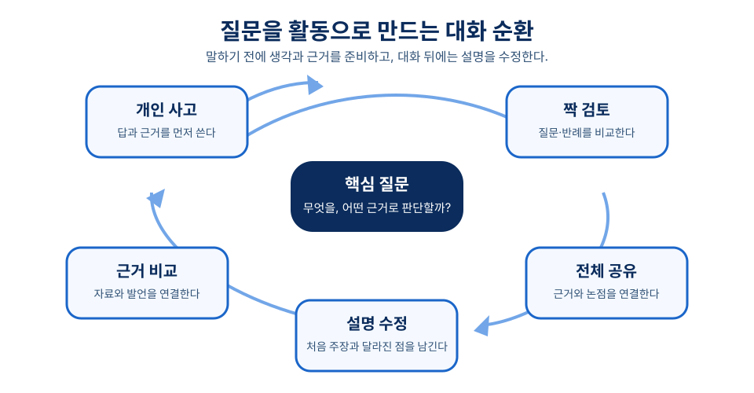
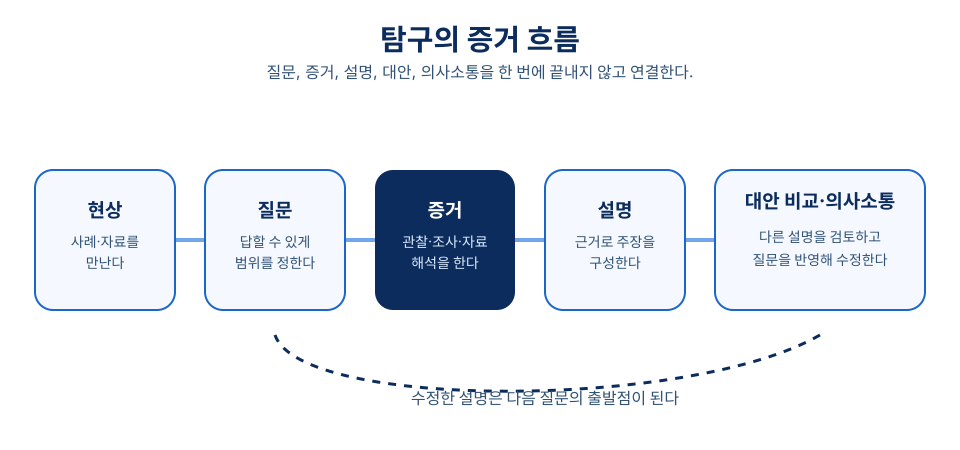

# 8장 질문과 탐구 중심 수업

## 학습 목표

이 장을 학습한 뒤에는 다음을 설명할 수 있어야 한다.

1. 질문, 대화, 토의, 탐구가 각각 어떤 수업 기능을 갖는지 구분할 수 있다.
2. 교사 질문을 학습자의 사고와 증거 사용을 돕는 설계 요소로 바꾸어 설명할 수 있다.
3. 대화적 교수와 탐색적 대화가 수업 담화의 질을 왜 중요하게 보는지 설명할 수 있다.
4. 하브루타식 짝 토의와 일반 토의법을 과장 없이 수업 전략으로 설계할 수 있다.
5. 탐구 중심 수업에서 질문, 증거, 설명, 대안 검토, 의사소통을 연결할 수 있다.

## 사전 읽기와 학습목표 대응표

**사전 읽기(40분, `ch08-prework-question-audit`)**: 1~6절을 읽고 누적 수업안의 질문 하나를 골라 학생이 사용할 자료·근거와 후속 질문을 표시한다. 질문을 많이 하거나 자유롭게 말하게 하면 탐구가 된다는 생각은 피한다. 질문이 너무 넓거나 자료 접근이 어렵다면 학생에게 모든 책임을 넘기지 말고 질문·자료·지원의 범위를 조정한다.

**수업 중 적용(별도 제출 없음, `ch08-cumulative-questioning`)**: 질문 전략을 개인 사고-짝 검토-전체 공유-설명 수정의 흐름으로 고친다. 질문, 증거, 대안 설명, 교사 지원 중 빠진 하나를 짝과 확인하고 수정 근거를 기록한다. 하브루타식 짝 토의는 보편적 효과가 보장된 기법으로 일반화하지 않는다.

| 목표 | 사전 읽기·근거 | 도입 사례·수업 적용 | 형성 평가 |
|---|---|---|---|
| `ch08-obj-01` 질문·대화·토의·탐구의 기능을 구분한다 | 1~3절의 질문과 담화 구조[^dillon1988][^brookfield1999] | 축제 예산 토의의 첫 질문을 분석한다. | 1번에서 정답 확인과 사고 과정을 구분한다. |
| `ch08-obj-02` 질문을 증거 사용 설계로 바꾼다 | 1절의 질문 설계와 후속 질문[^walsh2016] | 근거 문장과 반례를 표시한다. | 5번과 7번에서 자료로 답할 수 있게 질문을 좁힌다. |
| `ch08-obj-03` 대화적 담화의 질을 설명한다 | 2절의 대화적 교수[^alexander2020][^mercer2007] | 짝 검토와 전체 공유의 담화 규칙을 고친다. | **대화적 담화 점검 (`ch08-check-dialogue`)**: 2번에서 규칙의 학습 기능을 해설한다. |
| `ch08-obj-04` 짝 토의를 제한과 함께 설계한다 | 3~4절의 토의와 하브루타식 활동[^kent2010] | 텍스트 기반 해석 수정 활동을 설계한다. | 3번과 6번에서 절차와 한계를 적용한다. |
| `ch08-obj-05` 탐구의 증거·설명 흐름을 연결한다 | 5~6절의 탐구·PBL 구조[^nrc2000][^hmelo2004] | 수정된 축제 예산 질문에 증거와 대안을 붙인다. | **탐구 흐름 점검 (`ch08-check-inquiry`)**: 4~5번에서 탐구 요소와 범위 조정을 정당화한다. |

## 도입 사례

**창작 시나리오.** 중학교 3학년 사회 수업에서 한 교사는 “지역 축제 예산을 늘려야 하는가”라는 질문으로 토의를 시작했다. 학생들은 찬반을 빠르게 나누었지만, 자신의 경험만 말하고 근거 자료는 거의 사용하지 않았다. 교사는 질문을 “지역 축제가 해결하려는 문제는 무엇이며, 어떤 자료로 예산 확대의 효과를 판단할 수 있는가”로 바꾸었다.

학생들은 먼저 자료에서 근거 문장을 표시했다. 그다음 짝과 반례를 찾고, 모둠에서 대안 설명을 비교했다. 전체 토의 뒤에는 처음 주장과 수정한 주장을 함께 냈다. 이 사례에서 질문은 발언을 많이 만들기 위한 장치가 아니라, 증거와 설명의 관계를 만들기 위한 장치다.

## 1. 질문을 사고의 경로로 설계하기

질문 중심 수업은 교사가 질문을 많이 던지는 수업과 다르다. 핵심은 질문이 학습 목표와 연결되어 학생이 생각을 드러내고, 근거를 찾고, 설명을 고치게 하는가에 있다. Dillon은 질문과 질문하기가 형식·비형식 교육에서 중요한 역할을 하며, 묻는 사람과 답하는 사람 양쪽의 관점에서 보아야 한다고 설명한다.[^dillon1988]

질문은 수업 단계마다 다른 일을 한다. 도입에서는 경험과 선지식을 불러내고, 전개에서는 비교와 설명을 요구하며, 정리에서는 이해를 다시 구성하게 한다. Walsh와 Sattes는 질문을 준비하고 모든 학습자가 생각과 응답에 참여하도록 하는 절차를 강조한다.[^walsh2016] 질문 설계는 교사의 즉흥적 말솜씨가 아니라 수업 설계의 일부다.

좋은 수업 질문에는 세 가지가 필요하다. 먼저 확인하려는 사고가 기억, 해석, 적용, 분석, 평가 중 무엇인지 정한다. 다음으로 학생이 답할 때 쓸 자료와 근거를 준비한다. 마지막으로 답 뒤에 교사와 동료가 어떤 후속 질문으로 설명을 확장할지 정한다.

## 2. 대화적 교수: 발언량보다 담화 구조

대화적 교수는 말하기를 수업의 장식이 아니라 학습을 진전시키는 매체로 본다. Alexander는 교실 담화가 흥미를 끌고, 사고를 자극하며, 이해를 진전시키고, 논증을 구성하고 평가하도록 돕는 데 초점을 둔다.[^alexander2020] 여기서 대화는 자유 발언이 아니라 서로의 말에 응답하고 이유를 요구하며 더 나은 설명을 만드는 규칙 있는 상호작용이다.

Mercer와 Littleton은 교실 대화의 질이 아동의 사고와 학습 발달과 관련되며, 대화로 지식의 공동 구성이 이루어진다고 설명한다.[^mercer2007] 중요한 것은 누가 얼마나 많이 말했는지가 아니라 발언이 근거와 연결되는가이다. 학생은 생각을 말하고, 다른 설명을 듣고, 근거를 비교하고, 합의되지 않은 지점을 다시 물으며 사고를 외부화한다.

교사는 담화 규칙을 짧고 분명하게 제시한다. “주장에는 근거를 붙인다”, “반대할 때는 사람보다 생각을 검토한다”, “이전 발언을 이어받아 말한다”, “확신이 낮은 생각도 임시 설명으로 제안할 수 있다”가 예다. 이 규칙은 예절만이 아니라 추론을 함께 다루기 위한 조건이다.

## 3. 토의와 짝 대화: 탐색의 기능을 나누기

토의법은 의견 교환이지만 수업 토의는 일상 대화와 다르다. Brookfield와 Preskill은 토의를 시작하고 유지하며 다양한 관점과 목소리를 끌어내는 절차와 기법을 제시한다.[^brookfield1999] 따라서 “토론해 보자”라는 지시보다 자료, 역할, 발언 순서, 기록 방식, 정리 기준을 설계하는 일이 중요하다.

토의 주제가 너무 넓으면 감상 나열로 흐르고, 너무 좁으면 정답 확인으로 끝난다. “이 정책은 좋은가”보다 “이 정책이 해결하려는 문제는 무엇이며, 어떤 근거로 효과를 판단할 수 있는가”가 수업용 질문에 가깝다. 후자는 문제 정의와 근거, 평가 기준을 함께 묻는다.

역할은 대화의 기능을 나누는 장치다. 진행자는 질문을 유지하고, 근거 확인자는 자료와 발언의 연결을 살피며, 연결자는 이전 발언과 새 발언의 관계를 정리하고, 기록자는 논점의 변화를 남긴다. 역할을 바꾸어 운영하면 학생은 말하기뿐 아니라 듣기, 요약하기, 근거 요구하기를 배운다.

하브루타는 두 사람이 텍스트를 중심으로 함께 읽고 묻고 논의하는 유대교 학습 전통과 연결되어 소개된다. Kent는 고전 유대 텍스트를 둘러싼 짝 학습의 실천을 분석하며, 듣기와 말하기, 궁금해하기와 초점 맞추기, 지지하기와 도전하기를 핵심 실천으로 제안한다.[^kent2010] 이 장에서 다루는 이유는 특정 문화 전통을 단순한 기법으로 바꾸기 위해서가 아니라, 텍스트 기반 짝 토의의 상호작용 원리를 살피기 위해서다.

일반 교실에서는 하브루타를 보편적 효과가 입증된 만능 기법처럼 말하지 않는다. Kent의 논문은 상호작용을 분석하고 이론화한 자료이지, 모든 교과와 연령의 학업 효과를 보장하는 실험 연구로 확인된 것은 아니다.[^kent2010] 짧은 텍스트에서 핵심 문장과 질문을 표시하고, 한 질문을 근거 문장과 연결하며, “내 해석-상대의 도전-수정한 해석”을 기록하는 짝 토의 구조로 조심스럽게 활용한다.

## 4. 탐구 중심 수업: 질문과 증거를 연결하기

탐구 중심 수업은 학생에게 모든 것을 맡기는 방임형 수업이 아니다. National Research Council은 탐구를 질문 제기, 기존 정보 검토, 조사 계획, 증거 검토, 자료 수집과 해석, 설명과 예측, 의사소통, 대안 설명 고려를 포함하는 다면적 활동으로 설명한다.[^nrc2000] 탐구의 핵심은 활동량보다 사고의 구조다.

같은 자료도 단순 활동지가 될 수 있고 탐구의 출발점이 될 수도 있다. 차이는 질문과 증거의 관계에 있다. NRC는 탐구 가능한 질문, 증거의 우선성, 증거에 근거한 설명 구성, 대안 설명 비교, 설명의 의사소통과 정당화를 주요 특징으로 제시한다.[^nrc2000] 교사는 이 요소를 수업 단계로 번역해야 한다.

일반 절차는 현상이나 사례에서 탐구 가능한 질문을 만들고, 기존 지식과 자료를 검토해 임시 설명을 세우는 것으로 시작한다. 이후 관찰, 조사, 실험, 문헌 분석으로 증거를 모은다. 증거와 설명의 연결을 점검하고 대안을 비교한 뒤, 발표와 질문을 반영해 설명을 고친다. 과학뿐 아니라 사회과 자료 해석, 국어 텍스트 해석, 도덕 사례 판단에도 이 구조를 변형해 쓸 수 있다.

## 5. 문제기반학습과 교사의 지원

문제기반학습(PBL)은 탐구 중심 수업과 겹치지만 같은 말은 아니다. Hmelo-Silver는 PBL에서 학생이 협력 집단으로 문제를 해결하기 위해 무엇을 배워야 하는지 확인하고, 자기주도학습을 수행하며, 새 지식을 문제에 적용하고, 학습 과정과 전략을 성찰한다고 설명한다.[^hmelo2004] 문제 제시, 학습 필요 확인, 적용, 성찰이 연결되는 구조다.

Barrows는 문제기반학습이 하나의 특정 방법만을 가리키지 않으며, 설계 방식과 교사의 기술에 따라 의미와 질이 달라질 수 있다고 지적한다.[^barrows1986] “문제”, “탐구”, “토의”라는 이름을 붙였다고 사고가 자동으로 깊어지지 않는 이유다. 문제의 난이도, 자료의 접근성, 협력 구조, 교사 지원의 시점, 평가 기준을 함께 설계한다.

교사의 역할은 지식을 숨기는 일이 아니라 학습자가 지식을 필요로 하게 할 조건을 만드는 일이다. 처음에는 질문을 좁히고 필요한 자료를 제공하며, 근거와 설명을 연결하는 말을 모델링한다. 학습자가 익숙해질수록 질문 생성, 조사 계획, 대안 비교, 결과 정당화의 책임을 점진적으로 넘긴다.

## 6. 수업 설계 체크리스트

질문과 탐구 중심 수업을 준비할 때에는 학습 목표가 기억, 설명과 근거 사용, 관점 전환 중 무엇을 요구하는지 먼저 확인한다. 그다음 핵심 질문 하나와 그 질문에 답할 자료·증거를 준비한다. 학생이 혼자 생각할 시간, 짝과 검토할 시간, 전체에서 공유할 시간을 구분한다.

토의 규칙과 역할을 정해 발언량보다 사고의 질을 관리한다. 교사는 “왜 그렇게 생각했는가”, “어떤 근거가 있는가”, “다른 설명은 가능한가”, “어떤 조건에서 수정해야 하는가” 같은 후속 질문을 미리 준비한다. 산출물에는 정답뿐 아니라 질문의 변화, 근거의 사용, 설명의 수정 과정도 남긴다.

이 체크리스트는 수업을 복잡하게 만들기 위한 것이 아니다. 질문, 토의, 탐구는 구조가 없으면 소수 학생의 발언, 피상적 찬반, 근거 없는 의견으로 흐르기 쉽다. 좋은 구조는 학생의 사고를 대신하지 않고, 더 오래 깊게 생각할 시간을 확보한다.

## 개념 오해와 적용 한계

- **“질문이 많으면 질문 중심 수업이다”라는 오해**: 질문 수보다 질문 뒤에 개인 사고, 자료 탐색, 대화, 설명 수정이 이어지는지가 중요하다. 모든 학생이 근거를 준비할 시간도 함께 설계한다.
- **“자유 토의는 교사 개입이 적을수록 좋다”는 오해**: 토의에는 자료, 역할, 규칙, 정리 기준이 필요하다. 교사는 답을 대신하기보다 근거와 설명을 연결하는 규칙을 유지한다.
- **“하브루타는 모든 교과에 효과가 보장된 기법이다”라는 과장**: 이 장의 근거는 텍스트 기반 짝 상호작용을 분석한 범위다. 문화적 맥락을 존중하고, 근거를 바탕으로 해석을 수정하는 구조로 제한해 활용한다.
- **“탐구는 학생에게 모두 맡기는 일이다”라는 오해**: 질문이 너무 넓거나 자료 접근이 어려우면 교사는 범위를 좁히고 자료와 사고 틀을 제공해야 한다.

## 생각해 보기

1. 자신이 쓴 수업 질문 하나를 골라 보자. 학생이 답할 때 사용할 자료와 후속 질문이 분명한가?
2. 자유로운 대화와 규칙 있는 탐색적 대화는 수업에서 어떤 다른 경험을 만들까?
3. 탐구 질문이 너무 넓을 때, 교사가 어디까지 질문을 좁혀 주는 것이 적절하다고 보는가?

## 웹 학습 보조

두 도식은 질문을 수업 활동으로 바꾸고, 탐구의 증거 흐름을 점검하는 데 사용한다. 첫 도식은 개인 사고부터 설명 수정까지의 담화 흐름을, 둘째 도식은 질문에서 대안 비교까지의 탐구 흐름을 보여 준다.

*그림 8-1. 질문을 활동으로 바꾸는 대화 순환: 말하기 전에 생각과 근거를 준비하고, 대화 뒤 설명을 수정한다.*

*그림 8-2. 탐구의 증거 흐름: 질문, 증거, 설명, 대안, 의사소통을 분리하지 않고 연결한다.*

## 이론과 연구 확장

### 질문은 정답 확인보다 사고를 조직한다

Dillon은 질문과 질문하기가 형식·비형식 교육에서 중요한 역할을 하며, 질문하는 사람과 답하는 사람의 관점을 함께 보아야 한다고 설명한다.[^dillon1988] Walsh와 Sattes도 질문을 준비하고 모든 학습자가 생각과 응답에 참여하도록 하는 절차를 강조한다.[^walsh2016] 개인 사고 시간, 근거 표시, 짝 설명, 후속 질문을 포함할 때 질문은 사고를 조직하는 활동이 된다.

### 대화적 교수는 담화 규칙을 학습 조건으로 본다

대화적 교수는 말하기를 수업 장식이 아니라 학습을 진전시키는 매체로 본다.[^alexander2020] Mercer와 Littleton은 교실 대화의 질이 사고와 학습 발달과 관련되며 지식의 공동 구성이 대화로 이루어진다고 설명한다.[^mercer2007] 발언량보다 주장에 근거 붙이기, 이전 발언 이어받기, 생각 검토하기 같은 규칙이 중요하다.

### 짝 토의는 텍스트와 근거로 되돌아가야 한다

Brookfield와 Preskill은 토의를 시작하고 유지하며 다양한 관점을 끌어내는 절차를 제시한다.[^brookfield1999] Kent의 하브루타 논의는 텍스트 기반 짝 학습에서 듣기와 말하기, 지지와 도전이 함께 작동함을 보여 준다.[^kent2010] 일반 교실에서는 문화적 전통을 단순화하지 않고, 근거를 통해 해석을 수정하는 짝 토의로 신중히 적용한다.

### 탐구 수업은 방임이 아니라 증거의 구조화다

National Research Council은 탐구를 질문, 정보 검토, 조사 계획, 증거 검토, 설명, 의사소통, 대안 설명 고려를 포함하는 활동으로 설명한다.[^nrc2000] Hmelo-Silver의 PBL 논의도 문제 해결, 학습 필요 확인, 자기주도학습, 적용, 성찰을 함께 제시한다.[^hmelo2004] 교사는 질문을 좁히고 자료 접근을 돕고 증거와 설명의 연결을 모델링한다.

## 토론 질문

1. 도입 사례에서 처음 질문과 수정된 질문은 학생의 사고와 증거 사용을 어떻게 다르게 요구하는가?
2. 대화적 교수에서 발언량보다 발언 구조가 중요하다는 말은 실제 수업 운영에서 어떤 의미를 갖는가?
3. 탐구 수업에서 학생 질문이 너무 넓거나 자료로 답하기 어려울 때, 교사는 어느 정도까지 질문을 좁혀 주어야 할까?

## 형성 평가

1. 질문 중심 수업과 교사의 단순 정답 확인 질문을 구분하여 설명하시오.
   **예시 답안**: 질문 중심 수업은 질문 뒤에 개인 사고, 근거 탐색, 대화, 설명 수정이 이어지도록 설계하지만, 단순 정답 확인 질문은 이미 정해진 답을 빠르게 확인하는 데 그친다.
   **채점 기준**: 사고 과정, 근거 사용, 수정 또는 후속 활동 중 두 가지 이상을 포함하면 적절하다.

2. **대화적 담화 점검 (`ch08-check-dialogue`)**: 대화적 교수에서 필요한 담화 규칙 두 가지를 쓰시오.
   **예시 답안**: 주장에는 근거를 붙이고, 반대할 때는 사람보다 생각을 검토한다.
   **해설**: 담화 규칙은 예절만이 아니라 학습자의 추론을 공개적으로 다루기 위한 조건이다.

3. 하브루타식 짝 토의를 설계할 때 가장 적절한 절차는 무엇인가?
   ① 짝을 정한 뒤 자유롭게 대화하게 하고 결과 기록은 생략한다.
   ② 텍스트를 읽고 각자의 질문을 표시한 뒤, 근거 문장을 바탕으로 해석과 도전을 주고받게 한다.
   ③ 교사가 정답을 설명한 뒤 학생에게 같은 내용을 암송하게 한다.
   ④ 토의 시간을 모두 찬반 투표에 사용한다.
   **정답**: ②
   **해설**: 하브루타식 활동은 텍스트 기반 질문, 상호 도전, 해석 수정이 핵심이며 자유 대화만으로 충분하지 않다.

4. **탐구 흐름 점검 (`ch08-check-inquiry`)**: 탐구 중심 수업의 핵심 요소 세 가지를 쓰시오.
   **예시 답안**: 탐구 가능한 질문, 증거에 근거한 설명 구성, 대안 설명과의 비교를 들 수 있다.
   **루브릭**: 질문, 증거, 설명, 대안 검토, 의사소통 중 세 가지 이상을 정확히 제시하면 우수하다.

5. 다음 상황에서 교사가 제공해야 할 지원을 제안하시오. “학생들이 흥미로운 주제를 골랐지만 질문이 너무 넓어 자료로 답하기 어렵다.”
   **예시 답안**: 교사는 질문의 범위, 대상, 시간, 비교 기준을 좁히도록 도와야 한다. 예를 들어 “지역 축제는 좋은가”를 “최근 3년 방문객 자료와 주민 설문으로 축제 예산 확대의 효과를 어떻게 판단할 수 있는가”로 바꿀 수 있다.
   **채점 기준**: 질문 범위 축소와 자료·근거로 답할 수 있게 만드는 지원을 모두 포함하면 적절하다.

6. 다음 중 토의의 근거 사용을 가장 잘 돕는 역할은 무엇인가?
   ① 발언을 가장 많이 한 학생을 기록하는 역할
   ② 자료와 발언의 연결을 확인하고 근거 문장을 요청하는 역할
   ③ 모든 의견을 즉시 하나의 결론으로 바꾸는 역할
   ④ 교사의 정답을 받아 적는 역할
   **정답**: ②
   **해설**: 근거 확인자는 발언량이 아니라 주장과 자료의 연결을 점검해 탐색적 대화를 돕는다.

7. 탐구 흐름에서 증거에 근거한 설명을 만든 뒤 가장 적절한 다음 단계는 무엇인가?
   ① 대안 설명과 비교하고 그 근거를 검토한다.
   ② 처음 떠올린 답을 더 이상 수정하지 않는다.
   ③ 자료를 읽지 않고 찬반 투표를 한다.
   ④ 교사가 정답을 말할 때까지 기다린다.
   **정답**: ①
   **해설**: 탐구는 설명을 만든 뒤에도 대안과 비교하고 의사소통하며 설명을 정교화하는 과정을 포함한다.

## 요약

질문과 탐구 중심 수업은 교사의 질문, 학생의 대화, 자료 기반 토의, 탐구 활동을 하나의 학습 흐름으로 조직한다. 질문은 정답 확인을 넘어 사고와 근거 사용을 돕는 설계 요소가 되어야 한다. 토의에는 자료, 역할, 규칙, 정리 기준이 필요하며, 하브루타식 짝 토의는 텍스트 기반 해석 수정 구조로 신중히 활용한다. 탐구에서는 질문, 증거, 설명, 대안 검토, 의사소통을 연결하고 교사는 그 연결을 위한 범위와 지원을 설계한다.

## 핵심 용어

- **질문 중심 수업**: 질문을 통해 학습자가 선지식, 자료, 근거, 설명을 드러내고 수정하도록 수업 활동을 조직하는 접근이다.
- **대화적 교수**: 교실 담화를 통해 사고를 자극하고, 이유와 근거를 주고받으며 공동으로 이해를 발전시키는 교수 관점이다.
- **탐색적 대화**: 서로의 생각을 검토하고 이유를 요구하며 대안 설명을 비교하는 규칙 있는 학습 대화다.
- **하브루타식 짝 토의**: 텍스트나 사례를 중심으로 두 학습자가 질문, 해석, 도전, 수정을 주고받는 짝 토의 구조다.
- **탐구 중심 수업**: 탐구 가능한 질문, 증거 수집과 해석, 설명 구성, 대안 검토, 의사소통을 연결하는 수업 구조다.

## 참고문헌

[^alexander2020]: Alexander, R. (2020). *A Dialogic Teaching Companion*. Routledge. `https://www.routledge.com/A-Dialogic-Teaching-Companion/Alexander/p/book/9781138570351`

[^barrows1986]: Barrows, H. S. (1986). A taxonomy of problem-based learning methods. *Medical Education, 20*(6), 481-486. `https://doi.org/10.1111/j.1365-2923.1986.tb01386.x`.

[^brookfield1999]: Brookfield, S. D., & Preskill, S. (1999). *Discussion as a Way of Teaching: Tools and Techniques for Democratic Classrooms*. Jossey-Bass. `https://eric.ed.gov/?id=ED431724`

[^dillon1988]: Dillon, J. T. (1988). *Questioning and Teaching: A Manual of Practice*. Teachers College Press. `https://eric.ed.gov/?id=ED296994`

[^hmelo2004]: Hmelo-Silver, C. E. (2004). Problem-based learning: What and how do students learn? *Educational Psychology Review, 16*, 235-266. `https://doi.org/10.1023/B:EDPR.0000034022.16470.f3`.

[^kent2010]: Kent, O. (2010). A theory of "Havruta" learning. *Journal of Jewish Education, 76*(3), 215-245. `https://doi.org/10.1080/15244113.2010.501499`

[^mercer2007]: Mercer, N., & Littleton, K. (2007). *Dialogue and the Development of Children's Thinking: A Sociocultural Approach*. Routledge. `https://oro.open.ac.uk/6519/`

[^nrc2000]: National Research Council. (2000). *Inquiry and the National Science Education Standards: A Guide for Teaching and Learning*. Washington, DC: National Academy Press. `https://doi.org/10.17226/9596`

[^walsh2016]: Walsh, J. A., & Sattes, B. D. (2016). *Quality Questioning: Research-Based Practice to Engage Every Learner* (2nd ed.). Corwin Press. `https://books.google.com/books/about/Quality_Questioning.html?id=5R5uDQAAQBAJ`
