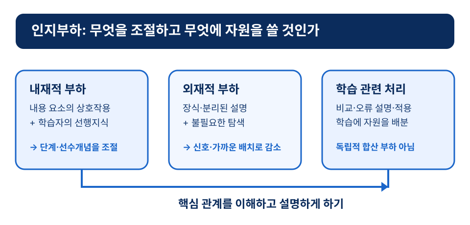
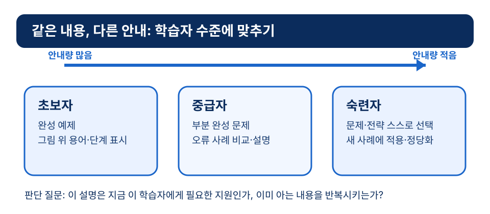

# 9장 멀티미디어 학습과 인지부하

## 학습 목표

이 장을 학습한 뒤에는 다음을 설명할 수 있어야 한다.

1. 인지부하 이론이 수업자료 설계에 주는 핵심 메시지를 설명할 수 있다.
2. 작동기억, 장기기억, 스키마의 관계를 학습자료 설계 관점에서 해석할 수 있다.
3. 이중부호화와 멀티미디어 학습 이론의 기본 가정을 구분할 수 있다.
4. 내재적 부하, 외재적 부하, 학습 관련 부하를 수업 설계 판단에 연결할 수 있다.
5. 멀티미디어 원리와 전문성 역전 효과를 활용하여 학습자 수준에 맞는 자료를 설계할 수 있다.

## 사전 읽기와 학습목표 대응표

**사전 읽기(35분).** 도입 사례와 본문 1~7절을 읽고, 자신이 본 학습자료 하나에서 핵심 관계와 불필요한 요소를 각각 한 가지씩 표시한다. 영상은 선택 자료다. 재생이나 청취가 어렵다면 본문과 자체 도식을 읽고 같은 판단을 수행한다.

| 목표 | 사전 읽기·근거 | 도입 사례·수업 적용 | 사전 확인 | 형성 평가 |
|---|---|---|---|---|
| ch09-obj-01 | 인지부하 이론의 설계 메시지[^sweller1988][^sweller1994] | 세포막 애니메이션에서 효과와 핵심 용어를 분리한다 | **ch09-precheck**: 핵심 관계와 장식 요소를 표시한다 | **ch09-fa-1**: 작동기억의 제한을 확인한다 |
| ch09-obj-02 | 작동기억·장기기억·스키마의 관계[^baddeley2012] | 필요한 선행 용어를 먼저 제시한다 | 필요한 선행 용어를 한 가지 고른다 | **ch09-fa-1**: 자료 설계 판단으로 설명한다 |
| ch09-obj-03 | 이중부호화와 멀티미디어 학습의 가정[^paivio1986][^mayer2009] | 그림과 설명의 역할을 나눈다 | “그림이 많으면 좋다”에 근거를 덧붙인다 | **ch09-fa-3**: 오해를 바로잡는다 |
| ch09-obj-04 | 세 부하의 설계 판단[^sweller1998] | 음악·긴 자막을 줄이고 멈춤 질문을 넣는다 | 외재적 부하 요소를 표시한다 | **ch09-fa-2**: 신호와 단계화를 고른다 |
| ch09-obj-05 | 멀티미디어 원리와 전문성 역전 효과[^mayermoreno2003][^kalyuga2003] | 초보자용 명칭 표시와 숙련자용 오류 비교를 나눈다 | 자신의 수준에 필요한 힌트를 고른다 | **ch09-fa-4, ch09-fa-5**: 안내량과 학습 증거를 판단한다 |

### 사전 확인과 수업 중 적용

- **ch09-precheck — 자료 해부(10분):** 선택한 자료에서 학습 목표와 직접 연결되는 요소, 외재적 부하를 만들 수 있는 요소를 표시하고 판단 근거를 한 문장으로 쓴다.
- **ch09-apply — 누적 수업안의 매체 설계(20분):** 한 학습 목표에 맞는 매체 하나를 선택하거나 사용하지 않기로 결정한다. 핵심 관계, 수준별 안내, 자막·텍스트·인쇄 같은 대체 경로, 접근성 점검, 학습 증거와 수정 책임을 수업안에 기록한다.

!!! caution "매체의 한계·형평성·책임"
    영상과 애니메이션은 설명과 맞지 않으면 외재적 부하를 키운다. 청각·시각 접근성, 기기·네트워크 격차, 외부 서비스의 데이터 처리 때문에 같은 매체가 모든 학생에게 같은 경로가 되지도 않는다. 교사는 대체 경로와 학습 증거를 확인한 뒤 선택과 수정에 책임을 진다.

!!! tip "관련 강의 자료"
    이 장과 연계된 슬라이드: [8강 멀티미디어 설계 원리](https://taehyeonglim.github.io/edtech/chapters/chapter-08/slides/deck.html){target=_blank}

## 도입 사례

**창작 시나리오.** 고등학교 생명과학 수업에서 한 교사는 세포막의 선택적 투과성을 설명하는 8분 애니메이션을 준비했다. 처음 자료에는 배경 음악, 움직이는 아이콘, 긴 자막, 내레이션이 한꺼번에 들어 있었다. 예비 검토에서 학생들이 핵심 용어보다 화면 효과를 더 많이 기억하자, 교사는 막 단백질·농도 차·이동 방향만 남기고 단계별 멈춤 질문을 넣었다. 초보자에게는 그림 위 명칭과 짧은 용어 설명을 제공하고, 이미 개념을 아는 학생에게는 오류 사례를 비교하게 했다. 이제 교사는 한 가지를 판단해야 한다. 화면을 더 풍부하게 만들기보다, 누가 어떤 정보를 어떤 순서로 처리해야 하는지를 어떻게 설계할 것인가?

## 1. 멀티미디어 학습을 설계한다는 것

멀티미디어 학습은 화면과 영상을 많이 쓰는 수업이 아니다. 말과 그림이 함께 제시될 때 학습자가 핵심 정보를 고르고, 관계를 묶고, 이미 아는 것과 연결하도록 돕는 설계다. 그래서 먼저 물어야 할 질문은 “기술을 썼는가?”가 아니라 “학생이 핵심 관계를 설명할 수 있게 되었는가?”이다.

Mayer의 멀티미디어 학습 연구는 사람들이 말과 그림에서 어떻게 학습하는지를 다룬다.[^mayer2009] 여기서 말은 화면 글과 내레이션을, 그림은 도표·사진·삽화·애니메이션을 포함한다. 두 표상을 함께 둔다고 학습이 자동으로 좋아지지는 않는다. 서로 다른 내용을 말하거나, 장식이 핵심을 가리거나, 설명과 그림이 멀리 떨어져 있으면 학생은 관계를 찾는 데 힘을 쓴다.

따라서 좋은 자료는 화려함보다 배치가 중요하다. 학생이 먼저 봐야 할 정보, 비교해야 할 관계, 미리 알아야 할 용어, 멈춰서 연습할 지점을 정해야 한다. 이 판단을 위한 언어가 인지부하 이론이다.

## 2. 제한된 작동기억과 스키마

인지부하 이론은 학습자가 한꺼번에 처리할 수 있는 정보에 한계가 있다는 전제에서 출발한다. Sweller는 문제를 풀 때 수단-목표 분석이 작동기억을 많이 사용하면 스키마 획득이 방해될 수 있음을 논의했다.[^sweller1988] 이후 연구는 학습할 내용의 구조와 자료의 제시 방식이 학습 난이도를 바꾼다고 설명했다.[^sweller1994]

초보자가 복잡한 문제에서 막히는 이유를 의지 부족으로만 해석해서는 안 된다. 요소가 많고 그 관계를 동시에 봐야 하는데, 장기기억에 관련 스키마가 아직 충분하지 않을 수 있다. Sweller, van Merrienboer, Paas는 작동기억의 제한과 장기기억의 스키마를 교수설계와 연결했다.[^sweller1998]

작동기억은 지금 처리하는 정보를 잠시 유지하고 조작하는 체계로 볼 수 있다. Baddeley는 이를 단일 저장고가 아니라 여러 처리 요소가 있는 체계로 논의했다.[^baddeley2012] 수업자료에서는 용어·기호·그림·절차·예외를 동시에 요구할수록 학생이 핵심 관계에 쓸 여유가 줄어든다는 뜻이다.

## 3. 말과 그림이 만날 때

이중부호화 이론은 언어 정보와 비언어 정보가 관련되지만 구분되는 체계로 표상될 수 있다고 본다. Paivio의 *Mental Representations*는 이 접근을 체계적으로 제시한 대표 저작이다.[^paivio1986] 교육 장면에서는 말과 그림이 서로를 보완할 수 있다는 가능성을 알려 준다.

그러나 그림이 많다고 좋은 것은 아니다. 그림이 핵심 관계를 보이지 못하면 장식에 머물고, 말과 그림이 다른 메시지를 주면 학생은 비교와 추측에 시간을 쓴다. Mayer의 이론은 이중 채널, 제한된 처리 용량, 능동적 처리를 바탕으로 학생이 말과 그림을 선택·조직·통합해야 한다고 설명한다.[^mayer2009]

예를 들어 복잡한 도표에는 관련 명칭, 방향, 단계를 바로 곁에 둔다. 긴 문장을 화면에 띄우고 그대로 읽는 방식은 읽기와 듣기 모두에 같은 언어 정보를 처리하게 할 수 있다. 자료의 양이 아니라 각 표상이 맡은 역할을 분명히 하는 것이 핵심이다.

## 4. 인지부하의 세 범주

내재적 부하는 내용의 복잡성과 학습자의 선행지식이 만나는 곳에서 생긴다. 초보자에게 분수 나눗셈은 수·연산·역수·절차·의미 해석이 얽힌 과제다. 관련 스키마가 있는 학생에게는 같은 과제가 덜 부담스러울 수 있다.

외재적 부하는 학습 목표와 직접 관련 없는 제시 방식에서 생긴다. 글과 그림이 멀리 떨어져 계속 시선을 옮겨야 하거나, 중요한 단서가 없거나, 장식 이미지가 설명을 가리면 커진다. 어려운 내용을 배우는 일은 피할 수 없지만, 불필요하게 어렵게 보이게 할 이유는 없다.

학습 관련 부하는 핵심 관계를 비교하고, 예제를 일반화하고, 자신의 오류를 설명하며, 새 상황에 적용할 때 쓰는 노력이다. 그래서 모든 부하를 없애는 것이 목표는 아니다. 불필요한 부담은 줄이고 필요한 사고에 자원을 쓰게 해야 한다.

*그림 9-1. 세 인지부하를 수업자료 설계 판단으로 바꾸기.*

## 5. 멀티미디어 원리를 수업에 적용하기

Mayer와 Moreno는 멀티미디어 학습에서 인지부하를 줄이는 여러 방법을 논의했다.[^mayermoreno2003] 수업자료를 다듬을 때에는 다음의 순서로 적용해 볼 수 있다.

1. 학생이 설명해야 할 핵심 관계를 한 문장으로 쓴다.
2. 그 관계에 꼭 필요한 용어·그림 요소·절차만 남긴다.
3. 글·음성·그림·애니메이션이 각각 어떤 역할을 맡을지 정한다.
4. 중요한 위치와 순서를 표시하고, 설명과 그림을 가깝게 둔다.
5. 복잡한 절차는 단계로 나누고 각 단계에 짧은 확인 질문을 넣는다.

신호는 학습자가 관계를 찾도록 돕는 화살표·색·번호·제목이다. 분절은 긴 설명을 짧은 단위로 나누고 멈춰 생각하게 하는 방법이다. 둘 다 자료를 쉽게 보이게 하려는 장식이 아니라, 학생의 주의를 핵심에 모으려는 판단이다.

## 6. 전문성에 맞춰 안내량 조절하기

같은 원리가 모든 학습자에게 같은 방식으로 작동하지는 않는다. Kalyuga, Ayres, Chandler, Sweller는 초보자에게 도움이 되는 안내가 숙련자에게는 중복 정보가 되어 방해가 될 수 있는 전문성 역전 효과를 논의했다.[^kalyuga2003]

초보자에게는 완성 예제, 그림 위 명칭, 단계별 해설이 필요할 수 있다. 중급자에게는 일부 단계를 비워 설명하게 하거나 오류 사례를 비교하게 할 수 있다. 숙련자에게는 문제 상황만 제시하고 해결 전략을 고르게 하는 편이 더 적절할 수 있다.

*그림 9-2. 전문성 역전 효과를 고려한 안내량 조절.*

## 7. 자료를 완성한 뒤 확인할 것

자료를 만든 뒤에는 “보기 좋은가?”보다 학습 증거를 확인한다. 학생이 핵심 관계를 자기 말로 설명하는지, 새 사례에 적용하는지, 오류를 찾고 수정하는지를 본다. 같은 교실에서도 기본 설명·선택형 힌트·심화 문제·빠른 점검을 나누면 안내가 필요한 학생은 지원을 받고, 이미 이해한 학생은 불필요한 설명에 묶이지 않는다.

이 절차는 교사에게 디자인 전문가가 되라고 요구하지 않는다. 자료의 목적을 분명히 하고, 학생의 제한된 인지 자원을 개념 이해와 문제 해결에 쓰게 하라는 요구다.

## 개념 오해와 적용 한계

- **“부하는 모두 나쁘다.”** 내용 자체의 어려움과 핵심 관계를 비교·설명하는 노력까지 없앨 수는 없다. 줄일 대상은 장식·분리된 설명·불필요한 탐색 같은 외재적 부하다.
- **“그림이나 영상은 많을수록 좋다.”** 그림은 설명해야 할 관계를 보일 때 도움이 된다. 핵심과 맞지 않는 효과는 오히려 주의를 흩뜨릴 수 있다.
- **“자세한 안내는 언제나 친절하다.”** 학습자의 선행지식에 따라 필요한 안내량이 다르다. 익숙한 학생에게는 반복 설명이 새로운 문제 해결을 방해할 수 있다.

## 생각해 보기

1. 최근 본 강의 슬라이드나 영상에서 학생이 핵심 관계보다 장식에 주목할 가능성이 있는 부분은 어디인가?
2. 같은 자료를 초보자와 이미 배운 학생에게 제시한다면, 무엇을 더하고 무엇을 덜겠는가?
3. 학생이 “자료가 쉬웠다”가 아니라 “관계를 설명할 수 있다”는 증거를 어떻게 남기게 하겠는가?

## 웹 학습 보조

아래 영상과 매트릭스는 목표 1·4를 보완한다. 영상 시청이 어렵다면 매트릭스와 본문 4~5절을 사용해 세 부하의 설계 판단을 수행한다.

  
검증 영상

  
John Sweller의 인지부하 이론 소개

  

    <iframe title="Emeritus Professor John Sweller, School of Education, UNSW Australia" src="https://www.youtube-nocookie.com/embed/mBmFqwgtQBY?cc_load_policy=1" loading="lazy" allow="clipboard-write; encrypted-media; gyroscope; picture-in-picture; web-share" allowfullscreen></iframe>
  

  
출처: YouTube oEmbed로 2026-06-14 확인한 UNSW Arts &amp; Social Sciences 제공 영상. 임베드는 youtube-nocookie 주소와 자막 우선 옵션을 사용한다.

  
인지부하 매트릭스

  
세 부하를 설계 판단으로 바꾸기

  

    
<strong>내재적 부하</strong>내용 복잡성과 선행지식의 관계를 조정한다.

    
<strong>외재적 부하</strong>장식, 분리된 설명, 불필요한 탐색을 줄인다.

    
<strong>학습 관련 부하</strong>비교, 일반화, 오류 설명에 자원을 쓰게 한다.

  

  
출처: 이 장 본문과 Sweller, Mayer, Mayer &amp; Moreno 참고문헌을 바탕으로 만든 자체 도식.

## 이론과 연구 확장

### 인지부하는 학습자의 무능력이 아니라 설계 조건을 드러낸다

Sweller의 초기 연구는 문제 해결 절차가 작동기억을 과도하게 사용하면 스키마 획득이 방해될 수 있음을 보였다.[^sweller1988] 이후 인지부하 이론은 작동기억의 제한과 장기기억의 스키마를 연결해 교수설계의 근거를 제공했다.[^sweller1998] 학생이 어려워한다는 사실만 보고 설명을 더 붙이기보다, 내용의 상호작용과 제시 방식 중 무엇이 부담을 키우는지 먼저 구분해야 한다.

### 말과 그림의 결합은 능동적 처리를 요구한다

Mayer의 이론은 이중 채널, 제한된 처리 용량, 능동적 처리라는 가정 위에서 말과 그림의 결합을 설명한다.[^mayer2009] Paivio의 이중부호화 이론도 언어와 비언어 표상의 보완 가능성을 보여 준다.[^paivio1986] 그림이 설명의 핵심 관계를 보이고, 텍스트와 음성이 불필요하게 중복되지 않을 때 그 가능성이 수업 설계가 된다.

### 외재적 부하를 줄인다고 사고를 없애는 것은 아니다

Mayer와 Moreno는 신호 제공, 분절, 적절한 표상 배치처럼 인지부하를 줄이는 방법을 논의했다.[^mayermoreno2003] 목표는 어려운 내용을 모두 단순화하는 것이 아니라, 장식과 탐색 때문에 필요한 사고가 밀려나지 않게 하는 것이다.

### 안내의 양은 학습자 전문성에 따라 달라진다

전문성 역전 효과 연구는 초보자에게 도움이 되는 안내가 숙련자에게는 중복 정보가 될 수 있음을 보여 준다.[^kalyuga2003] 기본 해설, 선택형 힌트, 오류 비교, 심화 문제를 나누어 제공하는 일은 장식적 차별화가 아니라 스키마 수준에 맞춘 설계다.

## 토론 질문

1. 도입 사례에서 배경 음악과 긴 자막을 줄인 결정은 어떤 점에서 외재적 부하를 줄이는가?
2. 같은 과학 애니메이션을 초보자와 숙련자에게 제시할 때 안내의 양과 방식은 어떻게 달라져야 하는가?
3. 멀티미디어 자료에서 “흥미로운 장식”과 “학습을 돕는 신호”를 구분할 기준은 무엇인가?
4. 학습 관련 부하를 늘리는 활동과 외재적 부하를 늘리는 활동은 교실에서 어떻게 다르게 관찰될 수 있는가?

## 형성 평가

1. 인지부하 이론의 핵심 전제와 가장 가까운 설명은 무엇인가?
   ① 학습자는 충분히 노력하면 모든 정보를 동시에 처리할 수 있다.
   ② 수업자료는 작동기억의 제한을 고려해 불필요한 부담을 줄여야 한다.
   ③ 어려운 내용은 항상 더 쉬운 내용으로 바꾸어야 한다.
   ④ 학생의 어려움은 자료와 관계없이 의지의 문제다.
   **정답**: ②
   **해설**: 학습자는 제한된 작동기억 안에서 정보를 처리한다. 설계는 외재적 부하를 줄이고 스키마 형성에 필요한 사고를 지원해야 한다.

2. 다음 중 외재적 부하를 줄이는 설계에 가장 가까운 것은 무엇인가?
   ① 핵심 개념과 무관한 배경 이미지를 많이 넣는다.
   ② 도표와 설명을 멀리 배치해 학생이 직접 찾게 한다.
   ③ 복잡한 절차를 단계로 나누고 중요한 위치에 신호를 표시한다.
   ④ 같은 긴 문장을 화면에 띄우고 그대로 읽어 준다.
   **정답**: ③
   **해설**: 단계화와 신호 제공은 불필요한 탐색을 줄이고 핵심 관계에 주의를 모으게 한다.

3. 이중부호화 이론에 대한 설명으로 가장 적절한 것은 무엇인가?
   ① 그림의 수가 많을수록 학습은 반드시 좋아진다.
   ② 말과 그림은 서로 다른 메시지를 줄수록 기억에 남는다.
   ③ 말과 그림은 핵심 관계를 서로 보완하도록 설계될 때 도움이 된다.
   ④ 그림은 글을 완전히 대신해야 한다.
   **정답**: ③
   **해설**: 그림이 설명과 맞지 않거나 핵심 관계를 보이지 못하면 장식이 되어 외재적 부하를 높일 수 있다.

4. 전문성 역전 효과를 고려한 수업자료 조정 예를 쓰시오.
   **예시 답안**: 초보자에게는 완성 예제와 그림 위 명칭 표시를 제공하고, 숙련자에게는 일부 힌트를 숨긴 문제나 오류 사례 분석을 제공한다.
   **루브릭**: 학습자 수준 차이와 안내량 조절이 모두 드러나면 우수하다.

5. 멀티미디어 자료를 평가할 때 “보기 좋다”보다 더 중요한 확인 질문을 하나 제시하시오.
   **예시 답안**: 학생이 자료를 본 뒤 핵심 관계를 자신의 말로 설명하고 새 예에 적용할 수 있는가를 확인해야 한다.
   **채점 기준**: 핵심 관계 설명, 적용 또는 전이, 학습 증거 확인을 포함하면 충분하다.

## 요약

멀티미디어 학습은 말과 그림을 많이 넣는 일이 아니라, 제한된 작동기억 안에서 학생이 핵심 정보를 선택·조직·통합하도록 돕는 일이다. 내재적 부하는 내용과 선행지식의 관계로 조절하고, 외재적 부하는 신호·가까운 배치·분절로 줄이며, 학습 관련 부하는 비교와 설명에 쓰게 한다. 초보자와 숙련자에게 필요한 안내량도 다르다. 자료의 효과는 화려함이나 재생 횟수가 아니라 학생이 핵심 관계를 설명하고 적용하는 증거로 판단한다.

## 핵심 용어

- **작동기억**: 현재 처리 중인 정보를 제한된 시간 동안 유지하고 조작하는 인지 체계로, 수업자료가 동시에 요구하는 처리량에 민감하다.
- **인지부하**: 학습자가 과제를 수행할 때 작동기억에 걸리는 부담으로, 내용 복잡성, 자료 제시 방식, 스키마 형성 활동의 영향을 받는다.
- **외재적 부하**: 학습 목표와 직접 관련 없는 장식, 분리된 설명, 불필요한 탐색 때문에 생기는 부담이다.
- **멀티미디어 학습**: 말과 그림을 함께 제시하되 학습자가 정보를 선택, 조직, 통합하도록 표상을 설계하는 학습 접근이다.
- **전문성 역전 효과**: 초보자에게 유용한 상세 안내가 숙련자에게는 불필요하거나 방해가 될 수 있는 현상이다.

## 참고문헌

[^baddeley2012]: Baddeley, A. (2012). Working memory: Theories, models, and controversies. *Annual Review of Psychology, 63*, 1-29. https://doi.org/10.1146/annurev-psych-120710-100422. Crossref metadata verified.

[^kalyuga2003]: Kalyuga, S., Ayres, P., Chandler, P., & Sweller, J. (2003). The expertise reversal effect. *Educational Psychologist, 38*(1), 23-31. https://doi.org/10.1207/S15326985EP3801_4. Crossref metadata verified.

[^mayer2009]: Mayer, R. E. (2009). *Multimedia Learning* (2nd ed.). Cambridge University Press. https://doi.org/10.1017/CBO9780511811678. Cambridge/Crossref metadata verified.

[^mayermoreno2003]: Mayer, R. E., & Moreno, R. (2003). Nine ways to reduce cognitive load in multimedia learning. *Educational Psychologist, 38*(1), 43-52. https://doi.org/10.1207/S15326985EP3801_6. Crossref metadata verified.

[^paivio1986]: Paivio, A. (1986). *Mental Representations: A Dual Coding Approach*. Oxford University Press. Catalog metadata verified through the U.S. National Library of Medicine at `https://catalog.nlm.nih.gov/discovery/fulldisplay/alma996406653406676/01NLM_INST:01NLM_INST`.

[^sweller1988]: Sweller, J. (1988). Cognitive load during problem solving: Effects on learning. *Cognitive Science, 12*(2), 257-285. https://doi.org/10.1207/s15516709cog1202_4. Crossref metadata verified.

[^sweller1994]: Sweller, J. (1994). Cognitive load theory, learning difficulty, and instructional design. *Learning and Instruction, 4*(4), 295-312. https://doi.org/10.1016/0959-4752(94)90003-5. Crossref metadata verified.

[^sweller1998]: Sweller, J., van Merrienboer, J. J. G., & Paas, F. G. W. C. (1998). Cognitive architecture and instructional design. *Educational Psychology Review, 10*(3), 251-296. https://doi.org/10.1023/A:1022193728205. Crossref metadata verified.
