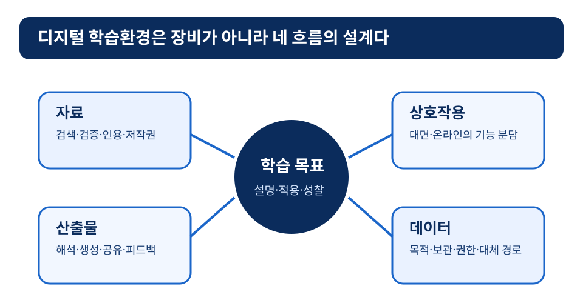
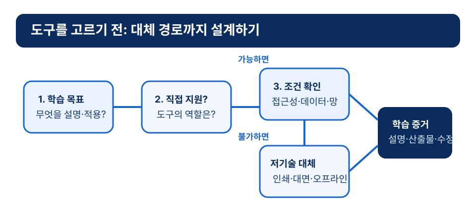

# 10장 디지털 학습환경과 미래교실

## 학습 목표

이 장을 학습한 뒤에는 다음을 설명할 수 있어야 한다.

1. 디지털 학습환경을 기기 도입이 아니라 학습 경험, 자료, 상호작용, 평가의 재구성으로 설명할 수 있다.
2. 2022 개정 교육과정의 디지털 기초소양 논의를 수업 설계와 연결할 수 있다.
3. 온라인 학습, 블렌디드 러닝, MOOC, 모바일 학습, 마이크로러닝의 차이를 구분할 수 있다.
4. 디지털교과서, AI 디지털교과서, AI 교육자료 용어를 정책 시점에 맞추어 조심스럽게 사용할 수 있다.
5. 실감미디어와 미래교실 설계에서 기술 효과를 과장하지 않고 교수학습 조건을 점검할 수 있다.

## 사전 읽기와 학습목표 대응표

**사전 읽기(40분).** 도입 사례와 본문 1~7절을 읽고, 자신이 경험한 디지털 수업 하나를 자료·상호작용·산출물·데이터의 네 흐름으로 메모한다. 정책·AI·제품 표현은 **2026-08-13 확인 기준**의 본문 용어로 읽고, 다음 학기에는 front matter의 검토 대상을 다시 확인한다.

| 목표 | 사전 읽기·근거 | 도입 사례·수업 적용 | 사전 확인 | 형성 평가 |
|---|---|---|---|---|
| ch10-obj-01 | 자료·상호작용·평가의 재구성[^means2010][^garrison2004] | 역사 탐구의 온라인 자료 검토와 대면 사료 비교를 나눈다 | **ch10-precheck**: 도구가 지원하는 목표와 흐름을 적는다 | **ch10-fa-1**: 장비 목록 오해를 확인한다 |
| ch10-obj-02 | 2022 개정 교육과정의 디지털 기초소양[^moe2022] | 자료의 검색·검증·인용을 역사 탐구에 연결한다 | 수업 설계와 연결할 요소를 표시한다 | **ch10-fa-2**: 공간의 기능 분담을 고른다 |
| ch10-obj-03 | 온라인·블렌디드·MOOC·모바일·마이크로러닝[^garrison2004][^kaplan2016][^traxler2007][^hug2005] | 지도 앱·공유 문서·인터뷰 영상의 역할을 구분한다 | 도구의 역할을 한 가지 적는다 | **ch10-fa-3**: 유형의 설계 조건을 판단한다 |
| ch10-obj-04 | 정책 용어의 시점성[^moe2023][^moe2026] | AI 교육자료라는 주장에 확인할 근거를 적는다 | 정책 용어의 확인 시점을 표시한다 | **ch10-fa-4**: 검증과 목표 적합성을 설명한다 |
| ch10-obj-05 | 실감미디어와 미래교실의 조건[^radianti2020][^mishra2006] | 접속이 어려운 학생에게 인쇄·오프라인 경로를 제공한다 | 기기·접속·장애 상황의 대안을 쓴다 | **ch10-fa-5**: 단순한 대안과 비교해 판단한다 |

### 사전 확인과 수업 중 적용

- **ch10-precheck — 환경 흐름 점검(10분):** 한 디지털 도구를 골라 학습 목표, 학생 활동, 수집될 수 있는 데이터, 접근 장벽을 네 칸에 기록한다. 확인이 필요한 주장에는 출처를 표시한다.
- **ch10-apply — 누적 수업안의 디지털 경로(20분):** 도구를 사용할 이유와 사용하지 않을 조건을 정한다. 대면·온라인의 기능, 개인정보를 입력하지 않는 운영 방식, 기기·장애·네트워크 문제의 저기술 대체 경로, 교사가 확인할 학습 증거와 수정 책임을 수업안에 넣는다.

!!! caution "정책·AI·제품 표현의 한계와 검토"
    정책 용어와 제품 기능·도입 범위는 변한다. 기술 사용 자체도 학습 효과를 보장하지 않는다. AI 교육자료와 디지털 플랫폼은 데이터 처리, 접근성, 언어·기기 격차, 알고리즘 추천의 편향을 함께 점검해야 한다. 이 장의 정책·AI·제품 내용은 2026-08-13에 확인했으며, 매 학기 공식 정책 자료와 학교의 개인정보·접근성 지침, 실제 서비스 조건을 검토한다.

!!! tip "관련 강의 자료"
    이 장 내용의 일부는 다음 슬라이드에 반영되어 있다: [3강 2022 개정 교육과정과 AI·디지털 교육](https://taehyeonglim.github.io/edtech/chapters/chapter-03/slides/deck.html){target=_blank}, [9강 AI 디지털교과서의 시대](https://taehyeonglim.github.io/edtech/chapters/chapter-09/slides/deck.html){target=_blank}

## 도입 사례

**창작 시나리오.** 중학교 역사 수업에서 한 교사는 지역 근현대사 탐구 프로젝트에 지도 앱, 공유 문서, 짧은 인터뷰 영상, 온라인 토론방을 모두 쓰려 했다. 수업안을 점검하자 도구는 많았지만, 학생이 무엇을 검증하고 어떤 산출물을 만들어야 하는지는 흐릿했다. 교사는 온라인 공간을 사전 자료 검토와 질문 제출에, 대면 수업을 사료 비교와 토론에, 공유 문서를 공동 보고서 초안과 피드백 기록에 배치했다. 접속이 어려운 학생에게는 인쇄 자료와 오프라인 제출 경로도 준비했다. 이때 남는 판단은 분명하다. 각 도구는 학습 목표를 위해 어떤 역할을 맡으며, 그 역할을 못 할 때는 어떻게 바꿀 것인가?

## 1. 디지털 학습환경은 네 흐름의 설계다

디지털 학습환경은 태블릿·전자칠판·무선망의 목록이 아니다. 학생이 자료에 접근하고, 다른 사람과 상호작용하고, 산출물을 만들고, 피드백을 받고, 데이터가 처리되는 방식이 연결된 환경이다. 따라서 설계의 출발점은 새 기기가 아니라 학습 과제와 증거다.

예를 들어 공유 문서는 동시 협업과 과정 피드백을 지원할 수 있다. 하지만 역할과 산출물 기준이 없으면 단순 분업 문서가 된다. 영상도 복잡한 과정을 보여 줄 수 있지만, 멈춤과 질문이 없으면 수동 시청으로 끝날 수 있다. 디지털 학습환경의 질은 도구의 최신성이 아니라 활동과 피드백의 연결에서 나온다.

*그림 10-1. 디지털 학습환경을 구성하는 네 흐름.*

## 2. 디지털 기초소양을 교과 수업에 넣기

2022 개정 교육과정은 미래 사회 변화와 학습자의 삶을 고려해 역량, 주도성, 깊이 있는 학습을 강조하는 방향으로 고시되었다.[^moe2022] 이 맥락에서 디지털 기초소양은 특정 소프트웨어를 빠르게 쓰는 기술만이 아니다. 디지털 환경에서 정보를 이해·활용·생성하고, 타인과 윤리적으로 참여하는 능력과 연결된다.

수업에서는 두 가지 질문으로 바꿔 볼 수 있다. 학생은 디지털 자료를 소비만 하는가, 아니면 근거를 판단하고 새로운 산출물로 재구성하는가? 도구는 학생의 선택과 협력을 넓히는가, 아니면 활동을 더 빨리 제출하게 하는가? 검색·검증·인용·저작권·개인정보·데이터 해석·온라인 협업 규칙을 교과 과제 안에서 다룰 때 디지털 기초소양은 실제 학습 목표가 된다.

교육과정은 지향과 기준을 제시한다. 학교의 인프라, 교사의 준비도, 학생의 접근성, 지역 조건이 모두 같다는 뜻은 아니다. “디지털 전환이 필요하다”는 선언보다 이 수업의 어느 지점에서 도구가 학습을 돕는지 구체적으로 판단해야 한다.

## 3. 온라인 학습과 블렌디드 러닝

온라인 학습은 자료 전달, 상호작용, 과제 제출, 피드백의 상당 부분이 네트워크 기반 환경에서 이루어지는 학습 형태다. 형식만 온라인이라고 해서 효과가 보장되지는 않는다. 미국 교육부의 연구 종합 보고서는 온라인과 블렌디드 조건을 비교하되, 연구 설계와 수업 조건의 차이를 함께 해석해야 함을 보여 준다.[^means2010]

블렌디드 러닝은 대면과 온라인을 단순히 섞는 방식이 아니다. Garrison과 Kanuka는 대면과 온라인 경험의 사려 깊은 통합을 통해 변화를 만들 수 있다고 논의했다.[^garrison2004] 수업 설계에서는 어느 공간에서 무엇을 할지, 한 공간의 결과가 다른 공간에서 어떻게 쓰일지를 정해야 한다.

개념 설명 영상은 온라인에서 미리 보고, 대면에서는 오류 사례 분석과 토론을 할 수 있다. 민감한 피드백이나 즉각 조정이 필요한 활동은 대면에서 다루고, 온라인에서는 초안 공유와 동료 피드백을 할 수 있다. “온라인 과제 하나 추가”가 아니라 각 공간이 다른 학습 기능을 맡게 하는 것이 핵심이다.

## 4. MOOC, 모바일 학습, 마이크로러닝

MOOC는 대규모 개방 온라인 강좌로 알려졌지만, 플랫폼·수강자 규모·인증 방식·상호작용 설계에 따라 구현이 다르다. Kaplan과 Haenlein은 MOOC와 SPOC를 고등교육의 디지털 전환 속에서 논의했다.[^kaplan2016] 설계자는 무료 강의라는 장점만 보지 말고, 학습자 다양성, 중도 이탈, 평가 신뢰도, 공동체 형성을 함께 봐야 한다.

모바일 학습은 스마트폰을 쓰는 수업보다 넓은 개념이다. Traxler는 이동성, 맥락, 개인 기기, 학습 경험의 변화와 연결해 이를 정의하고 평가해야 한다고 보았다.[^traxler2007] 현장 자료 수집, 위치 기반 탐구, 즉각 퀴즈, 사진·음성 기록에는 유용할 수 있지만, 알림·작은 화면·접근성·개인정보 문제를 고려하지 않으면 집중과 형평성을 해칠 수 있다.

마이크로러닝은 내용을 짧은 단위로 조직하는 접근이다. Hug는 작은 학습 단위와 학습 경험의 조직 문제를 탐색했다.[^hug2005] 복습·절차 안내·사전 읽기·현장 지원에는 적합할 수 있다. 다만 복잡한 개념 이해를 짧은 조각만으로 대체할 수는 없다. 짧게 나누는 것과 얕게 만드는 것은 다르다.

## 5. 정책 용어를 시점과 함께 읽기

정책 용어는 시점에 따라 바뀌므로 교재에서 조심스럽게 사용해야 한다. 2023년 교육부의 디지털 기반 교육혁신 방안은 AI 디지털교과서 도입과 맞춤형 학습 지원을 주요 과제로 제시했다.[^moe2023] 이 시기의 “AI 디지털교과서”는 정책 경위 속에서 이해할 용어다.

2026년 교육부 업무계획은 “AI 교육자료”라는 용어로 구 AI 디지털교과서, 코스웨어, 에듀테크 등을 포괄해 설명한다.[^moe2026] 그래서 이 장에서는 2026년 현재의 정책 용어를 “AI 교육자료”로 쓰고, “AI 디지털교과서”는 2023년 이후 논의의 역사적 용어로 구분한다. 특정 제품의 기능이나 도입 범위는 바뀔 수 있으므로, 수업과 연구에서는 최신 공식 자료를 다시 확인해야 한다.

중요한 것은 기술 명칭보다 수업 속 역할이다. 자료가 학생의 이해를 드러내는지, 교사가 그 정보를 바탕으로 피드백을 조정하는지, 학생이 자신의 학습 과정을 설명하는지, 데이터 처리 원칙이 지켜지는지를 물어야 한다. “AI가 맞춤형으로 해 준다”는 말만으로는 설계가 완성되지 않는다.

## 6. 실감미디어와 미래교실의 조건

실감미디어는 가상현실·증강현실·혼합현실처럼 공간감과 상호작용을 제공하는 매체를 포함한다. Radianti와 동료들의 체계적 문헌고찰은 고등교육에서 몰입형 가상현실 활용 연구를 정리하면서, 설계 요소와 평가 방식이 다양하다는 점을 보여 준다.[^radianti2020] 이는 가능성을 보여 주는 근거이지, 실감미디어가 항상 더 낫다는 결론은 아니다.

위험한 실험, 접근하기 어려운 장소, 보이지 않는 구조, 반복 연습이 필요한 절차에서는 장점이 있을 수 있다. 과학 실험실 안전 훈련, 역사 공간 탐방, 인체 구조 탐색, 기계 조립 절차가 예다. 동시에 멀미, 장비 비용, 접근성, 수업 시간, 교사의 통제, 평가 기준을 설계해야 한다.

미래교실은 특정 기기의 전시장이 아니다. 학생이 질문을 만들고, 자료를 탐색하고, 함께 산출물을 만들며, 피드백을 받는 환경이어야 한다. Mishra와 Koehler의 TPACK 논의는 내용·교수·기술의 결합으로 교사의 지식을 이해하게 한다.[^mishra2006] 좋은 디지털 학습환경은 기술 지식만으로 만들 수 없다는 뜻이다.

## 7. 도구 선택과 대체 경로

도구를 고르기 전에는 먼저 목표를 쓴다. 다음으로 그 도구가 목표를 직접 지원하는지, 학생이 소비를 넘어 해석·검증·생성을 할 수 있는지 확인한다. 접근성·기기 격차·장애 지원·언어 수준·데이터 처리 조건이 충족되지 않으면 인쇄 자료, 대면 활동, 오프라인 제출처럼 같은 목표를 달성할 대체 경로를 준비한다.

*그림 10-2. 디지털 도구 선택과 저기술 대체 경로의 설계 순서.*

수업 뒤에는 참여 로그만 보지 않는다. 학생의 설명, 산출물, 피드백 반영을 근거로 도구가 학습을 도왔는지 판단한다. 이 과정은 기술 사용을 줄이자는 뜻이 아니라, 기술을 학습 설계의 일부로 다루는 최소 조건이다.

## 개념 오해와 적용 한계

- **“기기가 많으면 디지털 학습환경이다.”** 장비는 조건일 뿐이다. 자료·상호작용·산출물·피드백·데이터가 목표와 연결되어야 학습환경이 된다.
- **“온라인 활동을 추가하면 블렌디드 러닝이다.”** 대면과 온라인이 서로 다른 학습 기능을 맡고 결과가 이어져야 한다.
- **“새 기술은 더 효과적이다.”** 실감미디어나 AI 교육자료의 가치는 새로움이 아니라 목표 적합성, 접근성, 실행 조건, 학습 증거로 판단한다.

## 생각해 보기

1. 자신이 경험한 디지털 수업에서 네 흐름 중 가장 약했던 것은 무엇이며, 어떻게 보완할 수 있는가?
2. 온라인과 대면 활동을 나눌 때 반드시 대면으로 남겨야 할 학습 기능은 무엇이라고 생각하는가?
3. 특정 도구를 쓸 수 없는 학생도 같은 목표에 도달하도록 하려면 어떤 대체 경로와 평가 증거가 필요한가?

## 웹 학습 보조

아래 환경 지도와 활동 패널은 목표 1·5의 설계를 돕는다. 사전 확인에서 고른 도구를 네 흐름으로 다시 읽고, 목표를 바꾸지 않는 대체 경로를 한 가지 적어 본다.

  
환경 지도

  
디지털 학습환경의 네 흐름

  

    
<strong>자료</strong>검색, 검증, 인용, 저작권을 함께 다룬다.

    
<strong>상호작용</strong>대면과 온라인의 기능을 분리해 연결한다.

    
<strong>산출물</strong>소비보다 해석, 생성, 공유를 중심에 둔다.

    
<strong>데이터</strong>수집 목적, 보관, 접근권한, 대체 경로를 확인한다.

  

  
출처: 이 장 본문과 디지털 기초소양, 블렌디드 러닝, AI 교육자료 논의를 바탕으로 만든 자체 도식.

  
설계 활동

  
디지털 도구 선택 전 대체 경로 쓰기

  <ol class="activity-steps">
    <li>도구가 직접 지원하는 학습 목표를 한 문장으로 적는다.</li>
    <li>접속 실패, 기기 격차, 장애 접근성 문제를 예상한다.</li>
    <li>같은 목표를 달성할 수 있는 오프라인 또는 저기술 대안을 준비한다.</li>
  </ol>
  
출처: 이 장의 도구 선택과 대체 경로 절을 바탕으로 만든 자체 활동.

## 이론과 연구 확장

### 디지털 기초소양은 교과 학습과 분리되지 않는다

2022 개정 교육과정은 미래 사회 변화와 학습자의 삶을 고려해 역량과 주도성, 깊이 있는 학습을 강조한다.[^moe2022] 이 맥락에서 디지털 기초소양은 별도의 사용법 단원이 아니라 교과 자료를 검색·검증·인용하고 산출물로 재구성하는 활동과 연결된다.

### 블렌디드 러닝은 공간의 기능 분담을 요구한다

온라인 학습 연구 종합 보고서는 온라인과 블렌디드 조건의 효과를 해석할 때 연구 설계와 수업 조건의 차이를 함께 보아야 함을 보여 준다.[^means2010] Garrison과 Kanuka도 블렌디드 러닝을 대면과 온라인 경험의 사려 깊은 통합으로 설명했다.[^garrison2004] 온라인은 자료 검토와 초안 공유를, 대면은 토론과 즉각 조정을 맡는 식으로 기능이 분명해야 한다.

### 모바일·마이크로 학습은 짧음과 이동성을 설계 문제로 만든다

Traxler는 모바일 학습을 이동성, 맥락, 개인 기기, 학습 경험의 변화와 연결해 정의하고 평가해야 한다고 보았다.[^traxler2007] Hug의 논의도 작은 학습 단위와 내러티브 조직의 가능성을 탐색했다.[^hug2005] 두 접근은 현장 기록과 짧은 복습에 유용하지만, 집중·개인정보·깊이 있는 이해를 함께 점검해야 한다.

### 미래교실의 핵심은 기술·교수·내용의 결합이다

실감미디어 연구는 몰입형 매체의 가능성과 함께 설계 요소와 평가 방식의 다양성을 보여 준다.[^radianti2020] Mishra와 Koehler의 TPACK 논의는 교사의 지식이 내용, 교수, 기술의 결합으로 이해될 수 있음을 강조한다.[^mishra2006] 미래교실은 장비 전시장이 아니라 이 세 조건과 접근성·데이터 윤리를 조정하는 환경이어야 한다.

## 토론 질문

1. 도입 사례에서 온라인 활동과 대면 활동을 기능별로 나눈 결정은 블렌디드 러닝 관점에서 왜 중요한가?
2. 디지털 기초소양을 교과 수업 안에서 다룰 때 검색, 검증, 인용, 저작권 중 어느 요소가 가장 자주 누락되는가?
3. 모바일 학습이 학습 기회를 넓히는 경우와 형평성 문제를 만드는 경우를 각각 예로 들어 보자.
4. AI 교육자료나 실감미디어를 선택할 때 기술 효과를 과장하지 않기 위해 교사가 확인해야 할 증거는 무엇인가?

## 형성 평가

1. 디지털 학습환경에 대한 설명으로 가장 적절한 것은 무엇인가?
   ① 전자칠판과 태블릿의 수가 많은 교실이다.
   ② 자료, 상호작용, 산출물, 피드백, 데이터가 목표에 맞게 조직된 환경이다.
   ③ 온라인으로만 진행하는 수업이다.
   ④ 최신 제품을 모두 쓰는 수업이다.
   **정답**: ②
   **해설**: 디지털 학습환경의 핵심은 장비 보유가 아니라 학습 활동과 평가 증거의 재구성이다.

2. 블렌디드 러닝 설계에서 가장 적절한 판단은 무엇인가?
   ① 온라인 과제를 하나 추가하면 자동으로 블렌디드 러닝이 된다.
   ② 대면과 온라인 활동이 서로 다른 학습 기능을 맡고 결과가 이어져야 한다.
   ③ 온라인 활동은 항상 대면 활동보다 우수하다.
   ④ 대면 수업에서는 디지털 자료를 사용할 수 없다.
   **정답**: ②
   **해설**: 블렌디드 러닝은 두 공간의 사려 깊은 통합과 기능 분담을 요구한다.

3. 마이크로러닝에 대한 설명으로 가장 적절한 것은 무엇인가?
   ① 짧은 단위이므로 복잡한 개념 학습을 완전히 대체한다.
   ② 모든 학생이 같은 속도로 짧은 영상을 시청하게 하는 방식이다.
   ③ 복습·절차 안내에는 유용할 수 있지만, 깊이 있는 이해의 조건도 설계해야 한다.
   ④ 모바일 기기가 있을 때만 가능한 수업이다.
   **정답**: ③
   **해설**: 짧게 나누는 것은 유용할 수 있지만, 복잡한 개념을 얕게 만들지 않도록 다른 학습 활동과 연결해야 한다.

4. 디지털 기초소양을 평가하는 과제 예를 하나 쓰시오.
   **예시 답안**: 학생이 온라인 자료 두 개를 비교해 신뢰도, 출처, 저작권 조건을 판단하고 이를 근거로 짧은 설명문을 작성하게 한다.
   **채점 기준**: 정보 검증, 윤리적 활용, 교과 산출물 연결이 포함되면 적절하다.

5. 실감미디어를 수업에 도입하기 전 확인해야 할 조건을 하나 제시하고 이유를 설명하시오.
   **예시 답안**: 같은 목표를 더 간단한 자료로 달성할 수 있는지 확인해야 한다. 실감미디어는 장비 비용, 멀미, 접근성 문제를 동반할 수 있기 때문이다.
   **루브릭**: 목표 적합성과 실행 조건을 모두 설명하고, 대체 경로를 제시하면 우수하다.

## 요약

디지털 학습환경은 장비와 플랫폼의 집합이 아니라 자료·상호작용·산출물·피드백·데이터의 흐름을 학습 목표에 맞게 재구성한 환경이다. 디지털 기초소양은 교과 자료를 검색·검증·인용·재구성하는 활동에서 길러진다. 온라인과 대면은 서로 다른 기능을 맡아야 하며, MOOC·모바일 학습·마이크로러닝·실감미디어는 가능성과 함께 접근성·형평성·깊이 있는 이해의 조건을 지닌다. AI 교육자료처럼 변하는 정책 용어는 시점과 공식 근거를 함께 확인한다. 도구가 실패하거나 일부 학생이 접근하지 못해도 같은 목표에 도달할 대체 경로와 학습 증거를 준비하는 일이 설계의 일부다.

## 핵심 용어

- **디지털 학습환경**: 디지털 매체와 데이터 흐름 속에서 자료 접근, 상호작용, 산출물 제작, 피드백, 평가가 조직되는 학습 환경이다.
- **디지털 기초소양**: 디지털 환경에서 정보를 이해·활용·생성하고 윤리적으로 참여하는 데 필요한 기본 역량이다.
- **블렌디드 러닝**: 대면 수업과 온라인 학습을 기능적으로 통합하여 각 공간의 학습 역할을 분명히 하는 접근이다.
- **AI 교육자료**: 2026년 현재 정책 문맥에서 구 AI 디지털교과서, 코스웨어, 에듀테크 등을 포괄해 설명하는 용어이다.
- **실감미디어**: 가상현실, 증강현실, 혼합현실처럼 공간감과 상호작용을 제공하는 매체를 포함하는 표현이다.

## 참고문헌

[^garrison2004]: Garrison, D. R., & Kanuka, H. (2004). Blended learning: Uncovering its transformative potential in higher education. *The Internet and Higher Education, 7*(2), 95-105. https://doi.org/10.1016/j.iheduc.2004.02.001. Crossref metadata verified.

[^hug2005]: Hug, T. (2005). Micro learning and narration: Exploring possibilities of utilization of narrations and storytelling for the designing of "micro units" and didactical micro-learning arrangements. In *Media in Transition 4*. MIT conference paper verified at `https://web.mit.edu/comm-forum/legacy/mit4/papers/hug.pdf`.

[^kaplan2016]: Kaplan, A. M., & Haenlein, M. (2016). Higher education and the digital revolution: About MOOCs, SPOCs, social media, and the Cookie Monster. *Business Horizons, 59*(4), 441-450. https://doi.org/10.1016/j.bushor.2016.03.008. Crossref metadata verified.

[^means2010]: Means, B., Toyama, Y., Murphy, R., Bakia, M., & Jones, K. (2010). *Evaluation of Evidence-Based Practices in Online Learning: A Meta-Analysis and Review of Online Learning Studies*. U.S. Department of Education. ERIC metadata verified at `https://eric.ed.gov/?id=ED505824`; official PDF verified at `https://www.ed.gov/media/document/evaluation-of-evidence-based-practices-online-learning-meta-analysis-and-review-of-online-learning-studies-revised-september-2010-107159.pdf`.

[^mishra2006]: Mishra, P., & Koehler, M. J. (2006). Technological pedagogical content knowledge: A framework for teacher knowledge. *Teachers College Record, 108*(6), 1017-1054. https://doi.org/10.1111/j.1467-9620.2006.00684.x. Crossref metadata verified.

[^moe2022]: 교육부. (2022). *초·중등학교 교육과정 총론 및 각론 고시, 교육부 고시 제2022-33호*. 교육부 공식 고시 페이지 verified at `https://www.moe.go.kr/boardCnts/viewRenew.do?boardID=141&boardSeq=93458&lev=0&m=040401&opType=N&page=1&s=moe&searchType=null&statusYN=W`.

[^moe2023]: 교육부. (2023). *디지털 기반 교육혁신 방안*. 교육부 공식 정책자료 verified at `https://www.moe.go.kr/boardCnts/viewRenew.do?boardID=72769&boardSeq=94551&lev=0`; 보도자료 verified at `https://www.moe.go.kr/boardCnts/viewRenew.do?boardID=294&boardSeq=94011&lev=0&m=020402&opType=N&page=1&s=moe&searchType=null&statusYN=W`.

[^moe2026]: 교육부. (2026). *2026년 교육부 주요업무 추진계획*. 교육부 공식 PDF `https://www.moe.go.kr/upload/filedown/2026_business_plan_data.pdf` 확인. 본문에서는 2026년 현재 용어를 "AI 교육자료"로 사용한다.

[^radianti2020]: Radianti, J., Majchrzak, T. A., Fromm, J., & Wohlgenannt, I. (2020). A systematic review of immersive virtual reality applications for higher education: Design elements, lessons learned, and research agenda. *Computers & Education, 147*, 103778. https://doi.org/10.1016/j.compedu.2019.103778. Crossref metadata verified.

[^traxler2007]: Traxler, J. (2007). Defining, discussing and evaluating mobile learning: The moving finger writes and having writ.... *The International Review of Research in Open and Distributed Learning, 8*(2). https://doi.org/10.19173/irrodl.v8i2.346. Crossref metadata verified.
