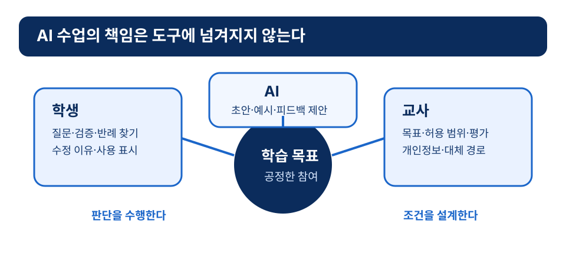
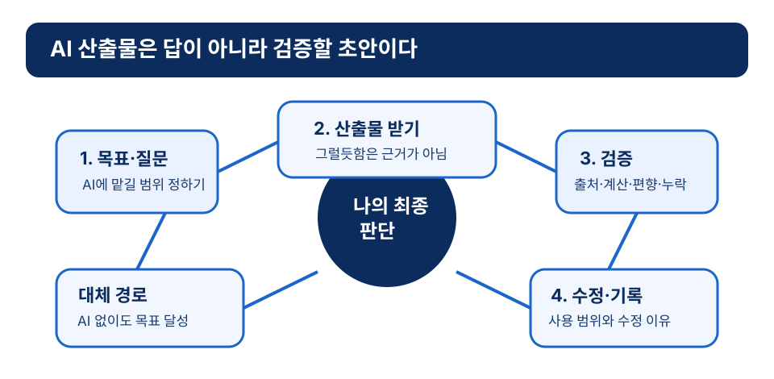

# 11장 AI와 교육의 만남

## 학습 목표

이 장을 학습한 뒤에는 다음을 설명할 수 있어야 한다.

1. 교육에서 AI를 다룰 때 기술 도입, AI 리터러시, 윤리, 교사 역할을 함께 고려해야 함을 설명할 수 있다.
2. AI에 대해 배우기, AI로 배우기, AI와 함께 문제 해결하기, AI를 비판적으로 다루기를 구분할 수 있다.
3. 생성형 AI와 대규모 언어모델의 교육적 가능성과 한계를 근거에 기반해 설명할 수 있다.
4. 학습분석, 교육 데이터 마이닝, 지능형 튜터링 시스템의 역할을 구분할 수 있다.
5. 개인정보, 편향, 투명성, 책임성 문제를 수업 설계와 학교 정책의 관점에서 점검할 수 있다.

## 사전 읽기와 학습목표 대응표

**사전 읽기(40분).** 도입 사례와 본문 1~7절을 읽고, AI가 만든 짧은 답변 또는 가상 답변 하나에 필요한 검증 질문 두 가지를 쓴다. 정책·AI·제품 표현은 **2026-08-13 확인 기준**이며, 다음 학기에는 front matter의 검토 대상을 다시 확인한다.

| 목표 | 사전 읽기·근거 | 도입 사례·수업 적용 | 사전 확인 | 형성 평가 |
|---|---|---|---|---|
| ch11-obj-01 | 기술 도입·AI 리터러시·윤리·교사 역할과 정책 용어의 시점성[^ng2021][^unesco2021][^moe2026-ai] | 국어 논설문에서 허용 범위와 판단 기록을 명시한다 | **ch11-precheck**: AI에 맡길 일과 학생이 판단할 일을 구분한다 | **ch11-fa-1**: AI 리터러시의 범위를 확인한다 |
| ch11-obj-02 | AI에 대해·AI로·AI와 함께·AI 비판의 네 갈래[^unesco2024teacher][^unesco2024student] | 활동의 네 갈래 중 비어 있는 부분을 찾는다 | 활동의 갈래를 한 가지 표시한다 | **ch11-fa-1**: 사용법을 넘는 판단을 확인한다 |
| ch11-obj-03 | 생성형 AI와 대규모 언어모델의 가능성과 한계[^brown2020][^kasneci2023] | AI 초안의 출처·계산·반례를 확인한다 | 검증할 두 항목을 적는다 | **ch11-fa-2**: 검증 과정을 평가한다 |
| ch11-obj-04 | 학습분석·교육 데이터 마이닝·지능형 튜터링의 역할[^siemens2011][^siemensbaker2012][^kulik2016][^solar] | 대시보드와 교사의 관찰을 비교한다 | 해석할 데이터의 한계를 적는다 | **ch11-fa-3, ch11-fa-5**: 역할과 한계를 판단한다 |
| ch11-obj-05 | 개인정보·편향·투명성·책임성의 설계 조건[^nist2023][^unesco2023genai] | 실명·성적을 입력하지 않고 가상 사례로 과제를 운영한다 | AI를 쓰지 않는 학생의 대안을 쓴다 | **ch11-fa-4**: 금지 행동과 대안을 설명한다 |

### 사전 확인과 수업 중 적용

- **ch11-precheck — 답변 검증 카드(10분):** AI가 만든 것으로 가정한 답변에서 주장 하나를 고른다. 원출처·계산·누락 관점·편향 가능성 중 두 가지 검증 방법과 확인하지 못했을 때의 표시 방식을 적는다.
- **ch11-apply — 누적 수업안의 AI 사용 규칙(20분):** AI 사용의 학습 목표와 비사용 조건을 정한다. 입력하면 안 되는 정보, 산출물 검증·인용·사용 표시, AI가 틀리거나 접근할 수 없을 때의 비AI 대체 경로, 교사와 학생의 최종 판단 책임을 수업안에 넣는다.

!!! caution "AI의 오개념·한계·윤리·형평성과 매 학기 검토"
    AI의 유창한 답변, 추천, 자동 피드백은 사실성·공정성·출처 적합성이나 학습 효과를 보장하지 않는다. 개인정보, 편향, 설명의 한계, 비용·언어·장애·접속 격차를 함께 검토하고, 학생이 AI를 쓰지 않아도 동등하게 목표를 달성할 수 있게 한다. 이 장의 정책·AI·제품 내용은 2026-08-13에 확인했으며, 매 학기 정책 용어, 서비스 조건, 학교 지침과 데이터 처리 방침을 검토한다.

!!! tip "관련 강의 자료"
    이 장과 연계된 슬라이드: [9강 AI 디지털교과서의 시대](https://taehyeonglim.github.io/edtech/chapters/chapter-09/slides/deck.html){target=_blank}, [10강 AI와 교육이 만나는 방법](https://taehyeonglim.github.io/edtech/chapters/chapter-10/slides/deck.html){target=_blank}

## 도입 사례

**창작 시나리오.** 고등학교 국어 수업에서 한 교사는 학생에게 생성형 AI로 논설문 초안을 다듬어 보게 하려 했다. 처음 안내에는 “AI를 활용해 글을 개선하라”는 문장만 있었다. 학생들은 어떤 사용이 허용되는지, 출처를 어떻게 표시할지, AI가 낸 근거를 믿어도 되는지 알 수 없었다. 교사는 과제를 고쳐 입력 금지 개인정보, 허용되는 질문 유형, 산출물 검증 절차, 수정 전후 비교표, 최종 판단 기록을 명시했다. 평가는 완성본뿐 아니라 프롬프트, 검증 근거, 반례 탐색, 자기 수정 이유도 보도록 바꾸었다. 이 수업에서 AI는 글을 대신 쓰는 도구인가, 아니면 학생의 판단을 더 엄밀하게 만들 재료인가?

## 1. AI 교육을 넓게 보기

교육에서 AI를 말하면 챗봇, 자동 채점, 맞춤형 추천, 디지털교과서부터 떠올리기 쉽다. 그러나 AI는 도구 목록만의 문제가 아니다. 학생이 무엇을 알아야 하는지, 교사가 어떤 판단을 유지해야 하는지, 학교가 어떤 데이터를 어떤 원칙으로 다룰지를 함께 묻는 주제다.

UNESCO는 AI와 교육을 논의하면서 인간 중심 접근, 포용성, 형평성, 윤리적 사용의 필요를 강조해 왔다.[^unesco2021] 따라서 AI 교육은 AI를 많이 쓰는 교육과 같지 않다. AI가 학습 기회를 넓히는지, 전문적 판단을 지원하는지, 데이터와 알고리즘의 위험을 관리하는지, 학생이 결과를 비판적으로 읽는지를 함께 봐야 한다.

한국 정책 맥락에서도 용어를 시점과 함께 읽을 필요가 있다. 2026년 교육부 업무계획은 “AI 교육자료”라는 용어로 구 AI 디지털교과서, 코스웨어, 에듀테크 등을 포괄해 설명한다.[^moe2026-ai] 이 장에서는 이 현재 용어를 기준으로 하되, 정책과 제품의 범위는 변할 수 있으므로 최신 공식 자료와 학교 지침을 다시 확인한다.

## 2. AI 리터러시와 수업의 네 갈래

AI 리터러시는 개발자 수준의 기술 지식을 모두 암기하는 능력이 아니다. Ng와 동료들은 AI를 이해하고, 사용하고, 평가하며, 윤리적 쟁점을 다루는 역량 논의를 정리했다.[^ng2021] UNESCO의 2024년 교사·학생 AI 역량 프레임워크도 AI를 윤리, 사회, 교수학습, 인간 주체성과 연결해 다룰 필요를 보여 준다.[^unesco2024teacher][^unesco2024student]

이 장은 수업 설계를 위해 네 갈래를 제안한다. **AI에 대해 배우기**는 데이터·알고리즘·모델·한계와 사회적 영향을 이해하는 활동이다. **AI로 배우기**는 설명·연습·피드백·번역·접근성 지원을 활용하는 활동이다. **AI와 함께 문제 해결하기**는 산출물을 검토하고 프롬프트를 바꾸며 근거를 확인하는 활동이다. **AI를 비판적으로 다루기**는 개인정보·편향·저작권·투명성·책임성을 학습 주제로 삼는 활동이다.

이 네 갈래는 국제기구의 분류를 그대로 옮긴 것이 아니라, 기존 논의를 바탕으로 이 교재가 수업 판단을 위해 구성한 틀이다. 그래서 외워야 할 목록이 아니라 점검 도구로 쓴다. 사용 활동만 있고 한계와 윤리가 없다면 AI 교육은 불완전하다.

*그림 11-1. AI 수업에서 학생·교사·AI의 역할 경계와 책임.*

## 3. 생성형 AI와 대규모 언어모델

생성형 AI는 텍스트, 이미지, 음성, 코드처럼 새로운 산출물을 만드는 AI 시스템을 넓게 가리킨다. 대규모 언어모델은 방대한 텍스트의 언어 패턴을 바탕으로, 프롬프트에 따라 다음에 올 가능성이 높은 언어적 출력을 만드는 모델 계열로 이해할 수 있다. Brown과 동료들의 GPT-3 연구는 다양한 과제에서 few-shot 수행을 보인 대표 사례다.[^brown2020]

교육에서는 설명 예시, 초안 피드백, 언어 지원, 코드 설명, 문제 생성, 역할극 대화, 접근성 지원에 활용될 수 있다. Kasneci와 동료들은 개인화 지원과 피드백 가능성뿐 아니라 오류, 편향, 평가, 학문적 진실성 문제도 함께 논의했다.[^kasneci2023]

가장 중요한 원칙은 AI의 유창함을 근거 없는 권위로 받아들이지 않는 것이다. 학생은 설명의 출처를 확인하고, 계산과 인용을 검증하며, 반례를 찾고, 자신의 말로 다시 구성해야 한다. 교사는 결과물만 평가하지 않고 AI 사용 과정, 검증 기록, 수정 이유, 최종 판단까지 함께 본다.

*그림 11-2. 생성형 AI 산출물을 검증하고 자신의 판단으로 마무리하는 순환.*

## 4. 학습분석과 교육 데이터 마이닝

학습분석은 학습자와 학습 맥락에 관한 데이터를 측정·수집·분석·보고해 학습과 학습환경을 이해하고 개선하려는 영역으로 설명되어 왔다.[^siemens2011] SoLAR의 2025년 정의는 여기에 해석과 소통, 교수학습 개선을 위한 실행 가능한 통찰을 더 분명히 둔다.[^solar] 교육 데이터 마이닝은 교육 데이터에서 패턴을 찾고 모델을 만드는 방법론적 전통과 연결된다. Siemens와 Baker는 두 영역의 관계와 차이를 함께 논의했다.[^siemensbaker2012]

교실에서는 출석, 접속, 과제 제출, 퀴즈 응답, 오답 패턴, 토론 참여, 산출물 변화 같은 데이터를 볼 수 있다. 데이터가 많다고 학습 이해가 깊어지는 것은 아니다. 접속 시간이 길어도 학습이 깊지 않을 수 있고, 빠른 제출이 높은 이해를 뜻하지 않을 수 있다. 학생의 설명·질문·산출물·대화를 함께 읽어야 한다.

AI 기반 분석에서 교사의 역할은 줄어들기보다 바뀐다. 무엇을 수집하는지, 그 데이터가 목표와 어떤 관계가 있는지, 추천을 따를 근거가 있는지, 학생에게 어떤 피드백이 필요한지를 판단한다. 학습분석은 교사를 대신하는 자동 조종 장치가 아니라 더 나은 질문을 만드는 진단 자료다.

## 5. AI 튜터와 맞춤형 학습

지능형 튜터링 시스템은 학생의 응답을 분석해 다음 문제, 힌트, 설명을 조정하려는 연구 전통을 가진다. Kulik과 Fletcher의 메타분석은 이 연구의 효과를 종합한 대표 자료다.[^kulik2016] 다만 이 결과를 모든 AI 도구와 모든 교과에 그대로 일반화해서는 안 된다. 효과는 과제 구조, 피드백 품질, 학습자 수준, 비교 조건, 교실 통합 방식에 따라 달라진다.

AI 튜터를 수업에 넣을 때에는 세 가지를 확인한다. 피드백이 정답만 알리는지, 오류의 원인과 다음 전략을 알려 주는지 본다. 학생이 그 피드백을 이해하고 자기 해결 과정을 고칠 기회가 있는지 본다. 교사가 AI가 놓친 오개념, 정서적 어려움, 협력 문제를 알아차릴 수 있는지도 본다.

맞춤형 학습은 혼자 화면을 오래 보는 것만 뜻하지 않는다. 교사의 관찰, 동료 설명, 전체 토론과 결합될 때 교육적 의미가 커진다. 낮은 성취 학생에게 반복 연습만 과도하게 배정해 학습 기회를 좁히지 않는지도 살펴야 한다.

## 6. 윤리: 개인정보, 편향, 투명성, 책임성

AI 교육의 윤리는 별도 부록이 아니라 수업 설계의 조건이다. NIST의 AI 위험관리 프레임워크는 타당성과 신뢰성, 안전성, 보안과 회복탄력성, 책임성과 투명성, 설명 가능성과 해석 가능성, 개인정보 보호, 공정성과 편향 관리를 신뢰할 수 있는 AI의 특성으로 제시한다.[^nist2023] 학교가 AI 도구를 검토할 때 쓸 수 있는 질문 목록이다.

학생의 학습 데이터, 음성, 글, 행동 로그, 평가 정보는 민감한 교육정보가 될 수 있다. 학교는 무엇을 왜 수집하는지, 얼마나 보관하는지, 누가 접근하는지, 제3자 제공 여부가 무엇인지 확인해야 한다. 편리하다는 이유만으로 학생 정보를 외부 서비스에 넣어서는 안 된다.

편향도 수업 주제가 되어야 한다. 특정 언어, 문화, 표현 방식에 불리한 답이 나올 수 있으므로 학생은 “정답인가?”뿐 아니라 “누구의 관점이 빠졌는가?”, “어떤 근거가 빠졌는가?”를 물어야 한다. UNESCO의 생성형 AI 지침은 정책, 교사 역량, 학습자 보호, 윤리적 거버넌스를 함께 고려하도록 강조한다.[^unesco2023genai] 수업에서는 AI 사용 허용 범위, 인용과 표시, 금지되는 입력, 검증 책임, 평가 기준을 명시한다.

## 7. 교사의 역할과 AI 수업 설계

AI가 수업에 들어오면 교사의 역할이 사라진다는 주장은 지나치게 단순하다. 교사는 어떤 활동에서 AI를 허용할지, 무엇을 평가할지, AI의 피드백을 어떻게 검토할지, 학생의 질문과 오개념을 어떻게 수업으로 가져올지 결정해야 한다.

수업안을 마무리할 때에는 다음을 점검한다.

1. 이 활동에서 AI 사용이 직접 지원하는 학습 목표는 무엇인가?
2. 학생은 AI 산출물을 어떤 기준으로 검증하고, 사용 범위를 어떻게 표시하는가?
3. 개인정보나 민감한 학습 정보가 외부 서비스에 입력되지 않는가?
4. AI가 틀리거나 접근하지 못할 때 같은 목표에 도달할 비AI 대체 경로가 있는가?
5. 최종 평가는 산출물뿐 아니라 질문, 검증, 수정, 성찰 과정을 포함하는가?

좋은 AI 활용 수업은 학생이 덜 생각하게 만드는 수업이 아니다. 학생이 더 좋은 질문을 만들고, 더 많은 대안을 비교하며, 더 엄밀하게 근거를 확인하게 하는 수업이다.

## 개념 오해와 적용 한계

- **“AI가 유창하게 답하면 사실이다.”** 유창성은 출처의 정확성, 계산의 타당성, 편향의 부재를 보장하지 않는다. 원자료와 반례로 검증해야 한다.
- **“맞춤형 추천은 중립적이다.”** 추천은 수집된 데이터와 설계 결정에 영향을 받는다. 낮은 성취 학생의 기회를 좁히거나 특정 집단에 불리하지 않은지 교사가 확인해야 한다.
- **“AI를 쓰면 교사의 판단이 줄어든다.”** 목표, 허용 범위, 개인정보, 대체 경로, 평가 기준을 정하는 책임은 남는다. AI는 제안을 할 수 있어도 최종 교육적 판단을 대신하지 못한다.

## 생각해 보기

1. 본인이 AI에 맡기고 싶은 과제에서 학생이 반드시 직접 수행해야 할 판단은 무엇인가?
2. AI가 만든 그럴듯한 설명을 만났을 때, 어떤 순서로 출처·계산·누락 관점·편향을 확인하겠는가?
3. AI 사용이 어려운 학생에게 같은 학습 목표와 평가 기회를 제공하려면 어떤 대체 경로가 필요한가?

## 웹 학습 보조

아래 AI 수업 지도와 사용 기록표는 목표 2·3·5를 보완한다. 도입 사례의 과제를 떠올리며, 학생이 할 검증과 교사가 정할 조건을 각각 한 가지씩 기록해 본다.

  
AI 수업 지도

  
AI 교육의 네 갈래

  

    
<strong>AI에 대해 배우기</strong> 데이터, 알고리즘, 모델, 한계를 이해한다.

    
<strong>AI로 배우기</strong> 설명, 피드백, 접근성 지원을 활용한다.

    
<strong>AI와 문제 해결하기</strong> 프롬프트, 검증, 수정 과정을 기록한다.

    
<strong>AI 비판하기</strong> 개인정보, 편향, 투명성, 책임성을 점검한다.

  

  
출처: 이 장 본문과 UNESCO AI 역량 프레임워크, AI 리터러시 논의를 바탕으로 재구성한 자체 도식.

  
윤리 점검 활동

  
생성형 AI 사용 기록표

  <ol class="activity-steps">
    <li>AI에 입력한 정보가 개인정보나 민감한 학습 정보인지 확인한다.</li>
    <li>AI 산출물의 출처, 계산, 인용, 누락된 관점을 검증한다.</li>
    <li>최종 산출물에는 사용 범위, 수정 이유, 자신의 판단을 함께 기록한다.</li>
  </ol>
  
출처: 이 장의 생성형 AI, NIST AI RMF, UNESCO 생성형 AI 지침 논의를 바탕으로 만든 자체 활동.

## 이론과 연구 확장

### AI 리터러시는 사용법보다 판단 능력을 포함한다

Ng와 동료들의 검토는 AI 리터러시를 AI의 이해, 사용, 평가, 윤리적 쟁점과 연결해 개념화한다.[^ng2021] UNESCO의 교사와 학생 AI 역량 프레임워크도 AI를 인간 주체성, 윤리, 교수학습, 사회적 영향과 함께 다루도록 요구한다.[^unesco2024teacher][^unesco2024student] 따라서 수업에서 AI 리터러시는 프롬프트 요령만이 아니라 산출물의 한계·편향·출처·책임을 검토하는 능력까지 포함한다.

### 생성형 AI는 가능성과 한계를 동시에 가진 학습 도구다

Brown과 동료들의 GPT-3 연구는 대규모 언어모델이 다양한 과제에서 few-shot 수행을 보일 수 있음을 보여 주었다.[^brown2020] Kasneci와 동료들은 교육적 기회와 함께 오류, 편향, 평가, 학문적 진실성 문제를 논의했다.[^kasneci2023] 생성형 AI 과제는 산출물의 유창성보다 출처 확인, 계산 검증, 반례 찾기, 수정 이유 설명을 중심 활동으로 삼아야 한다.

### 학습분석은 교사의 판단을 대체하지 않는다

학습분석은 학습자와 학습 맥락의 데이터를 분석해 학습 환경을 이해하고 개선하려는 영역으로 설명되어 왔다.[^siemens2011] SoLAR의 정의도 실행 가능한 통찰과 교수학습 개선을 강조한다.[^solar] 접속 시간, 제출 시각, 퀴즈 점수만으로 이해를 충분히 설명할 수 없으므로, 데이터는 학생의 설명·질문·산출물·교사 관찰과 함께 읽어야 한다.

### AI 윤리는 수업 설계의 중심 조건이다

NIST의 AI 위험관리 프레임워크는 타당성, 안전성, 책임성과 투명성, 설명 가능성, 개인정보 보호, 공정성과 편향 관리를 제시한다.[^nist2023] UNESCO의 생성형 AI 지침도 정책, 교사 역량, 학습자 보호, 윤리적 거버넌스를 함께 고려하도록 강조한다.[^unesco2023genai] 학교 수업에서는 AI 사용 허용 범위, 개인정보 입력 금지, 인용과 표시, 검증 책임, 대체 과제를 명확히 안내해야 한다.

## 토론 질문

1. 도입 사례의 수정된 과제 안내는 생성형 AI 활용의 공정성과 책임성을 어떻게 높이는가?
2. AI 산출물이 유창하지만 출처가 불분명할 때 학생에게 요구할 수 있는 검증 절차는 무엇인가?
3. 학습분석 대시보드의 추천과 교사의 관찰이 다를 때 어떤 자료를 추가로 확인해야 하는가?
4. AI 튜터가 낮은 성취 학생에게 반복 연습만 계속 제시한다면 어떤 교육적·윤리적 문제가 생길 수 있는가?

## 형성 평가

1. AI 리터러시에 대한 설명으로 가장 적절한 것은 무엇인가?
   ① 프롬프트를 빠르게 작성하는 기술만을 뜻한다.
   ② AI를 이해·사용·평가하고 윤리적 쟁점을 다루는 역량을 포함한다.
   ③ AI의 답을 더 빨리 복사하는 능력이다.
   ④ 교사가 AI에게 평가를 전부 맡기는 절차다.
   **정답**: ②
   **해설**: AI 교육은 도구 사용 능력과 비판적 판단, 윤리적 책임을 함께 다룬다.

2. 생성형 AI 활용 과제에서 평가해야 할 과정 요소를 두 가지 이상 쓰시오.
   **예시 답안**: 프롬프트 작성 의도, AI 산출물의 출처 검증, 반례 탐색, 수정 이유, 최종 판단 기록을 평가할 수 있다.
   **채점 기준**: 산출물 외의 질문·검증·수정·성찰 요소 중 두 가지 이상을 포함하면 적절하다.

3. 학습분석 데이터를 해석할 때 가장 적절한 태도는 무엇인가?
   ① 접속 시간이 길면 반드시 깊이 학습한 것으로 판단한다.
   ② 알고리즘 추천은 교사의 판단보다 항상 정확하다.
   ③ 데이터는 학생의 설명, 산출물, 관찰과 함께 해석한다.
   ④ 낮은 점수 학생에게는 반복 문제만 계속 제시한다.
   **정답**: ③
   **해설**: 학습분석은 진단 자료이며, 교사의 교육적 판단과 다른 증거와 함께 읽어야 한다.

4. AI 수업에서 개인정보 보호를 위해 피해야 할 행동을 하나 쓰고 대안을 제시하시오.
   **예시 답안**: 학생의 실명, 성적, 상담 내용 같은 민감한 정보를 외부 AI 서비스에 입력해서는 안 된다. 대신 익명화한 예시 자료나 교사가 만든 가상 사례를 사용한다.
   **루브릭**: 금지 행동과 대체 방법이 모두 구체적이면 우수하다.

5. 지능형 튜터링 시스템의 효과를 모든 AI 도구에 일반화하면 왜 문제가 되는가?
   ① AI 도구는 모두 같은 알고리즘을 쓰기 때문이다.
   ② 모든 학습자는 같은 피드백을 받아야 하기 때문이다.
   ③ 효과는 과제 구조, 피드백 품질, 학습자 수준, 교실 통합 방식에 따라 달라지기 때문이다.
   ④ AI 튜터는 데이터를 전혀 사용하지 않기 때문이다.
   **정답**: ③
   **해설**: AI 도구의 교육적 가치는 기술 명칭이 아니라 설계 조건과 사용 맥락에 따라 판단해야 한다.

## 요약

AI와 교육의 만남은 기술 도입만의 문제가 아니다. AI 리터러시는 이해·사용·평가·윤리적 판단을 포함하며, 생성형 AI는 설명과 피드백을 돕는 동시에 오류·편향·출처 불명확성·평가 공정성의 위험을 지닌다. 학습분석과 AI 튜터는 진단과 지원에 쓸 수 있지만, 학생의 설명과 교사의 관찰을 대신하지 못한다. 수업은 입력 금지 정보, 검증과 표시 방법, 비AI 대체 경로, 질문·검증·수정 과정을 포함한 평가를 미리 설계해야 한다. 최종 교육적 판단과 책임은 학생과 교사에게 남는다.

## 핵심 용어

- **AI 리터러시**: AI를 이해하고 사용하며 평가하고 윤리적 쟁점을 다루는 데 필요한 지식, 기능, 태도의 묶음이다.
- **생성형 AI**: 텍스트, 이미지, 음성, 코드 등 새로운 산출물을 만들어 내는 AI 시스템을 넓게 가리킨다.
- **학습분석**: 학습자와 학습 맥락의 데이터를 측정, 수집, 분석, 보고하여 학습과 교수 개선을 돕는 영역이다.
- **지능형 튜터링 시스템**: 학생 응답을 분석해 문제, 힌트, 설명, 피드백을 조정하려는 교육용 시스템이다.
- **책임성**: AI 활용에서 목적, 데이터 사용, 의사결정, 오류 대응, 평가 책임의 소재를 분명히 하는 원칙이다.

## 참고문헌

[^brown2020]: Brown, T. B., Mann, B., Ryder, N., Subbiah, M., Kaplan, J., Dhariwal, P., et al. (2020). Language models are few-shot learners. *Advances in Neural Information Processing Systems, 33*, 1877-1901. NeurIPS official proceedings verified at `https://papers.nips.cc/paper_files/paper/2020/hash/1457c0d6bfcb4967418bfb8ac142f64a-Abstract.html`; PDF verified at `https://proceedings.neurips.cc/paper_files/paper/2020/file/1457c0d6bfcb4967418bfb8ac142f64a-Paper.pdf`.

[^kasneci2023]: Kasneci, E., Sessler, K., Kuechemann, S., Bannert, M., Dementieva, D., Fischer, F., et al. (2023). ChatGPT for good? On opportunities and challenges of large language models for education. *Learning and Individual Differences, 103*, 102274. https://doi.org/10.1016/j.lindif.2023.102274. Crossref metadata verified.

[^kulik2016]: Kulik, J. A., & Fletcher, J. D. (2016). Effectiveness of intelligent tutoring systems: A meta-analytic review. *Review of Educational Research, 86*(1), 42-78. https://doi.org/10.3102/0034654315581420. Publisher/Crossref metadata verified.

[^moe2026-ai]: 교육부. (2026). *2026년 교육부 주요업무 추진계획*. 교육부 공식 PDF `https://www.moe.go.kr/upload/filedown/2026_business_plan_data.pdf` 확인. 본문에서는 2026년 현재 용어를 "AI 교육자료"로 사용한다.

[^ng2021]: Ng, D. T. K., Leung, J. K. L., Chu, S. K. W., & Qiao, M. S. (2021). Conceptualizing AI literacy: An exploratory review. *Computers and Education: Artificial Intelligence, 2*, 100041. https://doi.org/10.1016/j.caeai.2021.100041. Crossref metadata verified.

[^nist2023]: National Institute of Standards and Technology. (2023). *Artificial Intelligence Risk Management Framework (AI RMF 1.0)*. https://doi.org/10.6028/NIST.AI.100-1. NIST official publication page verified at `https://www.nist.gov/publications/artificial-intelligence-risk-management-framework-ai-rmf-10`; official PDF verified at `https://tsapps.nist.gov/publication/get_pdf.cfm?pub_id=936225`.

[^siemens2011]: Siemens, G., & Long, P. (2011). Penetrating the fog: Analytics in learning and education. *EDUCAUSE Review, 46*(5), 30-32. EDUCAUSE official article verified at `https://er.educause.edu/articles/2011/9/penetrating-the-fog-analytics-in-learning-and-education`.

[^siemensbaker2012]: Siemens, G., & Baker, R. S. J. d. (2012). Learning analytics and educational data mining: Towards communication and collaboration. In *Proceedings of the 2nd International Conference on Learning Analytics and Knowledge* (pp. 252-254). ACM. https://doi.org/10.1145/2330601.2330661. Crossref metadata verified.

[^solar]: Society for Learning Analytics Research. (2025). *What is Learning Analytics?* SoLAR official definition page verified at `https://www.solaresearch.org/about/what-is-learning-analytics/`.

[^unesco2021]: UNESCO. (2021). *AI and Education: Guidance for Policy-makers*. UNESCO official publication page verified at `https://www.unesco.org/en/articles/ai-and-education-guidance-policy-makers`.

[^unesco2023genai]: Miao, F., & Holmes, W. (2023). *Guidance for Generative AI in Education and Research*. UNESCO official publication page verified at `https://www.unesco.org/en/articles/guidance-generative-ai-education-and-research`; UNESCO document record verified at `https://unesdoc.unesco.org/ark:/48223/pf0000386693`.

[^unesco2024student]: UNESCO. (2024). *AI Competency Framework for Students*. UNESCO official publication page verified at `https://www.unesco.org/en/articles/ai-competency-framework-students`.

[^unesco2024teacher]: UNESCO. (2024). *AI Competency Framework for Teachers*. UNESCO official publication page verified at `https://www.unesco.org/en/articles/ai-competency-framework-teachers`.
